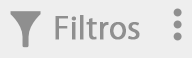
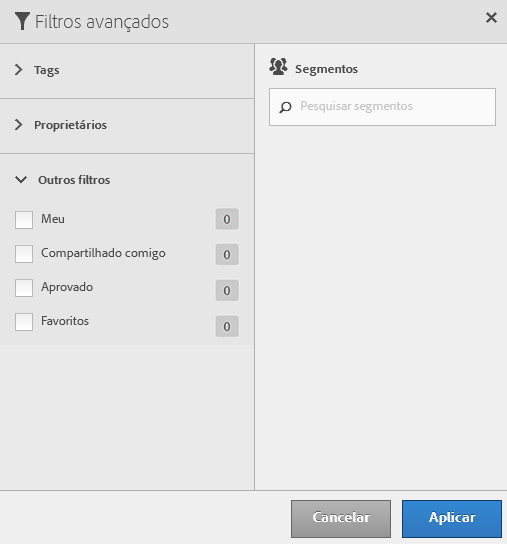

# Filtrar segmentos

Filtrar por tags, proprietários e outros filtros (Mostrar tudo, Meu, Compartilhado comigo, Favoritos e Aprovado).

A filtragem facilita a pesquisa por segmentos no trilho de segmentos.

1. No Gerenciador de segmentos, clique no ícone **[!UICONTROL Filtros]**: 

   

1. Os seguintes filtros estão disponíveis:

   | Nome do filtro | Descrição |
   |---|---|
   | Tags | Permite que você filtre por segmentos com tags  [específicos](/help/components/c-segmentation/c-segmentation-workflow/seg-tag.md). A coluna Tags é mostrada por padrão. |
   | Proprietários | Permite que você filtre segmentos por proprietário. |
   | Outros filtros > Exibir todos | **(Somente administrador)** Mostra todos os segmentos, seu proprietário e a última data de modificação. |
   | Outros filtros > Meus | Mostra todos os seus segmentos. |
   | Outros filtros > Compartilhados comigo | Mostra todos os segmentos que outros  [compartilharam](/help/components/c-segmentation/c-segmentation-workflow/t-seg-share.md) com você. |
   | Outros filtros > Favoritos | Mostra todos os segmentos que você marcou como  [Favoritos](/help/components/c-segmentation/c-segmentation-workflow/t-seg-favorite.md). |
   | Outros filtros > Aprovado | Mostra todos os segmentos  [aprovados](/help/components/c-segmentation/c-segmentation-workflow/seg-approve.md) oficialmente. |
   | Pesquisar segmentos | Permite que você pesquise segmentos por nome. |

