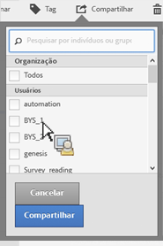

# Compartilhar segmentos

Dependendo das permissões, você pode compartilhar segmentos com organizações, grupos ou usuários individuais.

| Administrador | Pode compartilhar segmentos com Todos, Grupos e Usuários. Grupos estão configurados como grupos de permissões no Admin Console. |
|---|---|
| Não administrador | Pode compartilhar segmentos somente com usuários individuais. |

Quando você deve compartilhar segmentos com a empresa inteira em comparação a apenas um grupo de usuário ou indivíduos? Estas são algumas das práticas recomendadas que você pode seguir:

* Como um Administrador, compartilhe um segmento com **[!UICONTROL Todos]** se for útil para a empresa inteira e se todos estão confortáveis em usá-lo. Nesse caso, você também deve considerar torná-la um segmento [aprovado](/help/components/c-segmentation/c-segmentation-workflow/seg-approve.md).

* Como Administrador, compartilhe um segmento com um **[!UICONTROL Grupo]** específico se o segmento oferece bom valor de negócios para a equipe. Não aprove oficialmente esse tipo de segmento.
* Como Administrador ou usuário individual, compartilhe um segmento com outros indivíduos para vetar e validar um segmento. Se não for útil, é possível descartá-la. Não aprove oficialmente esse tipo de segmento.

1. No Gerenciador de segmentos, marque a caixa de seleção ao lado do segmento que você deseja compartilhar. A barra de ferramentas de gerenciamento do segmento aparece:

   

1. Clique em **[!UICONTROL Compartilhar]**.

   

   Se você for um Administrador, é possível selecionar **[!UICONTROL Tudo]** ou escolher a partir de **[!UICONTROL Grupos]** e **[!UICONTROL Usuários]** na organização. Como um não Administrador, você pode usar somente os usuários individuais. Use o campo **[!UICONTROL Pesquisa]** para pesquisar por grupos ou usuários. 1. Clique em **[!UICONTROL Compartilhar]**.

   O ícone Compartilhado aparece ao lado do segmento:  

1. Você pode filtrar por segmentos compartilhados com você ao ir para **[!UICONTROL Filtros]** &gt; **[!UICONTROL Outros filtros]**&gt;**[!UICONTROL Compartilhado comigo]**.
