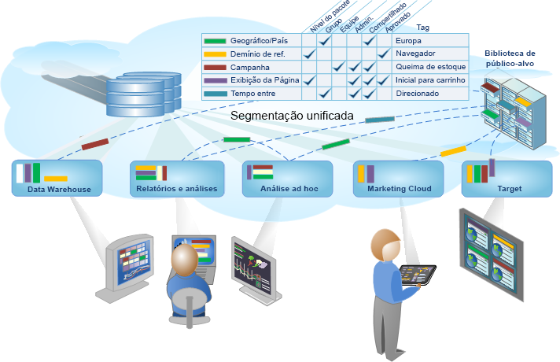

# Segmentação do Analytics

O Adobe Analytics permite construir, gerenciar, compartilhar e aplicar segmentos avançados de público-alvo em seus relatórios usando os recursos do Analytics, a Adobe Experience Cloud, o Adobe Target e outros produtos integrados da Adobe.

A segmentação do Analytics inclui o [Construtor de segmentos](../../components/c-segmentation/c-segmentation-workflow/seg-workflow.md#concept_BD4C17B01C5B4E378D0C14C852D055D4) para construir segmentos e executar um pré-teste, e o [Gerenciador de segmentos](../../components/c-segmentation/c-segmentation-workflow/seg-workflow.md#section_7FDCD12949BE4741A402DB83AB7B37DF) para coletar, marcar, aprovar, definir a segurança e compartilhar segmentos na organização.

Os cientistas de dados e analistas de marketing podem empregar, estender e refinar segmentos para análises específica para suas necessidades, em seguida, salvar o segmento para outros usuários a fim de estender, refinar e salvar como um novo segmento na biblioteca. Depois de executado, é um ciclo de criação e gerenciamento de informações de público-alvo codificado como um [fluxo de trabalho de segmento unificado](../../components/c-segmentation/c-segmentation-workflow/seg-workflow.md#concept_6D2E1A72A3AD4EBBB9135094F2D9DEDF).

**Introdução**

Comece com [Configuração de um fluxo de trabalho de segmentação](../../components/c-segmentation/c-segmentation-workflow/seg-workflow.md#concept_6D2E1A72A3AD4EBBB9135094F2D9DEDF) ou [criação de segmentos](../../components/c-segmentation/c-segmentation-workflow/seg-build.md#concept_BD4C17B01C5B4E378D0C14C852D055D4), ou consulte [Sobre segmentos](../../components/c-segmentation/seg-overview.md#concept_82653C7E29FE49F5A4B5E5E93B0A6399) para obter uma visão geral rápida.
