# Sobre os segmentos e contêineres

Os segmentos permitem que você identifique subconjuntos de visitantes com base em características ou interações de site. Os segmentos são criados como informações de público-alvo codificadas que você pode criar de acordo com necessidades específicas e, em seguida, verificar, editar e compartilhar com outros membros da equipe, ou usar em outros produtos da Adobe e recursos do Analytics.

Os segmentos baseiam-se em uma hierarquia de nível de [!UICONTROL Visitante], [!UICONTROL Visita] e [!UICONTROL Ocorrência] por meio de um modelo de contêiner aninhado. Os contêineres aninhados permitem que você defina atributos de visitante e ações com base em regras entre e nos contêineres. Segmentos do Analytics podem ser construídos, aprovados, compartilhados, salvos e executados em vários produtos e recursos da [!DNL Adobe Experience Cloud]. Os segmentos podem ser gerados a partir de um relatório, construído em um relatório de painel, ou marcado para acesso rápido.

Você pode construir e salvar segmentos no Construtor de segmentos, ou gerar segmentos a partir de um relatório de Fallout (na [!DNL ad hoc analysis]). Você também pode empregar e estender segmentos pré-construídos com base em regras específicas entre contêineres aninhados, o que lhe permite filtrar resultados e aplicar a relatórios. Além disso, os segmentos podem ser usados juntamente como [segmentos empilhados](/help/components/c-segmentation/c-segmentation-workflow/seg-workflow.md).

## Segmentos {#section_CC4EBA2A6CCB4F8BBB8437052A880657}

Os segmentos identificam quem são seus visitantes (país, sexo, cafeteria), quais dispositivos e serviços eles usam (navegador, mecanismo de pesquisa, dispositivo móvel), de onde navegaram (mecanismo de pesquisa, página de saída anterior, pesquisa natural) e muito mais.

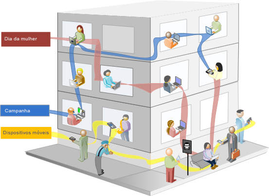

Os segmentos podem ter por base os seguintes valores:

* Visitantes com base em atributos: tipo de navegador, dispositivo, número de visitas, país, gênero.
* Visitantes com base em interações: campanhas, pesquisa por palavras-chave, mecanismo de pesquisa.
* Visitantes com base em saídas e entradas: visitantes do Facebook, uma página de aterrissagem definida e um domínio de referência.
* Visitantes com base em variáveis personalizadas: campos do formulário, categorias definidas, ID do cliente.

Ao construir segmentos de público-alvo no Construtor de segmentos, você define condições com os operadores [!UICONTROL E] e [!UICONTROL OU] entre os contêineres.

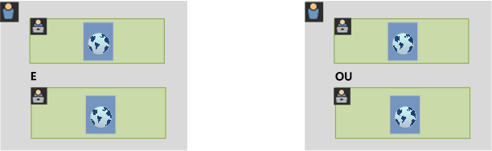

Esse tipo de conjunto de dados de filtros de segmento com base em características unidas com operadores [!UICONTROL E] e [!UICONTROL OU].

## Segmentos sequenciais  {#section_EE5B14287FC44E0B96E77679A2438948}

Os segmentos sequenciais permitem que você identifique visitantes com base na navegação e visualização de página no site, o que fornece um segmento de ações e interações definidas. Os segmentos sequenciais ajudam você a identificar o que um visitante gosta e o que um visitante evita. Ao construir segmentos sequenciais, o operador [!UICONTROL ENTÃO] é usado para definir e organizar a navegação do visitante.


| Visita um | Visita dois | Visita três |
|---|---|---|
| Na primeira visita, o visitante foi para a página de aterrissagem principal (A), excluiu a página da campanha (B) e, em seguida, visualizou a página do Produto (C). | Na segunda visita, o visitante novamente foi para a página de aterrissagem principal (A), excluiu a página da campanha (B) e, novamente, foi para a página do Produto (C), em seguida, foi para a nova página (D). | Na terceira visita, o visitante entrou e seguiu o mesmo caminho da primeira e segunda visita, em seguida, excluiu a página F para ir diretamente para a página de produto direcionada (G). |

Os segmentos sequenciais podem ser baseados nos seguintes valores de ocorrência:

* Os visitantes com base na sequência de ocorrências de páginas, visualizações de página em uma única visita, visualizações de página em visitas separas, visitas que excluíram visualizações de página.
* Visitantes com base no tempo entre e após visualizações de página, após um tempo limite, entre ocorrências, após um evento.

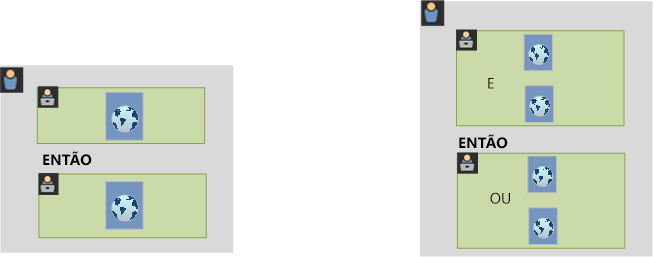

Um segmento sequencial filtra conjuntos de dados com base nas ações do usuário com o operador [!UICONTROL ENTÃO].

## Vídeo passo a passo {#section_89D6184890AF4086A8056BFBB0B68C29}

Este vídeo do YouTube proporciona uma breve visão geral sobre o que são os contêineres de segmentos e como usá-los.

| Nome do vídeo | Link do vídeo |
|---|---|
| Contêineres de segmentos | [Contêineres de segmentos no Adobe Analytics](https://www.youtube.com/watch?v=A513j-ej0oc&amp;index=2&amp;list=PL2tCx83mn7GtHqZicFTa--aE6d02BvvTd) |

## Sobre contêineres {#section_AF2A28BE92474DB386AE85743C71B2D6}

Um Segmento define as condições para filtrar um visitante com base em atributos ou interações no site. Para definir as condições em um segmento, você define regras para filtrar visitantes com base nas características de visitante e/ou nas características de navegação. Para detalhar ainda mais os dados do visitante, você pode filtrar com base em visitantes específicos e/ou ocorrências de visualização de página para cada visitante. O Construtor de segmentos fornece uma arquitetura simples para construir esses subconjuntos e aplicar regras como contêineres aninhados e hierárquicos Visitante, Visita ou Ocorrência.

A arquitetura de contêiner empregada no Construtor de segmentos define **[!UICONTROL Visitante]** como o contêiner mais externo, contendo dados abrangentes específicos para visitantes em visitas e visualizações de página. Um contêiner de **[!UICONTROL Visita]** aninhado permite definir regras para detalhar os dados do visitante com base em visitas e um contêiner de **[!UICONTROL Ocorrência]** aninhado permite detalhar as informações do visitante com base em visualizações de página individuais. Cada contêiner permite que você informa o histórico do visitante, as interações detalhadas por visitas ou detalhar por ocorrências individuais.

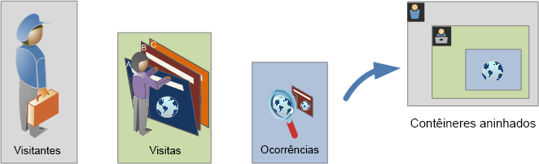

**Contêiner do visitante**

O Contêiner do visitante inclui cada visita e visualização de página de visitante em um período especificado. Um segmento no nível do Visitante retorna a página que atende à condição, além de todas as páginas visualizadas pelo visitante (e somente restrita pelos intervalos de datas definidos). Como o contêiner mais amplamente definido, os relatórios gerados no nível do contêiner do Visitante retornarão visualizações de página em todas as visitas e permite que você gere uma análise multivisita. Consequentemente, o contêiner do Visitante é o mais suscetível às mudanças com base em intervalos de datas definidos.

Os contêineres do visitante podem incluir valores com base no histórico geral do visitante.

* Dias Antes da Primeira Compra
* Página de entrada original
* Domínios de referência originais

**Contêiner de visita**

O contêiner de Visita permite que você identifique as interações de página, campanhas ou conversões de uma sessão da Web específica. O contêiner de Visita é o mais usado porque capta comportamentos para a sessão de visita inteira depois que a regra é atendida e permite que você defina quais visitas você deseja incluir ou excluir na criação e aplicação de um segmento. Também pode ajudar você a responder à pergunta sobre quantos visitantes visualizaram a seção Notícias e esportes na mesma visita? Ou páginas que atribuíram a uma conversão com êxito para uma venda?

Os contêineres de visita incluem valores com base em ocorrência por visita:

* Número da visita
* Página de entrada
* Frequência de Retorno
* Métricas de participação
* Métricas alocadas linearmente

**Contêiner de ocorrências**

O contêiner de Ocorrências define quais ocorrências de página você deseja incluir ou excluir de um segmento. É o mais estrito dos contêineres disponível para permitir a identificação de cliques e visualizações de página específicos, nos quais a condição é verdadeira, o que lhe permite visualizar um único código de rastreamento, ou isolar um comportamento em uma seção específica do site. Você também pode desejar indicar um valor específico quando uma ação ocorre, como o canal de marketing quando um pedido é efetuado.

Os contêineres de ocorrência incluem valores com base em detalhamentos de páginas únicas:

* Produtos
* Propriedades de lista
* eVars de lista
* eVars de comércio (no contexto de eventos)

   >[!NOTE]
   >
   >Se você usar esse contêiner em um valor que persiste, como uma evar, isso obterá cada ocorrência na qual o valor é persistente. Em caso de um código de rastreamento que expira após uma semana, esse valor pode persistir em várias visitas.

**contêiner do Grupo lógico**

O contêiner do Grupo lógico permite que você ofereça um contêiner separado dentro das regras do segmento, para filtrar entidades que não são baseadas hierarquicamente. Por exemplo, você pode oferecer um contêiner aninhado dentro do segmento que faz a filtragem com base no Visitante. Este tipo de lógica requer a quebra da hierarquia (pois que você já possui um contêiner de nível superior) para filtrar somente visitantes selecionados. Isto pode ser realizado usando o contêiner do Grupo lógico. Consulte [Exemplos de Grupos lógicos](/help/components/c-segmentation/c-segmentation-workflow/seg-sequential-build.md) para informações adicionais.

## Aninhamento de contêineres {#section_7FDF47B3C6A94C38AE40D3559AFFAF70}

Ao criar contêineres de segmento em outros contêineres, você cria um segmento dentro de um segmento. A seguinte lógica é usada com contêineres aninhados:

1. Determine quais dados estão incluídos com o contêiner mais externo. Quaisquer dados que não correspondem a essa regra exterior são descartados no relatório segmentado.
1. Aplique essa regra aninhada aos dados restantes. A regra aninhada NÃO se aplica a quaisquer ocorrências que a primeira regra descarta.
1. Repita até que todas as regras de contêiner aninhado sejam calculadas. Os dados restantes são incluídos no relatório resultante.

Você pode usar o aninhamento entre contêineres, bem como entre regras em um contêiner. Você pode aninhar o seguinte em cada contêiner:

| Nome do contêiner | O que você pode aninhar dentro |
|---|---|
| Ocorrência | Somente eventos |
| Visita | Contêiner de ocorrências, Eventos |
| Visitante | Contêiner de visitas, Contêiner de ocorrências, Eventos |
| Grupo lógico | Contêiner de visitante, Contêiner de visita, Contêiner de hit |

**Incluir vários contêineres em uma única definição**

Incluir vários segmentos em um novo segmento composto permite que você refine dados ainda mais. Arrastar dois segmentos existentes juntos atua como uma instrução &quot;OU&quot; ao filtrar visitantes. Todos os contêineres na área são analisados em comparação a todos os dados, e quaisquer dados que correspondem a qualquer um dos contêineres são incluídos no relatório.

Por exemplo, arrastar um contêiner de visita, onde País = Estados Unidos com um contêiner de visita, onde Pedido = Verdadeiro

```
Country = United States + Order = True
```

criará um segmento que se comporta desta forma:

1. Inicialmente, esse segmento analisa seus dados inteiros e identifica todos os visitantes nos Estados Unidos.
1. Em seguida, o segmento analisa todos os dados novamente, procurando se quaisquer visitantes efetuara um pedido.
1. Ambos os conjuntos de dados seriam aplicados ao relatório.

## Contêineres para segmentos sequenciais {#section_324AF503F51A4A62806151FE440F3B2E}

A segmentação sequencial emprega os mesmos contêineres básico incluindo [!UICONTROL Visitantes], [!UICONTROL Visitas] e [!UICONTROL Ocorrências] (incluindo visualizações de página ou outras dimensões) aninhados hierarquicamente.


Os [!UICONTROL Visitantes] constituem o contêiner de maior ordem na segmentação sequencial, com as [!UICONTROL Visitas] contidas no contêiner de [!UICONTROL Visitantes] e as [!UICONTROL Ocorrências] contidas nos contêineres de [!UICONTROL Visitantes] ou [!UICONTROL Visitas]. Essa  [hierarquia de contêiner](/help/components/c-segmentation/seg-overview.md#section_7FDF47B3C6A94C38AE40D3559AFFAF70) deve ser mantida para construir segmentos sequenciais bem ordenados.

**Para construir segmentos sequenciais**, os contêineres são aninhados e a lógica sequencial é unida por meio do operador [!UICONTROL ENTÃO] que requer que cada contêiner seja verdadeiro com base na sequência do visitante.

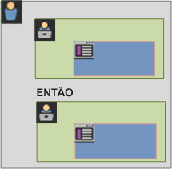

A única exceção para essa hierarquia de contêineres é ao usar o  [contêiner do Grupo lógico](/help/components/c-segmentation/c-segmentation-workflow/seg-sequential-build.md). O contêiner do [!UICONTROL Grupo lógico] permite aninhar uma ocorrência em um contêiner sem ordem para capturar eventos e dimensões, mas fora de uma ordem sequencial.

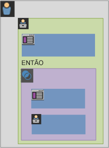

## Relatórios com base nos dados de contêiner {#concept_BE822C12F87C4F07B7147D80BEFBAB87}

Os contêineres permitem que você filtre dados de forma diferente com base em valores de relatório ao relatar segmentos e aplicá-los a relatórios.

Dados captados em cada nível da hierarquia de contêineres de Visitante > Visita > Ocorrência afetam como você constrói seus segmentos. Se você considerar o mesmo segmento aplicado ao mesmo relatório com o mesmo conjunto de dados, você obterá valores diferentes com base no contêiner a partir do qual você gera o relatório. Fatores como nível de relatório de contêiner e persistência de valores em ocorrências pode resultar em grandes alterações na precisão do relatório. 

## Dados básicos de contêiner {#section_9576D970F912450191AFB5B83F7F1656}

Por exemplo, o visitante representado abaixo visitou um site na primeira visita, chegou na Página inicial e, em seguida, visitou três páginas adicionais e converteu a visita em uma venda. Em uma visita separada, o visitante chegou na página do Produto, em seguida, na página inicial, retornou à página do Produto e, em seguida, fechou a sessão depois de visualizar Chapéus de inverno. Com base nos dados captados de cada contêiner para segmento, os valores diferentes serão exibidos no relatório.

O segmento *Páginas iguais a Casaco de inverno* abaixo é aplicado ao **Relatório de páginas**.

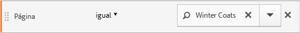

Com base no contêiner selecionado, o relatório exibe resultados diferentes.

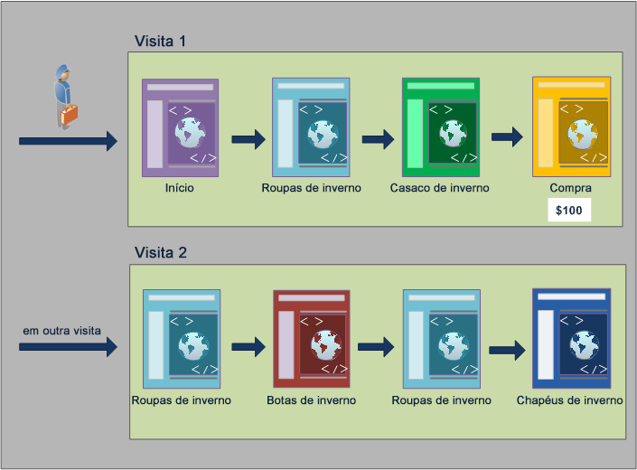

**Relatar a partir do Contêiner de ocorrências**

Quando essa condição está em um contêiner de Ocorrência, então o relatório lista somente páginas, onde *Páginas = Casacos de inverno* é verdadeiro. Como somente uma das páginas corresponde a essa condição em um contêiner de apenas uma páginas, somente a página de Casacos de inverno é exibida.

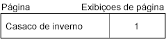

Com relatório do contêiner Ocorrências, você pode visualizar como os relatórios de contêineres diferentes afetam os valores gerais dos relatórios. Ao visualizar o relatório de segmento, observe que as visualizações de página são aproximadamente iguais às visitas (aproximadamente 2.000 visitantes visualizaram páginas duplicadas em uma visita, o que adiciona ao número total de visualizações de página), e visitantes únicos são aproximadamente iguais ao número de visitas (aproximadamente 2.000 visitantes únicos visitaram mais de uma vez).

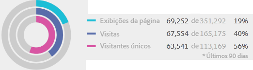

>[!IMPORTANT]
>
>Independentemente da forma como você visualiza os dados, dos contêineres de Ocorrência, Visita ou Visitante, todos têm o mesmo número de visitantes, 63.541, neste exemplo. Independentemente da forma como você gera o relatório, a condição de visitante inicial, Visitantes que visualizaram a página de Casacos de inverno, permanece intacta. É o subconjunto de dados a partir do qual você cria relatórios em níveis diferentes.

**Relatar a partir do Contêiner de visitas**

Se a mesma condição está em um contêiner de Visita, então o relatório lista todas as páginas na visita, onde *Página igual a Casacos de inverno* é verdadeiro. A condição filtra a página de Casacos de inverno, mas também capta todas as outras páginas na visita, onde a condição é verdadeira. Como o visitante também visitou as páginas Inicial, Produto e Compra na visita, onde a condição foi atendida, essas páginas adicionais são listadas na relatório quando relatado com dados do contêiner de Visitante.

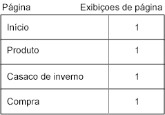

Ao mostrar valores de segmento do contêiner Visita, você pode visualizar que o número de visualizações de página aumentou significativamente. Isso ocorre porque o relatório do contêiner de Visita identifica todas as páginas que atendem às condições, além de todas as outras páginas visualizadas na visita (com todas as visualizações de página captada em cada contêiner de Visita).


**Relatar a partir do Contêiner de visitantes**

Se essa mesma condição está em um contêiner de Visitante, o relatório lista todas as páginas visualizadas por qualquer visitante, onde *Página igual a Casacos de inverno* é verdadeiro. Isso significa que se um visitante visualizou a página Casacos de inverno, então todas as páginas no contêiner Visitante, incluindo visualizações de página em outras visitas, serão listadas. Consequentemente, as páginas que não correspondem à condição serão listadas no relatório, pois o visitante as visualizou anteriormente. Todas as páginas no contêiner de Visitantes serão listadas, mesmo se ocorreram anteriormente ou não atenderam especificamente às condições.

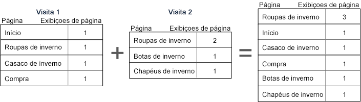

Ao mostrar segmentos do contêiner Visitante, você pode visualizar que as Visualizações de página e Visitas aumentaram. Isso ocorre porque do nível de visitante, se o visitante visitou a página Casacos de inverno somente uma vez (o que transforma a condição em verdadeira), então todas as outros visualizações de página e as demais visitas são captadas para esse visitante.

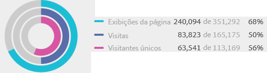

Em resumo, entender como a segmentação funciona em vários detalhamentos de dados é essencial para interpretar os dados retornados.

## Relatório com base no contêiner {#section_D0604748F2794327B8C668617A31EC18}

Cada detalhamento de dados do segmento tem um escopo ao qual é aplicado. A maioria dos detalhamentos é baseada nas *Exibições de página*. No entanto, vários segmentos valiosos têm por base o contêiner *Visita* e, em menor grau, o contêiner *Visitante*. É importante entender o relatório com base no escopo do contêiner.

Com base no exemplo de segmento *Página = Casacos de inverno* usado anteriormente, os problemas listados abaixo definem outros aspectos do segmento baseado na forma como os dados do contêiner são aplicados e como o escopo dos dados deve corresponder ao tipo de segmento.

**Contêiner de segmento com base na regra de segmento correspondente**

A aplicação do contêiner de segmento em comparação ao escopo natural dos dados traz resultados esperados, onde os itens de linha correspondem à regra de segmento.

* **Contêiner de ocorrência onde a página é igual a &quot;Casaco de inverno&quot;**: visualizar um relatório de *página* com esse segmento retorna somente os valores iguais a &quot;Casaco de inverno&quot;. Todas as demais páginas são excluídas do relatório.
* **Contêiner de visitas onde a página de entrada é igual a &quot;Roupas de inverno&quot;**: visualizar um relatório de *Página de entrada* com esse segmento retorna somente a segunda visita, pois a página de entrada corresponde a regra do segmento.
* **Contêiner de visita onde o número de visitas é igual a 1**: a visualização da página de Visita tudo da primeira visita está incluída no relatório, pois corresponde à regra de segmento.

**Visualizações de página no nível do contêiner de visita**

Várias regras de segmento identificam visualizações de página por visita. Quando isso ocorre, o contêiner inteiro de Visitante é aplicado, se apenas uma única ocorrência corresponde à regra. Esse relatório de segmento é especialmente valioso porque as visualizações de página com base em visitas fornecem informações com base nas visualizações de página por visita.

* **Contêiner de visita onde a página é igual a página &quot;Casaco de inverno&quot;**: em um relatório de página no nível de contêiner do visitante exibe todas as visualizações de página de visitas de incluíram uma visualização da página &quot;Roupas de inverno&quot;. Se a página corresponde à regra de segmento, todas as visualizações de página associadas a essa visita são incluídas no relatório.
* **Contêiner de visita onde a página é igual à página &quot;Inicial&quot;**: um relatório de página com esse segmento somente exibe dados da primeira visita. Isso ocorre porque na segunda visita o visitante não visualizou uma página &quot;Inicial&quot;.
* **Contêiner de visitante onde página é igual a &quot;Roupas de inverno&quot;**: em um relatório de página, esse segmento recupera todos os dados de ambas as visitas, pois nela o visitante visualizou a página &quot;Roupas de inverno&quot;.

**Contêiner de segmento que identifica Ocorrências inferiores às Visualizações de página**

Usando um segmento com um contêiner menor do que o escopo de detalhamento retorna dados inesperados. O uso de um detalhamento menor ainda obtém todas as ocorrência de um escopo de dados.

* **Contêiner de ocorrência onde a página de entrada é igual à página de Produto**: cada página associa à página de entrada da visita, o que transforma isso em um detalhamento com base em visita. O uso desse segmento obtém não apenas a página de entrada da Página de produto, mas também todas as ocorrência nessa visita.
* **Contêiner de ocorrência onde List Var 1 contém o Valor A**: se vários valores foram definidos na mesma ocorrência como a list var, então todos os valores de variável são incluídos no segmento. Não há uma forma de separar valores que ocorrem na mesma visualização de página, pois o contêiner de Ocorrência é o menor contêiner de segmento para detalhar ocorrências.
* **Contêiner de ocorrência onde Página é igual a &quot;Compra&quot;**: se estiver usando visualizações de página como uma métrica, somente a página de Compra é exibida (como esperado). Se estiver usando um relatório de Participação de renda, então todas as páginas na primeira visita recebem US$ 100, pois as métricas de participação têm por base visitas.
* **Contêiner de ocorrência onde a Página é igual a &quot;Casaco de inverno&quot;**: se estiver usando visualizações de página como uma métrica, somente a página Casaco de inverno é exibida (como esperado). Se estiver usando um relatório de Participação de receita, nenhuma página recebe o crédito, pois essa dimensão requer uma dimensão persistente. A visualização de página que resultou na compra (a Página de compra) não está incluída no contêiner de Ocorrência, portanto, nenhuma participação de receita é fornecida para qualquer item. No entanto, executar um relatório a partir de um contêiner de Visita deve incluir todas as visualizações de página nessa visita e devem distribuir a participação de receita (US$ 100) em todas as páginas visualizadas na sessão.

## Persistência em contêineres {#concept_E579D72B1C644AE9A4C4EAF6B47A4DCB}

Filtragem por dimensão que persiste em várias páginas, como uma eVar de campanha ou uma dimensão de Referência, afeta os dados coletados no nível do contêiner e devem ser compreendidos para conferir precisão ao relatório.

Os dados de segmento podem variar com base na persistência de uma dimensão ou podem ser aplicados variavelmente em páginas selecionadas. Algumas dimensões, como a dimensão Página, fornecem valores exclusivos no nível da página e são filtrados com base nos dados do contêiner Ocorrência. (Consulte o exemplo de [Relatórios com base em Dados do contêiner](/help/components/c-segmentation/seg-overview.md)). Outras dimensões, como a dimensão de Domínio de referência, persistem em várias páginas para uma visita. Algumas dimensões ou variáveis aplicadas, como Duração da visita, permanecem durante o histórico inteiro do visitante.

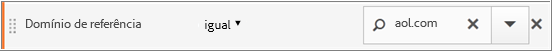

Em contraste com a dimensão Páginas, o valor do Domínio de referência é vinculado a cada página nessa visita. Por exemplo, o visitante abaixo chega na Página inicial a partir de um site de referência. Consequentemente, todas as páginas nessa visita recebem o mesmo valor de domínio de referência.

O segmento do *Domínio de referência é igual a aol.com* abaixo é aplicado ao **Relatório de páginas**.

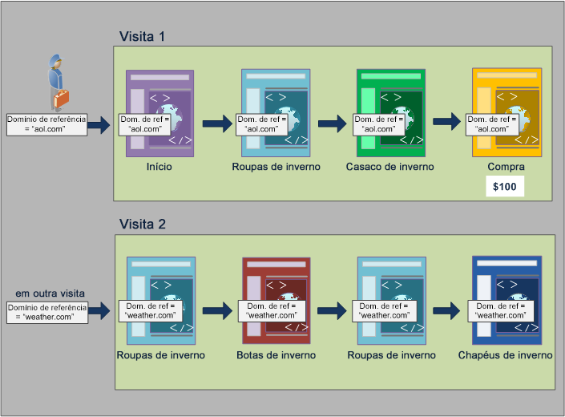

Em uma nova visita, o visitante é enviado de outro site. Consequentemente, todas as páginas na nova visita são atribuídas o novo valor de domínio para cada visualização de página.

**Relatar a partir do Contêiner de ocorrências**

Como todas as visualizações de página na mesma visita são atribuídas o mesmo valor de Domínio de referência, relatado no nível de contêiner de Ocorrência, onde *Domínio de referência = &quot;aol.com&quot;* retorna todas as páginas listadas na tabela abaixo.

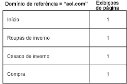

Exibindo dados do contêiner de Ocorrência, um pouco mais de 92.000 visualizações de página foram visualizadas em mais de 33.000 visitas por mais de 32.000 visitantes. Em média, há três visualizações de página em cada visita e aproximadamente todas as visitas foram de visitantes únicos.

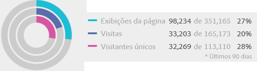

**Relatar a partir do Contêiner de visitas**

Se a mesma condição é filtrada no contêiner Visita para um relatório Páginas, então todas as páginas na visita, onde *Domínio de referência = &quot;aol.com&quot;* é verdadeiro. Como o valor do domínio de referência é definido no nível de visita, os relatórios nos níveis de Visualização de página e Visita são os mesmos.


Nesse exemplo, como todas as páginas têm o mesmo valor de domínio de referência com base na visita, o relatório do nível do contêiner de Visita é (quase) o mesmo do relatório do contêiner de Visualização de página (com um pequeno deslocamento—98, 234 a 98.248—devido a anomalias de dados).


**Relatar a partir do Contêiner de visitantes**

Do contêiner de Visitante, o Relatório de página lista todas as páginas visualizadas por qualquer visitante, onde o *Domínio de referência é igual a &quot;aol.com&quot;* é verdadeiro. Consequentemente, se um visitante tinha *&quot;aol.com&quot;* como um domínio de referência a qualquer momento no histórico (no período de tempo definido), então todas as páginas no contêiner de Visitante, incluindo as visualizações de página em outras visitas, serão listadas. Mesmo páginas que não correspondem à condição primária serão listadas no relatório, pois essas páginas estão incluídas no contêiner de Visitante. Todas as páginas no contêiner de Visitantes serão listadas, mesmo se ocorreram anteriormente ou não atenderam especificamente às condições.

Em um relatório Domínio de referência, *Domínio de referência = &quot;aol.com&quot;* é verdadeiro em quatro visualizações de página, mas *Domínio de referência = &quot;weather.com&quot;* é verdadeiro em outras páginas com ocorrência do visitante. A partir do contêiner do Visitante, você obtém uma lista de Visitantes, onde &quot;aol.com&quot; é verdadeiro, mas também fornece as páginas nas quais o domínio de referência é &quot;weather.com&quot;, não o valor que correspondeu a solicitação inicial no segmento.

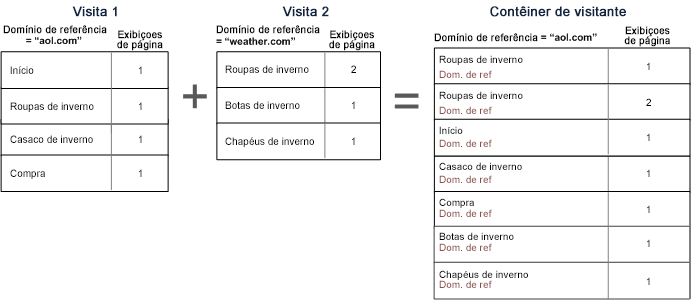

Quando você visualize dados do contêiner de Visitante, observe que as visualizações de página aumentaram significativamente (de 98.248 a 112.925). Isso ocorre devido a todas as visualizações de página do visitante, incluindo aquelas com outros valores do domínio de referência salvo no nível do contêiner de Visitante, foram listadas (bem como as visitas adicionar por esse visitante, aumentando visitas de 33.203 a 43.448).

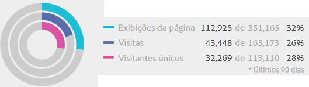

Em resumo,

* O contêiner de Visita retorna todas as páginas visualizadas em uma visita onde pelo menos uma página atende aos critérios. Portanto, se uma página é visualizada somente na visita 1 no dia 1, então todas as páginas visualizadas na visita inteira são incluídas nos dados.
* Tenha cuidado quando a condição que você está segmentando está em uma eVar ou outro tipo de variável persistente. Por exemplo, você pode usar a condição &quot;onde a campanha contém email&quot; e expira após 7 dias. Portanto, se a campanha é definida na primeira visita, ela persistirá por mais 7 dias. Cada visita será incluída embora a campanha seja definida somente na primeira visita. As outras visitas também serão incluídas (enquanto estiverem no intervalo de datas do relatório). Se você deseja impedir que valores persistentes sejam incluídos, use a &quot;instância de&quot; do evento, ou uma variável Prop equivalente, se disponível.

