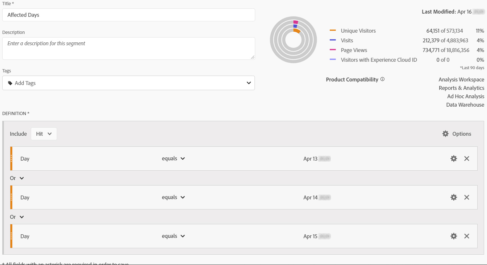
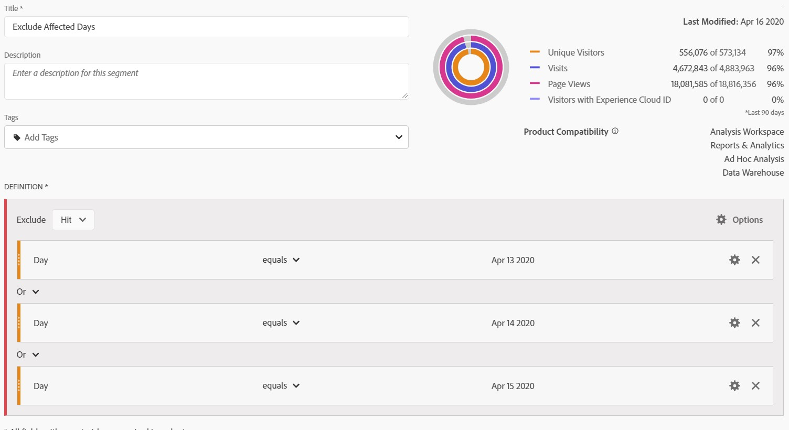

# Excluir datas específicas na análise

Se você tiver dados [afetados por um evento](/help/technotes/event-impacted.md), poderá usar um segmento para excluir quaisquer intervalos de datas que não deseja incluir em seus relatórios. A segmentação de datas impactadas no evento pode ajudar a impedir que sua organização tome decisões sobre dados parciais.

## Isole os dias afetados

Crie um segmento que isola o dia ou o intervalo de datas afetados. Esse segmento é útil se você quiser focar apenas nos dias problemáticos para ver mais informações sobre seu impacto.

1. Abra o construtor de segmentos indo até **[!UICONTROL Components]** > **[!UICONTROL Segments]** e, em seguida, clique em **[!UICONTROL Add]**.
2. Arraste a dimensão &#39;Dia&#39; para a tela de definição e defina-a como o dia que deseja isolar.
3. Repita a etapa acima para todos os dias que você deseja isolar em seu relatório.

A Adobe recomenda usar os componentes de dimensão laranja, e não os componentes de intervalo de datas violeta. Se você usar componentes de intervalo de datas violeta, eles substituirão o intervalo de calendário do projeto:

## Excluir dias afetados

Crie um segmento que exclua o dia ou o intervalo de datas afetados. Esse segmento é útil se você quiser excluir os dias que ocorreram problemas para minimizar o impacto no relatórios geral.

1. Abra o construtor de segmentos indo até **[!UICONTROL Components]** > **[!UICONTROL Segments]** e, em seguida, clique em **[!UICONTROL Add]**.
2. Na parte superior direita da tela de definição do segmento, clique em **[!UICONTROL Options]** > **[!UICONTROL Exclude]**.
3. Arraste a dimensão &#39;Dia&#39; para a tela de definição e defina-a como o dia que deseja remover.
4. Repita a etapa acima para cada dia que você deseja remover no relatório.

## Usar esses segmentos em relatórios

Depois de criar o segmento excluído, você pode usá-lo exatamente como usaria outros segmentos.

### Comparar segmentos em um relatório de tendências

Você pode aplicar o segmento &quot;Dias afetados&quot; e &quot;Excluir dias afetados&quot; em um relatório para compará-los lado a lado. Arraste ambos os segmentos acima ou abaixo de uma métrica para compará-los:

### Aplicar o segmento excluído a um projeto

Você pode aplicar o segmento &quot;Excluir dias afetados&quot; a um projeto do Workspace. Arraste o segmento excluído para a seção Área de trabalho chamada *Solte um segmento aqui*.

>[!TIP] Inclua uma observação sobre os dados excluídos na descrição do painel para ajudar aqueles que visualizam o relatório. Clique com o botão direito do mouse no título de um painel e clique em **[!UICONTROL Edit description]**.

### Usar o segmento excluído em um conjunto de relatórios virtual

Você pode usar o segmento em um conjunto [de relatórios](../../vrs/vrs-about.md) Virtual para excluir os dados de forma mais conveniente. Essa opção é ideal, pois você não precisa se lembrar de aplicar o segmento para cada relatório que inclui o intervalo de datas afetado. Se você já usar os conjuntos de relatórios virtuais como fonte de dados primária, poderá adicionar o segmento a um VRS existente.

1. Navegue até **[!UICONTROL Components]** > **[!UICONTROL Virtual report suites]**.
2. Clique em **[!UICONTROL Add]**.
3. Insira o nome e a descrição desejados para o conjunto de relatórios virtual.
4. Arraste o segmento excluído para a área rotulada **[!UICONTROL Add segment]**.
5. Clique **[!UICONTROL Continue]** no canto superior direito e clique em **[!UICONTROL Save]**.

