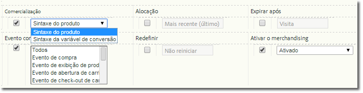

# Implementar uma variável de comercialização

Descreve como ativar e implementar uma variável de comercialização.

## Ativar uma variável de comercialização {#section_331B41FF5AED42F2AEFE043DD60238C7}

Merchandising can be enabled for any custom eVar on the **[!UICONTROL Admin Tools]** &gt; **[!UICONTROL Report Suites]** &gt; **[!UICONTROL Conversion Variables]** page (you no longer need to call Adobe):



| Configuração | Descrição |
|--- |--- |
| Expirar após | Determina por quanto tempo os valores de comercialização devem persistir. |
| Comercialização | Sintaxe do produto: o valor é definido em s.products.    Sintaxe de variável de conversão: o valor é definido na s.eVar de comercialização designada. |
| Evento de vinculação de comercialização (somente sintaxe de variável de conversão) | Indica quando um produto deve ser vinculado à categoria de comercialização atual. Vários eventos podem ser selecionados ao pressionar e segurar Ctrl e clicar em vários itens na lista.   Observação: quando "Sintaxe de produto" é selecionada, não é possível escolher um evento (está desativado, mas não esmaecido). Você pode selecionar um evento somente quando a "Sintaxe de variável de conversão" é selecionada. |

## Como implementar usando a sintaxe de produto {#section_2774578D09CE40A093CB0D0A294DBF7C}

Quando a Sintaxe de produto está ativada, a categoria de comercialização é preenchida diretamente na variável de produtos, portanto, não é necessário selecionar e configurar um evento de vinculação. Este é o método recomendado e deve ser utilizado, salvo quando o valor não está disponível para definição em `s.products` quando o evento bem-sucedido ocorre.

* **Sintaxe**

```js
  s.products="category;product;quantity;price;event_incrementer; 
<codeph outputclass="syntax">
  eVarN=merch_category| 
 <codeph outputclass="syntax">
   eVarM=merch_category2" 
 </codeph outputclass="syntax"> 
</codeph outputclass="syntax">
```

* **Exemplo**

```js
  s.events="prodView" 
  s.products=";Fernie Snow Goggles;;;; 
<codeph outputclass="syntax">
  eVar1=goggles" 
   In 
</codeph outputclass="syntax">
```

O valor "óculos" para eVar1 é atribuído ao produto "Óculos de neve Fernie". Todos os eventos subsequentes bem-sucedidos (anúncios de produtos, check-outs, compras e assim por diante) que envolvem este produto são creditados a "óculos".

## Como implementar usando uma sintaxe de variável de conversão {#section_6AE10F69F4A14636AB050BEA89A34E4E}

A Sintaxe de variável de conversão deve ser usada quando o valor da eVar não está disponível para definição em `s.products`. Normalmente, isso significa que sua página não tem o contexto do canal de comercialização ou método de pesquisa. Nesses casos, você deve definir a variável de comercialização antes de chegar na página do produto e o valor persiste até o evento de vinculação ocorrer.

Quando o evento de vinculação selecionado durante a configuração ocorre, o valor persistido da eVar está associado ao produto. Por exemplo, se prodView é especificado como o evento de vinculação, a categoria de comercialização está vinculada à lista de produtos atual somente quando o evento ocorre. Somente eventos de vinculação subsequentes podem atualizar uma eVar de comercialização já atribuída a um produto.

* **Sintaxe** Na mesma página ou na anterior antes do evento de vinculação:

   ```js
   s.eVar1="merchandising_category"
   ```

   Na página onde o evento de vinculação ocorre:

   ```js
   s.events="prodView" 
   s.products="category;product"
   ```

* **Exemplo** Página 1 da visita:

   ```js
   s.eVar1="Outdoors:Ski Goggles"
   ```

   Página 2 da visita:

   ```js
   s.events="prodView" 
   s.products=";Fernie Snow Goggles"
   ```

   O valor "Exterior:Óculos de Ski" para eVar1 está atribuído ao produto "Óculos de neve Fernie". Todos os eventos subsequentes bem-sucedidos (anúncios de produtos, check-outs, compras e assim por diante) que envolvem este produto são creditados a "óculos".

Além disso, o valor atual da variável de comercialização está vinculado a todos os produtos subsequentes até que uma destas condições seja atendida:

* eVar expira (com base na configuração "Expirar após")
* A eVar de comercialização é substituída por um novo valor.

Para obter mais informações, consulte "[Merchandising da sintaxe de conversão avançada](https://analyticsdemystified.com/adobe-analytics/advanced-conversion-syntax-merchandising/)" em [!DNL analyticsdemystified.com].
