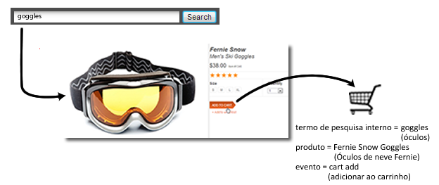
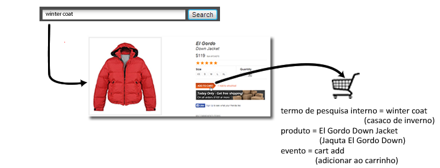

# Visão geral das variáveis de comercialização

Ao medir o êxito de campanhas externas ou termos de pesquisa externos, normalmente você deseja um único valor para receber crédito por qualquer evento bem-sucedido que possa ocorrer. Por exemplo, se um cliente clica em um link de uma campanha de email para visitar seu site, todas as compras efetuadas como resultado devem ser creditadas à campanha.

E quanto as eventos que são motivados por pesquisa interna ou por navegação de categoria quando um cliente procura por vários itens? Por exemplo, um cliente pesquisa por "óculos" em seu site e, em seguida, adiciona um par ao carrinho:

Antes do checkout, o cliente pesquisa por "casaco de inverno" e, em seguida, adicionar uma jaqueta ao carrinho:

Quando esta compra é concluída e considerando que o local não mudou de Mais recente, você terá uma pesquisa interna por "casaco de inverno" creditada com a compra de um par de óculos. Bom para "casaco de inverno", mas ruim para decisões de marketing:

| Termo de pesquisa interna | Receita |
|---|---|
| casaco de inverno | $157 |

**Como as variáveis de comercialização resolver esse problema**

As variáveis de comercialização entre categorias, ou "evars de comercialização", permitem que você atribua o valor atual de uma eVar a um produto quando um evento bem-sucedido ocorre. Este valor permanece vinculado ao produto, mesmo se um ou mais valores novos forem definidos posteriormente para essa eVar específica.

Se comercialização for ativada para a eVar no exemplo anterior, o termo de pesquisa "óculos" é vinculado aos Óculos de neve Fernie, e o termo de pesquisa "casado de inverno" é vinculado à jaqueta El Gordo Down. As variáveis de comercialização alocam receitas no nível do produto, portanto, cada termo recebe crédito pela quantidade de receita do produto ao qual o termo foi associado:

| Termo de pesquisa interna | Receita |
|---|---|
| casaco de inverno | $119 |
| óculos | $38 |

