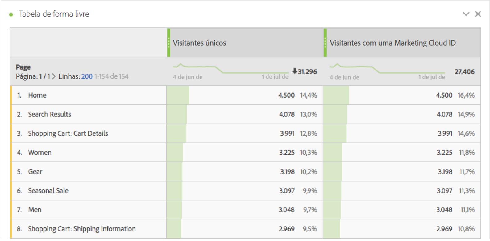
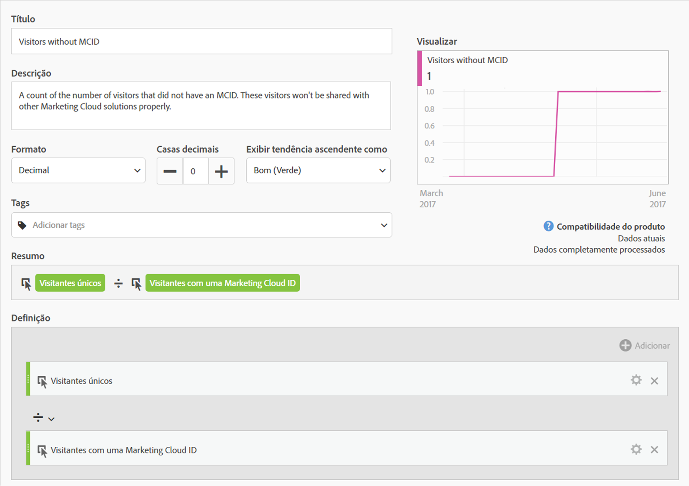
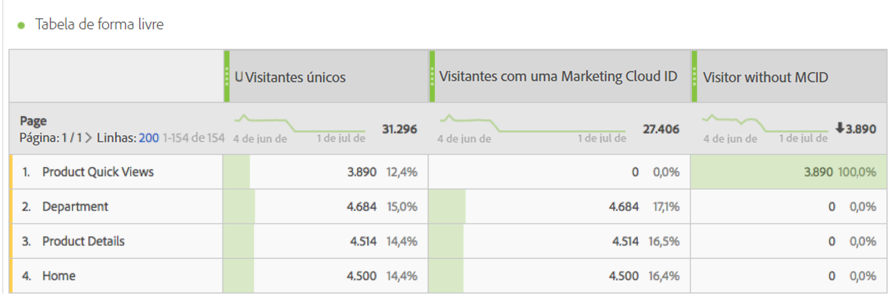
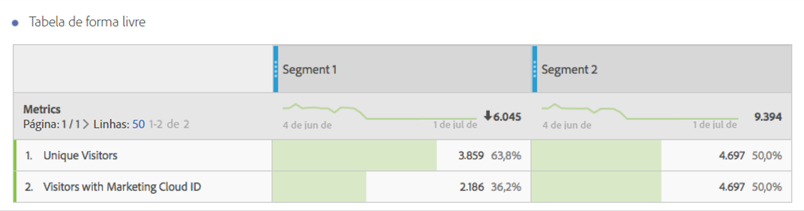

# Visitantes com Experience Cloud ID

Disponível na Analysis Workspace e no Construtor de segmentos.

Exibe o número de visitantes com uma Experience Cloud ID. É possível compreender quais páginas têm o Serviço de identidade implantado e quantos visitantes podem ser compartilhados com outras soluções da Experience Cloud. Também é possível usar essa métrica em segmentos que são compartilhados com a Experience Cloud.

>[!IMPORTANT]
>
>Para que essa métrica apareça, você deve estar executando o [Serviço de identidade](https://marketing.adobe.com/resources/help/pt_BR/mcvid/) para o conjunto de relatórios.

## Depurar a configuração da Experience Cloud ID {#section_679E62142A3E46548FF8FBDA46568005}

A métrica [!UICONTROL Visitantes com Experience Cloud ID] é uma métrica útil no Adobe Analytics, criada para ajudá-lo a encontrar e depurar a configuração do [!UICONTROL Serviço de identidade]. A métrica é uma contagem do número total de visitantes em um conjunto de relatórios ao qual foi designado uma Experience Cloud ID do Serviço de identidade. Essa métrica pode ser muito útil ao diagnosticar o porquê de certas integrações da Experience Cloud não estarem compartilhando quantos visitantes conforme o esperado ou identificando áreas do site que podem ainda não ter a MCID implantada.

Para usar a métrica Visitantes com Experience Cloud ID, apenas arraste-a para qualquer relatório como uma métrica, como neste relatório de [!UICONTROL Páginas]:

Nesse exemplo, note que cada página possui o mesmo número de Visitantes únicos quanto de Visitantes com uma Experience Cloud ID. No entanto, o número total de Visitantes únicos é maior que o número total de Visitantes com Experience Cloud ID. Para encontrar as páginas que não estão configurando a MCID para todos os visitantes, [crie uma métrica calculada](https://marketing.adobe.com/resources/help/pt_BR/analytics/calcmetrics/cm_build_metrics.html) com a definição a seguir:

Ao adicionar a métrica calculada ao relatório, é possível classificar o relatórios de Páginas, de forma que as páginas com os maiores números de visitantes sem MCID apareçam:

Agora é possível visualizar rapidamente que as páginas “Exibições rápidas do produto” não estão adequadamente implementadas com o Serviço de identidade e devem ser atualizadas o quanto antes. Um relatório semelhante pode ser construído em qualquer tipo de dimensão, tal como tipo de navegador, seção do site ou tipos de conteúdo.

Uma vez identificadas as páginas que possuem visitantes sem uma MCID, você poderá informar à sua equipe de implantação, para que eles possam corrigir essas páginas.

Em alguns casos, é possível encontrar um pequeno número de MCIDs que não estão configuradas para alguns visitantes, mesmo que o Serviço da MCID tenha sido implantando na página. Nesses casos, é possível que aconteça devido a um erro comum na configuração do JavaScript do Analytics ou na configuração do DTM na qual a função AppMeasurement é iniciada antes de fornecer um conjunto de relatórios. Para evitar essas falhas, lembre-se de [inserir o código de núcleo do AppMeasurement](https://marketing.adobe.com/resources/help/en_US/sc/implement/dtm/t_appmeasurement-code.html) corretamente.

Lembre-se de que qualquer segmento baseado na página &quot;Exibições rápidas do produto&quot; (como mostrado acima) compartilhada com a Experience Cloud possivelmente terá uma taxa de correspondência muito baixa com outras soluções da Experience Cloud. Para verificar a cobertura da MCID para qualquer segmento, é possível construir um relatório como o apresentado a seguir:

Nessa tabela, que compara o número de Visitantes únicos com o número de Visitantes com uma Experience Cloud ID, é fácil visualizar que o &quot;Segmento 1&quot; não possui 100% de cobertura MCID, enquanto o &quot;Segmento 2&quot; possui. Isso significa que se eu compartilhasse o Segmento 1 com a Experience Cloud, poderia compartilhar com apenas 2.186 do total de 3.859 visitantes.
