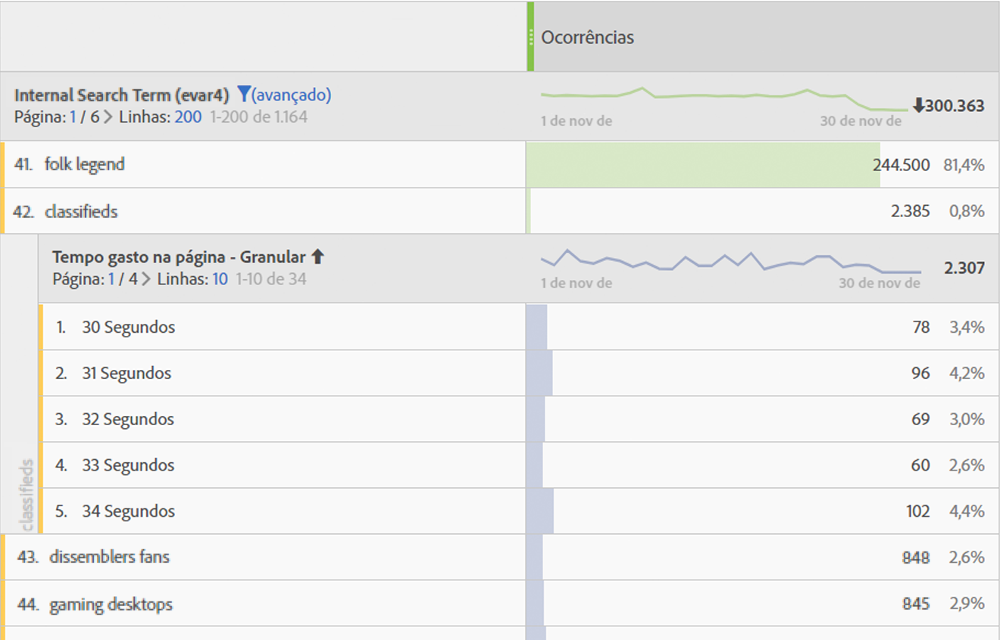
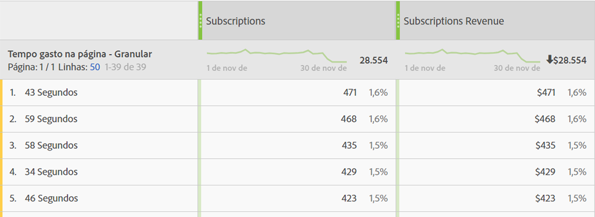

# [!UICONTROL Tempo gasto]

Várias métricas e dimensões [!UICONTROL de tempo gasto] são oferecidas nos produtos do Adobe Analytics.

## [!UICONTROL Métricas 'Tempo gasto']

| Métrica | Definição | Disponível em |
|---|---|---|
| [!UICONTROL Total de segundos gastos] | Representa a quantidade total de tempo que os visitantes interagem com um item de dimensão específico. Inclui a instância de um valor e persistência em todas as ocorrências subsequentes. No caso de props, o tempo gasto também é contado em relação a eventos de link subsequentes. | Analysis Workspace, Relatórios e análises, Construtor de relatórios (chamado de "tempo total gasto"), Data Warehouse, Análise ad hoc |
| [!UICONTROL Tempo gasto por visita] (segundos) | *Total de segundos gastos / (rejeições de visitas)* Representa a quantidade média de tempo que os visitantes interagem com um item de dimensão específico durante cada visita. | Analysis Workspace, Relatórios e análises, Análise ad hoc |
| [!UICONTROL Tempo gasto por visitante] (segundos) | *Total de segundos gastos /* visitante únicoRepresenta a quantidade média de tempo que os visitantes interagem com um item de dimensão específico ao longo da vida do visitante (duração do cookie). | Analysis Workspace, Relatórios e análises, Análise ad hoc |
| [!UICONTROL Tempo médio gasto no site] (segundos) | Representa a quantidade total de tempo que os visitantes interagem com um item de dimensão específico, por sequência com um item de dimensão. Não está limitado a médias de “site” como o nome sugere. Consulte a seção "Como o tempo gasto é calculado" para obter mais informações sobre as sequências. **Observação**: Essa métrica muito provavelmente difere de "Tempo gasto por visita" em um nível de item de dimensão devido às diferenças no denominador no cálculo. | Analysis Workspace, Relatórios e análises (mostrado em minutos), Construtor de relatórios (mostrado em minutos), Análise ad hoc |
| [!UICONTROL Tempo médio gasto na página] | Métrica descontinuada.  Em vez disso, recomendamos que você use "Tempo médio gasto no site" se o tempo médio de um item de dimensão for necessário. | Report Builder (quando uma dimensão está na solicitação) |
| [!UICONTROL Duração]total da sessão, t.c.p. Duração da sessão [!UICONTROL anterior] | Somente SDK do aplicativo para dispositivo móvel.  Determinada na próxima vez que o aplicativo for inicializado, para a sessão anterior. Calculado em segundos, esta métrica não contabiliza quando o aplicativo está em segundo plano, somente quando está em uso. Esta é uma métrica em nível de sessão. Exemplo: Instalamos o aplicativo ABC, iniciamos e o usamos por 2 minutos e então fechamos o aplicativo. Nenhum dado é enviado sobre este tempo de sessão. The next time we launch the app, [!UICONTROL Previous Session Length] will be sent with a value of 120. | Analysis Workspace, Relatórios e análises, Construtor de relatórios, Interface do usuário do Mobile Services |
| [!UICONTROL Duração] média da sessão (móvel) | *Duração total da sessão / (Inicializações - Primeiras inicializações)Somente SDK do aplicativo* móvel. Esta é uma métrica em nível de sessão. | Construtor de relatórios, interface do usuário do Mobile Services, Análise ad hoc |

## Dimensões "Tempo gasto"

| Dimensão | Definição | Disponível em |
|---|---|---|
| [!UICONTROL Tempo gasto por visita - granular] | O tempo total gasto durante a visita, truncado no segundo mais próximo e aplicado a cada ocorrência que fez parte da visita. Esta é uma dimensão em nível de visitas. | Analysis Workspace, Análise ad hoc |
| [!UICONTROL Tempo gasto por visita - sementado] | A dimensão granular segmentada em 9 intervalos diferentes. Esta é uma dimensão em nível de visitas. Os intervalos incluem:<ul><li>Menos de 1 minuto</li><li>1 a 5 minutos</li><li>5 a 10 minutos</li><li>10 a 30 minutos</li><li>30 a 60 minutos</li><li>1 a 2 horas</li><li>2 a 5 horas</li><li>5 a 10 horas</li><li>10 a 15 horas</li></ul>**Observação**: Não pode haver cestos maiores que esse, pois uma visita expira após 12 horas de atividade. | Analysis Workspace, Relatórios e análises, Construtor de relatórios, Análise ad hoc |
| [!UICONTROL Tempo gasto na página - granular] | O tempo total gasto em cada ocorrência, truncado no segundo mais próximo. Esta é uma dimensão em nível de ocorrência e inclui exibições de página e eventos de link. Apesar do nome, não está limitado à dimensão "página". | Analysis Workspace, Análise ad hoc |
| [!UICONTROL Tempo gasto na página - segmentado] | A dimensão granular segmentada em 10 intervalos diferentes; entretanto, a dimensão segmentada somente conta exibições de página (e exclui eventos de links). Essa é uma dimensão em nível de ocorrências. Os intervalos incluem:<ul><li>menos de 15 segundos</li><li>15 a 29 minutos</li><li>30 a 59 minutos</li><li>1 a 3 minutos</li><li>3 a 5 minutos</li><li>5 a 10 minutos</li><li>10 a 15 minutos</li><li>15 a 20 minutos</li><li>20 a 30 minutos</li><li>mais de 30 minutos</li></ul> | Analysis Workspace, Relatórios e análises, Análise ad hoc |

## Como o 'Tempo gasto' é calculado

O Adobe Analytics usa valores explícitos (incluindo eventos de link e exibições de vídeo) para calcular o [!UICONTROL Tempo gasto].

>[!NOTE]
>
>Without link events like [!UICONTROL Video Views] or [!UICONTROL Exit Links], time spent on the last hit of a visit cannot be known. For similar reasons, [!UICONTROL Bounce Visits] (i.e. visits with a single hit) also does not have a 'time spent' associated with it.

The **numerator** in all time spent calculations is total seconds spent.

The **denominator** is not available as a separate metric in Adobe Analytics. Para métricas de "tempo gasto" em nível de ocorrência, o denominador é sequências. Uma sequência é um conjunto consecutivo de ocorrências em que uma determinada variável contém o mesmo valor (seja por definição, expansão para a frente ou persistente). "Expandir para frente" refere-se à persistência de props entre exibições de página (ou seja, em eventos de link subsequentes), para fins de cálculo do tempo gasto.

* For example, in the case of [!UICONTROL Page Name] or other dimensions at the hit level, the denominator is essentially [!UICONTROL 'Instances'] or [!UICONTROL 'Page Views'], but with reloads and unset values (e.g. link events) counted as a single interaction (a sequence).

* As ocorrências de rejeição e saída também são removidas do denominador porque o 'tempo gasto' não pode ser conhecido.

## Perguntas frequentes

**T1: Todas as métricas de "tempo gasto" podem ser aplicadas a qualquer dimensão?**

A: As métricas de "tempo gasto" que podem ser aplicadas a qualquer dimensão são:

* [!UICONTROL Total de segundos gastos]

* [!UICONTROL Tempo gasto por visita] (segundos)

* [!UICONTROL Tempo gasto por visitante] (segundos)

* [!UICONTROL Tempo médio gasto no site] (segundos)

**T2: Qual dimensão de tempo gasto é melhor usada em detalhamentos com outras dimensões?**

A: The [!UICONTROL Time Spent on Page – granular] dimension is a hit-level dimension. Detalhar por outra dimensão fornecerá os segundos que uma ocorrência durou, em que a dimensão detalhada também estava presente.
No exemplo abaixo, o termo de pesquisa "classificados" está associado a tempos de ocorrência de 54 segundos, 59 segundos etc., talvez indicando que os visitantes estão gastando tempo lendo o conteúdo retornado para esse termo.

**T3: Qual métrica é apropriada em relação à dimensão de[!UICONTROL Tempo gasto na página - granular]?**

A: Qualquer métrica. A dimensão mostrará o tempo gasto na ocorrência exata em que o evento ocorreu. Um tempo gasto maior significa que um visitante permaneceu mais tempo na página (ocorrência) em que o evento ocorreu.

**T4: Qual é a diferença entre o Tempo[!UICONTROL médio gasto no site]e o[!UICONTROL Tempo gasto por visita]?**

A: A diferença é o denominador na métrica:

* [!UICONTROL O tempo médio gasto no site] usa as sequências que incluem um item de dimensão.

* [!UICONTROL O tempo gasto por visita] usa a contagem de visitas

Como resultado, essas métricas também podem fornecer resultados semelhantes em nível de visita, mas serão diferentes em nível de ocorrência.

## Exemplos de cálculos de [!UICONTROL Tempo gasto]

Suponha que o seguinte conjunto de chamadas de servidor seja para um único visitante em uma única visita:

| Ocorrência de visita nº | 1 | 2 | 3 | 4 | 5 | 6 | 7 |
|---|---|---|---|---|---|---|---|
| **Tempo decorrido da visita (em segundos)** | 0 | 30 | 80 | 180 | 190 | 230 | 290 |
| **Segundos gastos** | 30 | 50 | 100 | 10 | 40 | 60 | - |
| **Tipo de ocorrência** | Página | Link | Página | Página | Página | Página | Página |
| **Nome da página** | Início | - | Produto | Início | Início (recarga) | Carrinho | Confirmação de pedido |
|  |  |  |  |  |  |  |  |
| **prop1** | A (conjunto) | A (distribuir para a frente) | não definido | B (conjunto) | B (conjunto) | A (conjunto) | C (conjunto) |
| **segundos gastos da prop1** | 30 | 50 | - | 10 | 40 | 60 | - |
|  |  |  |  |  |  |  |  |
| **eVar1** | Vermelho (definido) | Vermelho (persistente) | (expirado) | Azul (definido) | Azul (definido) | Azul (persistente) | Vermelho (definido) |
| **segundos gastos da eVar1** | 30 | 50 | - | 10 | 40 | 60 | - |

Com base na tabela acima, as métricas de tempo gasto são calculadas da seguinte forma:

| prop1 | Total de segundos gastos | Tempo gasto por visita | Tempo gasto por visitante | Contagem de sequências | Tempo médio gasto no site |
|---|---|---|---|---|---|
| A | 30+50+60=140 | 140/1=140 | 140/1=140 | 2 | 140/2=70 |
| B | 10+40=50 | 50/1=50 | 50/1=50 | 1 | 50/1=50 |
| C | 0 | 0 | 0 | 0 | 0 |
| Tempo não atribuído | 100 | - | - | - | - |

| eVar1 | Total de segundos gastos | Tempo gasto por visita | Tempo gasto por visitante | Contagem de sequências | Tempo médio gasto no site |
|---|---|---|---|---|---|
| Vermelho | 30+50=80 | 80/1=80 | 80/1=80 | 1 | 80/1=80 |
| Azul | 10+40+60=110 | 110/1=110 | 110/1=110 | 1 | 110/1=110 |
| Tempo não atribuído | 100 | - | - | - | - |

Tempo gasto por visita (granular): 290Tempo gasto na página (granular): 10, 30, 40, 50, 60, 100

Algumas observações adicionais em apoio ao exemplo:

* Todos os cálculos de tempo gasto são baseados no tempo decorrido da visita, que começa em zero na primeira ocorrência da visita.

* "Segundos gastos" é a diferença entre o carimbo de data e hora da ocorrência atual e o carimbo de data e hora da próxima ocorrência. Como resultado, a última ocorrência da visita (e rejeições) não tem tempo gasto.

* Uma “sequência” é um conjunto consecutivo de ocorrências em que uma determinada variável contém o mesmo valor (seja por definição, expansão para a frente ou persistente). Por exemplo, prop1 “A” tem duas sequencias: ocorrências 1 e 2 e ocorrência 6. Os valores na última ocorrência da visita não iniciam uma nova sequência porque a última ocorrência não tinha tempo gasto. Tempo médio gasto no site usa as sequências no denominador.

   * Para fins de tempo gasto apenas, as props são "expandidas para frente" das ocorrências de página para ocorrências de link subsequentes, conforme mostrado acima para prop1 na ocorrência 2. Isso permite que o valor definido para prop1 na ocorrência 1 (“A”) acumule o tempo gasto na ocorrência 2.

   * As eVars acumulam o tempo gasto em qualquer ocorrência na qual a eVar está definida ou persistente. A persistência de eVar é definida pelas configurações de eVar em Analytics &gt; Administrador.

