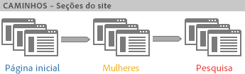
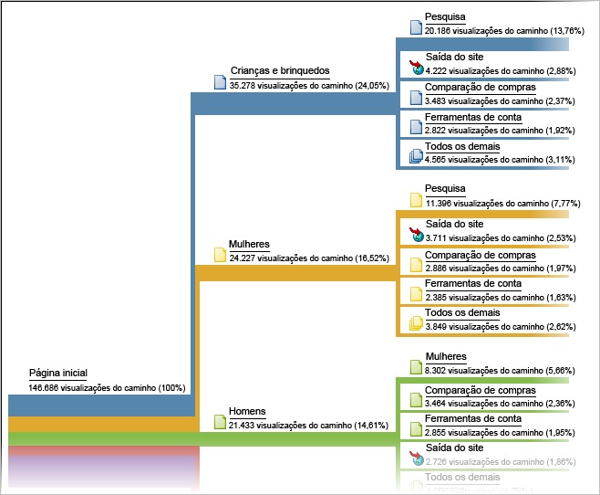

# Definição de caminho

Um grupo de relatórios com base na análise de caminho. Tecnicamente, definição de caminho significa mover de um nome de página a outro (de um valor a outro).

Use o [Fluxo da Analysis Workspace](https://marketing.adobe.com/resources/help/en_US/analytics/analysis-workspace/flow.html) para opções de caminho mais flexíveis.

> [!NOTE] Observação: para permitir a definição de caminho, vá para **[!UICONTROL Administração &gt; Conjuntos de relatórios &gt; Editar configurações &gt; Tráfego &gt; Variáveis de tráfego]**. Para habilitar o caminho nos relatórios do Servidor e da Seção do site, entre em contato com o Atendimento ao Cliente.

Se você deseja saber a ordem em que os valores são coletados, então é necessário ativar a definição de caminho para a variável que coleta esses dados. A definição de caminho é ativada por padrão para as páginas. A definição de caminho não é ativada para quaisquer props por padrão, pois só é adequada em alguns casos. Entre em contato com o atendimento ao cliente para ativar a definição de caminho em uma prop.

> [!NOTE] Na Ad Hoc Analysis, ao ativar classificações em uma prop, as métricas de definição de caminho se tornam disponíveis para todas as classificações definidas para a prop ativada.

**Exemplo - Definição de caminho em seções do site**

Ativar a definição de caminho para a variável *`s.channel`* permite que você acompanhe como os visitantes do site se movem entre Seções do site (conforme o valor muda).



A definição de caminho fica então disponível em vários relatórios de caminho, como o [!UICONTROL Fluxo de próxima seção do site], que exibe como os visitantes se movem pelos grupos de páginas ou seções de site.



**Exemplo - Definição de caminho em pesquisas**

Esse mesmo conceito de ir de um valor a outro valor também se aplica a outras variáveis de tráfego, incluindo *`s.props`*. Por exemplo, se você ativar a definição de caminho do Termo de pesquisa interna *`s.prop`*, poderá ver o caminho que os visitantes seguem pelos termos de pesquisa.

**Exemplo - Definição de caminho por status de logon**

Você pode desejar saber como as pessoas caminham por site com base no status de logon de um visitante. Para ver essa informação, você não deve consultar os relatórios de definição de caminho para status de logon, pois eles mostrariam somente como os visitantes alteraram valores nesse relatório, ou como os visitantes podem ter se desconectado. Em vez disso, concatene o valor do segmento com a variável *`s.pageName`* e, então, defina o caminho da variável resultante. Este é um exemplo de código para definição de caminho de página por status do membro:

```js
s.pageName="Home Page"; 
s.prop18="Gold"; // Member Status 
s.prop19=s.prop18 + ":" + s.pageName;
```

Em seguida, ative a definição de caminho para *`s.prop19`* para ver como os membros caminham pelas páginas.

> [!NOTE] Se você usar a análise ad hoc, você pode segmentar os caminhos de página sem a necessidade de concatenar valores de segmentos e aplicar qualquer segmento aos relatórios de definição de caminho.

