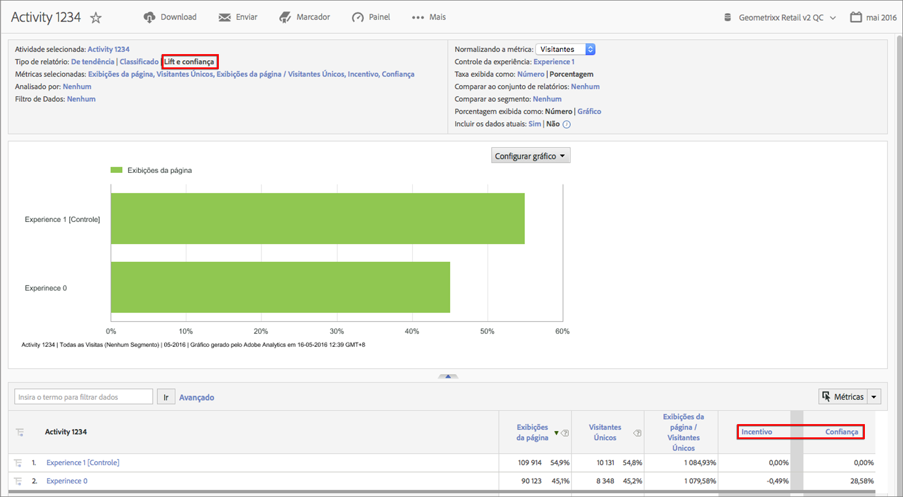

# Target Lift e Confidence

Você poderá medir o sucesso das campanhas no Adobe Analytics da mesma maneira que fazia no [!DNL Target Classic] antigamente.

**[!UICONTROL Análises]** > **[!UICONTROL Relatórios]** > **[!UICONTROL Exibir todos os relatórios]** > **[!UICONTROL Adobe Target]** > **[!UICONTROL Análises do Target]** > **[!UICONTROL Atividades do Target]** .

Há mais informações sobre [Lift](https://marketing.adobe.com/resources/help/pt_BR/target/target/c_estimating_lift_in_revenue.html) e [Confidence](https://marketing.adobe.com/resources/help/pt_BR/rec/c_Confidence_Level_and_Confidence_Interval.html) na documentação do Adobe Target.

Para calcular Lift e Confidence:

1. No relatório **[!UICONTROL Atividades da meta]**, clique em uma atividade para exibir seus detalhes.
1. Em Tipo de relatório, selecione **[!UICONTROL Lift e Confidence]**.
1. Clique em **[!UICONTROL Exibir métricas]** para adicionar uma métrica. Não é possível adicionar mais de uma métrica a este tipo de relatório, já que a prática recomendada é avaliar um teste com base em uma única métrica. A adição de métricas causaria desorganização e reduziria o sinal do teste.
1. (Optional) Em **[!UICONTROL Métrica de normalização]**, selecione uma das seguintes opções: Visitantes, Visitas ou Impressões. Na maioria das vezes, Visitantes será o padrão.

1. O relatório adicionará essas métricas, incluindo o raio entre a métrica e a métrica de normalização.

## Configurações do relatório  {#section_3508439E09CA4E38B2EA309BA477C01D}

<table id="table_0FBB257C96454CDA82D487DC68459C13"> 
 <thead> 
  <tr> 
   <th colname="col1" class="entry"> Configuração </th> 
   <th colname="col2" class="entry"> Descrição </th> 
  </tr> 
 </thead>
 <tbody> 
  <tr> 
   <td colname="col1"> Atividade selecionada </td> 
   <td colname="col2"> A atividade do Target que você está visualizando no momento e para a qual Confidence e Lift estão sendo calculados. </td> 
  </tr> 
  <tr> 
   <td colname="col1"> Tipo de relatório </td> 
   <td colname="col2"> É aqui que você seleciona Lift e Confidence; eles aparecerão como métricas nos resultados de relatório abaixo. </td> 
  </tr> 
  <tr> 
   <td colname="col1"> Métricas selecionadas </td> 
   <td colname="col2"> Exibe a métrica selecionada (no exemplo acima, Receita), a métrica de normalização (Visitantes únicos), a razão entre essas duas métricas e, por fim, os cálculos Lift e Confidence em comparação à Experiência de controle. </td> 
  </tr> 
  <tr> 
   <td colname="col1"> Analisado por </td> 
   <td colname="col2"> É possível detalhar ainda mais os relatórios, usando outros relatórios. </td> 
  </tr> 
  <tr> 
   <td colname="col1"> Filtro de dados </td> 
   <td colname="col2"> Permite aplicar filtros específicos a este relatório. </td> 
  </tr> 
  <tr> 
   <td colname="col1"> Métrica de normalização </td> 
   <td colname="col2"> Você pode normalizar usando Visitas, Visitantes ou Impressões. A métrica de normalização torna-se o denominador do cálculo “lift”. Além disso, afeta a maneira como os dados são agregados antes da aplicação do cálculo “confidence”. </td> 
  </tr> 
  <tr> 
   <td colname="col1"> Experiência de controle </td> 
   <td colname="col2"> A experiência do Target à qual está sendo comparada e para a qual o cálculo “lift” está sendo feito. </td> 
  </tr> 
  <tr> 
   <td colname="col1"> Comparar ao conjunto de relatórios </td> 
   <td colname="col2"> Permite que você escolha outros conjuntos de relatórios para comparar. </td> 
  </tr> 
  <tr> 
   <td colname="col1"> Comparar ao segmento </td> 
   <td colname="col2"> Permite que você escolha segmentos para comparar. </td> 
  </tr> 
  <tr> 
   <td colname="col1"> Percentagem exibida como número/gráfico </td> 
   <td colname="col2"> Exibe a percentagem de Lift e Confidence como um número ou gráfico. </td> 
  </tr> 
  <tr> 
   <td colname="col1"> Incluir os dados atuais </td> 
   <td colname="col2"> 
A opção Incluir dados atuais do Reports &amp; Analytics permite exibir os dados mais recentes do Analytics, geralmente antes que sejam totalmente processados e finalizados. Os dados atuais exibem a maioria das métricas comuns em minutos, fornecendo dados acionáveis para proporcionar uma tomada de decisão rápida. 
 </td> 
  </tr> 
 </tbody> 
</table>

