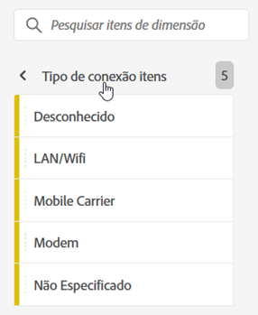
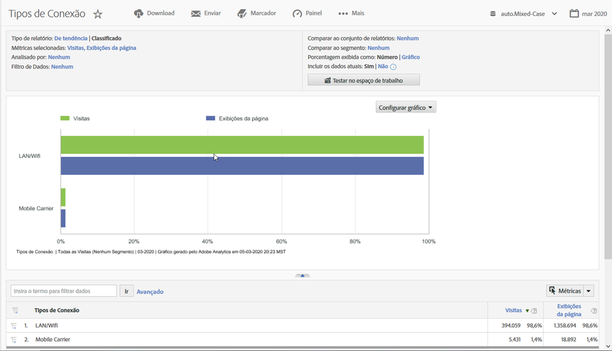

# Tipo de conexão

Exibe métricas para o tipo de conexão com a Internet, incluindo modem, LAN/Wifi, operadora de celular e assim por diante.

## Exemplo

O relatório a seguir compara os tipos de conexão das métricas [Visitas](https://docs.adobe.com/content/help/en/analytics/components/variables/metrics/metrics-visit.html) e Exibições de página:

Você pode encontrar insights adicionais sobre o tipo de conexão da operadora de celular ao exibir o Relatório [**da operadora de **](https://docs.adobe.com/content/help/en/analytics/components/variables/dimensions-reports/reports-mobile-carrier.html)celular.
