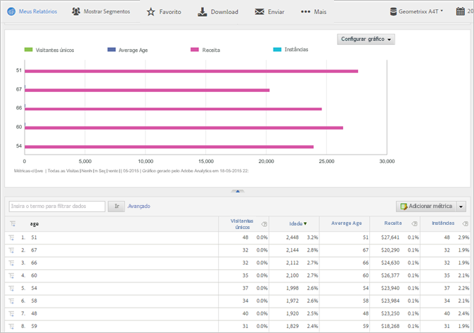

# Atributos do cliente

Perguntas frequentes do Analytics para os atributos do cliente, e como executar o relatório de atributos do cliente.

**[!UICONTROL Relatórios]** **[!UICONTROL &gt; Perfil]** do visitante &gt; Atributos **[!UICONTROL do cliente]**

Se você capturar os dados de clientes de empresas em um banco de dados de gerenciamento de relacionamento com o cliente (CRM), poderá fazer upload dos dados em uma fonte de dados do atributo do cliente na Experience Cloud. Após os dados serem carregados, é possível executar o relatório Atributos do cliente no Reports &amp; Analytics.

* [Atributos do cliente e métricas de relatórios no Analytics](../../../components/c-variables/dimensionslist/reports-customer-attributes.md#section_EF343662146B460A882D3DF772ADD86D)
* [Perguntas frequentes: atributos do cliente no Analytics](../../../components/c-variables/dimensionslist/reports-customer-attributes.md#section_E29641D1F3D649C1AC9EA5231921F038)

Consulte [Atributos do cliente](https://marketing.adobe.com/resources/help/en_US/mcloud/attributes.html) na ajuda da Experience Cloud para obter informações sobre o upload de dados de atributo do cliente.

## Atributos do cliente e métricas de relatórios no Analytics {#section_EF343662146B460A882D3DF772ADD86D}

After you upload customer attributes and validate the schema (in the Experience Cloud), the system creates metrics based on the friendly names (like  or ) that you map to the attribute strings and integers. *`age`**`gender`* These metrics appear in **[!UICONTROL Visitor Profile]** &gt; **[!UICONTROL Customer Attributes]** reports.

Por exemplo:

**[!UICONTROL Perfil]** do visitante &gt; Atributos **[!UICONTROL do]** cliente &gt; **[!UICONTROL Idade]**

**Exemplo: Métricas de idade**

Se você especificar uma sequência como *`age`*, o sistema cria as seguintes métricas e dimensões:

* Dimensão de idade: permite executar um relatório com base no atributo Idade.
* Métrica de idade: uma métrica que pode ser adicionada a um relatório, como um relatório de Visitantes únicos.
* Contagem da métrica Idade: permite saber, por exemplo, se os visitantes especificaram um valor de *`age`* em um formulário.

Como as métricas são os totais na tabela de um relatório, [crie uma métrica calculada](https://marketing.adobe.com/resources/help/en_US/analytics/calcmetrics/) que informa a idade média. The formula for this metric is .`Age / Count of Age`

## Perguntas frequentes: atributos do cliente no Analytics {#section_E29641D1F3D649C1AC9EA5231921F038}

<table id="table_88631069013B408EBB0A810657662B36"> 
 <thead> 
  <tr> 
   <th colname="col1" class="entry"> Pergunta </th> 
   <th colname="col2" class="entry"> Resposta </th> 
  </tr> 
 </thead>
 <tbody> 
  <tr> 
   <td colname="col1"> 
Por que é preferível usar o Serviço de identidade para definir a ID do cliente em vez de preencher a ID do cliente em uma prop ou eVar? 
 </td> 
   <td colname="col2"> 
O uso do Serviço de identidade oferece vários benefícios: 
 
    <ul id="ul_5D3659604D43419F9CA5920B4F93728E"> 
     <li id="li_BA2EF0715C5A47EFAFA7191CFAD088A4">Se você não definir a ID do cliente com o Serviço de identidade, os registros do cliente estarão disponíveis somente para o Adobe Analytics. Se quiser usar os registros do cliente para direcionamento em tempo real, você deve usar o Serviço de identidade. </li> 
     <li id="li_228358684E474A298E39578D427BF932">Usar o Serviço de identidade para definir a ID do cliente reduz o tempo necessário para sincronizar IDs com a Experience Cloud. Se você colocar a ID do cliente em uma prop ou eVar, as IDs do cliente serão enviadas para a Experience Cloud por meio da sincronização do servidor de back-end que ocorre em lotes. O Serviço de identidade sincroniza a ID do cliente com a Experience Cloud imediatamente. </li> 
     <li id="li_BCF28219E4014FCF9F747C3D8D270526"> Usar o Serviço de identidade em vez de uma prop ou eVar libera essa prop ou eVar para outros usos. </li> 
    </ul> </td> 
  </tr> 
  <tr> 
   <td colname="col1"> 
Se eu já estiver armazenando uma ID do cliente em uma prop ou eVar, por que deveria usar essa nova funcionalidade em vez de classificar minha prop ou eVar com os atributos do CRM? 
 </td> 
   <td colname="col2"> 
As props e eVars estão sujeitas às limitações de clientes únicos excedidos. Com essa funcionalidade, é possível trazer dados do atributo para um número ilimitado de IDs do cliente. Além disso, usar a abordagem de prop-eVar limita as informações do CRM para o Analytics. 
 </td> 
  </tr> 
  <tr> 
   <td colname="col1"> 
Como meus atributos do CRM serão exibidos no Adobe Analytics? 
 </td> 
   <td colname="col2"> 
Os atributos do CRM serão manifestados no Analysis Workspace, em Reports &amp; Analytics, na Ad Hoc Analysis, na API de relatórios e no Report Builder. Os atributos de texto serão exibidos como relatório/dimensões. Os atributos numéricos serão exibidos como dimensões e métricas. 
 </td> 
  </tr> 
  <tr> 
   <td colname="col1"> 
Os dados do CRM estarão disponíveis no Data Warehouse e nos feeds de dados? 
 </td> 
   <td colname="col2"> 
Os dados do CRM não estão disponíveis atualmente no Data Warehouse ou no feed de dados do Analytics. 
 </td> 
  </tr> 
 </tbody> 
</table>

