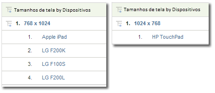

# Dispositivo móvel

Exibe informações sobre acesso a web sites a partir de um dispositivo móvel. Contém relatórios móveis que melhoram a identificação do visitante ao coletar dados sobre os dispositivos móveis utilizados para visualizar site. Os relatórios de dispositivos móveis podem identificar o fabricante e os recursos de um dispositivo, como o tamanho da tela, suporte a áudio, vídeo e cookies, além de outras métricas. Relatórios de dispositivos móveis também estão disponíveis para todos os Conjuntos de relatórios.

## Celular {#topic_D306EA4558194488AC47A45B9C570150}

Exibe informações sobre acesso a web sites a partir de um dispositivo móvel. Contém relatórios móveis que melhoram a identificação do visitante ao coletar dados sobre os dispositivos móveis utilizados para visualizar site. Os relatórios de dispositivos móveis podem identificar o fabricante e os recursos de um dispositivo, como o tamanho da tela, suporte a áudio, vídeo e cookies, além de outras métricas. Relatórios de dispositivos móveis também estão disponíveis para todos os Conjuntos de relatórios.

>[!NOTE]
>
>Os Relatórios móveis exibem somente o tráfego da Web móvel. Dados de aplicativos móveis recolhidos com iOS, Android e outros SDKs nativos são incluídos no Relatório de dispositivos móveis, sendo exibidos apenas quando habilitados nas Ferramentas administrativas.

Os relatórios móveis a seguir estão disponíveis:

<table id="table_900BB8F2F3A746B6B97DC629B39910DA"> 
 <thead> 
  <tr> 
   <th colname="col1" class="entry"> Relatório </th> 
   <th colname="col2" class="entry"> Descrição </th> 
  </tr> 
 </thead>
 <tbody> 
  <tr> 
   <td colname="col1"> 
Dispositivos 
 </td> 
   <td colname="col2"> 
Mostra o número de visitantes que acessaram o site usando dispositivos móveis, como dispositivos que executam o iOS ou Android. Isso pode ajudá-lo a entender o impacto das iniciativas móveis para que você possa se planejar adequadamente. É possível usar esse relatório para: 
 
 
     <ul id="ul_8CC40461C2944A63AED561E384275D24"> 
      <li id="li_4667815ED7384DE9824FB47F02040374"> 
Desenvolver estratégias que envolvam usuários remotos 
 </li> 
      <li id="li_12C1F430E5464FB4AC29C2D970165935"> 
Identifique as preferências do seu público-alvo 
 </li> 
      <li id="li_BFECB3B1F5A345BA82FC22BF99E8E418"> 
Acompanhar o surgimento de usuários sem fio e remotos 
 </li> 
     </ul> 
 </td> 
  </tr> 
  <tr> 
   <td colname="col1"> Fabricante </td> 
   <td colname="col2"> Agrupa acessos ao site com dispositivos móveis de acordo com seus fabricantes. O relatório exibe o tipo do fabricante, o número de visualizações de cada fabricante e as porcentagens correspondentes. </td> 
  </tr> 
  <tr> 
   <td colname="col1"> Tamanho de tela </td> 
   <td colname="col2"> 
 Agrupa acessos de dispositivos móveis ao site de acordo com o tamanho da tela do dispositivo. O relatório mostra cada tamanho de tela, o número de visitantes do site que utilizaram cada tamanho de tela e cada tamanho de tela como porcentagem do total de visualizações. O relatório de Tamanho de tela mostra a altura e a largura do tamanho da tela, comparado aos relatórios Altura de tela e Largura de tela. 
 
No momento, o relatório de tamanho da tela móvel encontra-se estático no dispositivo. Independentemente da orientação da tela, cada dispositivo possui uma resolução de tela fixa no relatório. É possível depreender isso analisando o Tamanho de tela por dispositivo móvel. 
 </td> 
  </tr> 
  <tr> 
   <td colname="col1"> Altura de tela </td> 
   <td colname="col2"> 
 Exibe a altura da tela de diversos dispositivos móveis e o número de visualizações de cada altura de tela. Você também pode exibir o relatório de Tamanho de tela para visualizar a altura e a largura da tela. 
 </td> 
  </tr> 
  <tr> 
   <td colname="col1"> Largura de tela </td> 
   <td colname="col2"> 
 Exibe a largura da tela de diversos dispositivos móveis e o número de visualizações de cada largura de tela. Você também pode exibir o relatório de Tamanho de tela para visualizar a altura e a largura da tela. 
 </td> 
  </tr> 
  <tr> 
   <td colname="col1"> Suporte a cookies </td> 
   <td colname="col2"> 
Agrupa acessos de dispositivos móveis que possuem ou não suporte a cookies. Os visitantes são divididos em grupos que possuem ou não possuem suporte a cookies. O tipo de dispositivo móvel é identificado na sequência de agente do usuário. A Adobe mantém uma lista de dispositivos móveis conhecidos por terem suporte a cookies. Se o dispositivo móvel listado no sequência do agente do usuário também está listado na lista de dispositivos móveis da Adobe, então o  O item de linha suportado no  relatório de Suporte a cookies é incrementado. Otherwise, the  Not Supported line item in the report is incremented. 
 </td> 
  </tr> 
  <tr> 
   <td colname="col1"> Suporte de imagem </td> 
   <td colname="col2"> 
 Agrupa dispositivos móveis com base nos tipos de imagens que eles suportam. 
 
Por exemplo, se o telefone de um visitante que suporta imagens .jpeg, acessa um site, o relatório Suporte de imagem é incrementado pelo menos uma vez. Se o telefone tiver suporte a mais do que um formato de imagem, a visita a um site pode resultar em múltiplos incrementos para aquela visita. Em outras palavras, se o seu telefone tem suporte aos formatos .jpeg, .png e .gif, então cada um desses grupos no relatório é incrementado. Dessa forma, a soma dos grupos pode ser maior do que o total exibido na parte inferior do relatório. 
 </td> 
  </tr> 
  <tr> 
   <td colname="col1"> Profundidade de cor </td> 
   <td colname="col2"> 
 Agrupa acessos de dispositivos móveis pelo número de cores suportadas. O relatório mostra o número total de visitantes de site que usaram um dispositivo móvel, e divide-os em grupos com base no número de cores configuradas em seus dispositivos móveis. 
 
Por exemplo, se o celular do visitante suportar 24 cores, o relatório incrementa o item de linha que corresponde a 24 cores. 
 </td> 
  </tr> 
  <tr> 
   <td colname="col1"> Suporte de áudio </td> 
   <td colname="col2"> 
 Agrupa dispositivos móveis com base nos tipos de formatos de áudio suportados por eles. 
 
Por exemplo, se o telefone de um visitante suportar o .mp3, o relatório de Suporte de vídeo será incrementado em um. Se o telefone suporta mais de um formato de áudio, uma visita a um site pode resultar em incrementos para cada tipo de áudio suportados. Em outras palavras, se um telefone suportar os formatos .mp3, .aac e .amr, cada um desses grupos é incrementado no relatório. Dessa forma, a soma dos grupos pode ser maior do que o total exibido na parte inferior do relatório. 
 </td> 
  </tr> 
  <tr> 
   <td colname="col1"> Suporte de vídeo </td> 
   <td colname="col2"> 
 Agrupa dispositivos móveis com base nos tipos de formatos de vídeo suportados por eles. 
 
Por exemplo, se o dispositivo móvel de um visitante suportar .mp4, o relatório de Suporte de vídeo é incrementado em um. Se o telefone suportar múltiplos formatos de imagem (como .mp4 e .wmv), cada um desses grupos é incrementado no relatório. Dessa forma, a soma dos grupos pode ser maior do que o total exibido na parte inferior do relatório. 
 </td> 
  </tr> 
  <tr> 
   <td colname="col1"> DRM </td> 
   <td colname="col2"> 
 Agrupa os dispositivos móveis com base no tipo de suporte a Digital Rights Management (DRM). Grupos DRM incluem  Bloqueio de encaminhamento,  Entrega combinada,  Entrega separadae  Desconhecido. 
 </td> 
  </tr> 
  <tr> 
   <td colname="col1"> Protocolos de rede </td> 
   <td colname="col2"> 
 Agrupa os dispositivos móveis com base nos protocolos de rede (GPRS, CSD, EDGE, HSCSD etc) que eles suportam. O relatório também inclui um grupo desconhecido para protocolos de rede não identificados. 
 
Quando um visitante usa um dispositivo móvel para acessar site, o relatório de Protocolos de rede é incrementado em um. Se o telefone suporta múltiplos protocolos de rede, cada um desses grupos é incrementado no relatório. Dessa forma, a soma dos grupos pode ser maior do que o total exibido na parte inferior do relatório. 
 </td> 
  </tr> 
  <tr> 
   <td colname="col1"> Sistema operacional (substituído) </td> 
   <td colname="col2"> 
 Agrupa dispositivos móveis com base no sistema operacional móvel em execução no dispositivo. Sistemas operacionais móveis incluem Windows, RIM, iOS, Symbian, etc. O relatório também inclui um grupo desconhecido para sistemas de operacionais móveis não identificados. 
 
Note: This report was deprecated when the Technology &gt; <a href="../../../components/c-variables/dimensionslist/reports-operating-system.md#concept_3FADC871C6204533B4FCE73316B0B34F" format="dita" scope="local"> Operating Systems</a> report was updated to include all operating systems, including mobile. É possível criar um segmento no qual "dispositivo móvel" existe e aplicá-lo ao relatório Tecnologia &gt; Sistemas operacionais para exibir somente os sistemas operacionais de dispositivos móveis. 
 </td> 
  </tr> 
  <tr> 
   <td colname="col1"> Versão do Java </td> 
   <td colname="col2"> 
 Agrupa os dispositivos móveis com base na versão do Java que eles suportam. O relatório Versão do Java identifica a versão do Java pelo Java Specification Request (JSR) suportado pelo dispositivo. O relatório também inclui um grupo desconhecido para sistemas de operacionais móveis não identificados. 
 
Você pode obter mais informações sobre uma JSR específica no site do <a href="https://jcp.org/en/jsr/overview" scope="external" format="html">Java Community Process</a>. 
 </td> 
  </tr> 
  <tr> 
   <td colname="col1"> Tamanho do URL de marcador </td> 
   <td colname="col2"> 
 Agrupa dispositivos móveis com base no tamanho máximo suportado, em caracteres, de um URL de marcador. 
 </td> 
  </tr> 
  <tr> 
   <td colname="col1"> Tamanho do URL de email </td> 
   <td colname="col2"> 
 Agrupa dispositivos móveis com base no tamanho máximo suportado, em caracteres, de um URL de email. 
 </td> 
  </tr> 
  <tr> 
   <td colname="col1"> Tamanho do URL de navegador </td> 
   <td colname="col2"> 
 Agrupa dispositivos móveis com base no tamanho máximo suportado, em caracteres, de um URL de navegador. 
 </td> 
  </tr> 
  <tr> 
   <td colname="col1"> Transmissão do número do dispositivo (ATIVADA/DESATIVADA) </td> 
   <td colname="col2"> 
 Agrupa os dispositivos móveis com base no suporte à transmissão do número do dispositivo. O relatório também inclui um grupo desconhecido para os dispositivos cujo suporte à transmissão do número do dispositivo não pode ser determinado. 
 </td> 
  </tr> 
  <tr> 
   <td colname="col1"> PTT </td> 
   <td colname="col2"> 
 Agrupa dispositivos móveis com base em seu suporte a Push To Talk (PTT). O relatório também inclui um grupo  Grupo desconhecido para dispositivos em que o suporte a PTT não pode ser determinado. 
 </td> 
  </tr> 
  <tr> 
   <td colname="col1"> Suporte a email de decoração </td> 
   <td colname="col2"> 
 Agrupa os dispositivos móveis com base no suporte a DecoMail, que permite que um usuário decore seus emails com gráficos e animações. O relatório também inclui um grupo  Grupo desconhecido para os dispositivos cujo suporte por email de decoração não pode ser determinado. 
 </td> 
  </tr> 
  <tr> 
   <td colname="col1"> Serviços de Informações </td> 
   <td colname="col2"> 
 Agrupa os dispositivos móveis com base nos serviços de notícias (canal I/B, EZ News Flash, W+INFO etc.) que eles possuem suporte. Quando um visitante usa um dispositivo móvel com suporte a serviços de notícias para acessar o site, o relatório Serviços de informações é incrementado em pelo menos um. Se o telefone suporta vários serviços de notícias, cada um desses grupos é incrementado no relatório. Por conta disso, a soma dos grupos pode ser maior do que o total mostrado na parte inferior do relatório. 
 </td> 
  </tr> 
 </tbody> 
</table>

