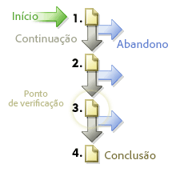

# Caminhos

Exibe informações sobre a ordem na qual as páginas de seu site são acessadas. Você pode coletar informações sobre onde o visitante vai antes e após visitar qualquer página em seu site.

## Caminhos {#topic_39F11BCBEDC3495EA1300149FC6D4F14}

Exibe informações sobre a ordem na qual as páginas de seu site são acessadas. Você pode coletar informações sobre onde o visitante vai antes e após visitar qualquer página em seu site.

Os relatórios incluem caminhos padrão em profundidade e relatórios de análise avançada opcionais que revelam o fluxo de cliques nas páginas vistas. Você pode descobrir caminhos completos, os caminhos mais longos e mais populares; explicar o fluxo de página, desistência e abandono graficamente, mostrar padrões novos e em mudança ao longo do tempo e analisar os caminhos de entrada e saída.

**[!UICONTROL Fluxo da próxima página]** ou **[!UICONTROL Fluxo do próximo site]**: exibe um gráfico de dois níveis de profundidade de ramificação de uma página selecionada (ou seção, departamento e assim por diante), que seus visitantes visualizam após saírem da página selecionada. Utilize este relatório para analisar e identificar os passos de seus visitantes após visualizarem a página selecionada. É possível:

* Entender quais etapas são usadas mais frequentemente após visualizar uma página selecionada.
* Otimizar o design do caminho do site para canalizar o tráfego para uma página de destino desejada.
* Identificar o local para o qual os visitantes estão indo em vez de suas páginas de destino desejadas.

**[!UICONTROL Próxima página]** (ou próximas categorias): fornece a análise detalhada do caminho do site, mostrando as páginas do site que os visitantes visualizaram após verem uma página selecionada. Por exemplo, ao selecionar e criar relatórios sobre o site inteiro, o relatório mostra as dez principais páginas de aterrissagem, com as cinco mais populares próximas páginas listadas abaixo de cada página de aterrissagem. Estes dados podem ajudar a compreender qual o conteúdo, recursos e outros dados, na maioria das vezes obrigam seus visitantes a navegarem pelo site

**[!UICONTROL Fluxo de página anterior]** (ou fluxo de outras categorias anteriores): apresenta dois níveis das páginas mais populares que os visitantes visualizam antes da página selecionada. O relatório também destaca quando os visitantes acessam o site.

**[!UICONTROL Página anterior]** (ou próximas categorias): fornece a análise detalhada do caminho do site, mostrando as páginas do site que os visitantes visualizaram após verem uma página selecionada.

**[!UICONTROL FallOut]**: esse relatório mostra o desgaste da visita e as taxas de conversão entre cada ponto de verificação definido. As etapas estão organizadas de cima para baixo, com números não processados e porcentagens mostradas à esquerda, e as porcentagens de conversão e desistência à direita.

Consulte [Relatório de fallout](/help/components/c-variables/dimensionslist/reports-fallout.md).

**[!UICONTROL PathFinder]**: Permite ainda dissecar seus caminhos completos em fragmentos, produzindo os padrões precisos que são instrumentais para otimizar site. O assistente do Pathfinder permite especificar critérios de seleção que são usados para gerar o relatório, de forma que possa analisar os fragmentos de caminho e buscar por aqueles que começam com uma certa página, terminam com uma determinada página ou mesmo aqueles que começam com uma página e terminam com outra.

**[!UICONTROL Extensão do caminho]**: mostra o quão profundo os visitantes navegaram do site (tanto por percentagem e por contagem total). Em outras palavras, o relatório indica quantas páginas o visitante médio do site visualiza antes de sair.

**[!UICONTROL Análise de página]**: contém um subconjunto de relatórios que permite analisar o seguinte:

* **[!UICONTROL Resumo da página / Resumo da categoria do site]**: mostra tudo o que você precisa saber sobre o relatório da página. Coleta e organiza informações específicas da página sobre uma única página e as apresenta em um único relatório.
* **[!UICONTROL Recargas]**: mostra o número de vezes que páginas individuais foram recarregadas pelos visitantes da página.
* **[!UICONTROL Tempo gasto na página]**: mostra o tempo em que os visitantes navegaram em páginas individuais do site. O tempo de permanência é dividido em dez categorias: menos de 15 segundos, 15-30 segundos, 30-60 segundos, 1-3 minutos, 3-5 minutos, 5-10 minutos, 10-15 minutos, 15-20 minutos, 20-30 minutos e mais de 30 minutos.
* **[!UICONTROL Cliques para a página]**: identifica o número de cliques que os visitantes usaram para acessar cada página do site. A profundidade de uma página é medida pela contagem do número de páginas exibidas antes.

**[!UICONTROL Entradas e saídas]**: o relatório de Entradas e saídas mostra, por porcentagem e por total de visitas, quais páginas no site são as primeiras páginas vistas por um novo visitante. Você pode selecionar:

* **[!UICONTROL Páginas de entrada]** (ou seções): mostra, por porcentagem e por total de visitas, quais páginas no site são as primeiras páginas vistas por um novo visitante. Você pode usar este relatório para identificar qual das suas páginas da Web são os pontos mais frequentes de entrada, otimizar os pontos de entrada primária do site e o tráfego de entrada da unidade para suas mensagens-chave.
* **[!UICONTROL Páginas de entrada originais]**: mostra a primeira página visualizada pela primeira vez pelos visitantes do site. Cada usuário é contado apenas uma vez, a não ser que ele exclua seus cookies do navegador ou não esteja sendo rastreado por cookies.
* **[!UICONTROL Visitas únicas à página]**: mostra páginas que frequentemente são páginas de entrada e saída para as sessões de navegação do visitante.
* **[!UICONTROL Páginas de saída]**: mostram, por porcentagem e pelo total de visitas, quais locais no site foram os últimos que os visitantes visualizaram antes de sair do site.

