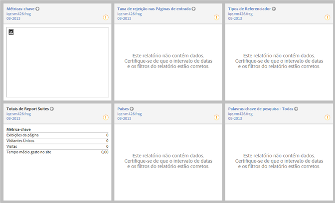

# Visão geral do site

O relatório Métricas do site &gt; Visão geral do site é mostrado no logon e permite que você imediatamente visualize e interaja com os dados relevantes. Você pode editar o layout, salvá-lo como um painel e investigar os dados para obter uma análise mais profunda.

Clique em **[!UICONTROL Layout]** na barra de ferramentas para personalizar este relatório e salvá-lo como um painel.

Se você designar um painel para ser exibido como página de destino, este relatório não será exibido automaticamente.
