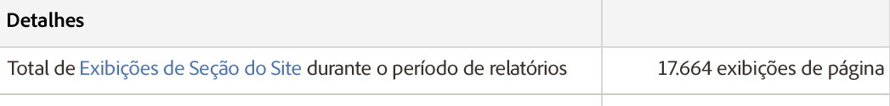

# Resumo das seções do site

Um relatório resumido para seções do site que exibem pontos de entrada da página anterior, pontos de saída da próxima página e informações sobre instâncias (chamadas de visualizações de página na interface), profundidade das seções do site, tempo gasto nas seções e mais.

Novamente, as Visualizações de página exibidas em **[!UICONTROL Detalhes]devem ser interpretadas como Instâncias:**

