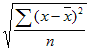

# Funções básicas


O [Construtor de métricas calculadas](/help/components/calculated-metrics/workflow/c-build-metrics/cm-build-metrics.md) permite aplicar funções matemáticas e estatísticas. Este artigo documenta uma lista em ordem alfabética das funções e suas definições.

>[!NOTE]
>
>Sempre que [!DNL metric] for definida como um argumento em uma função, outras expressões de métricas também serão permitidas. Por exemplo, [COLUMN MAXIMUM(metrics)](#column-maximum) também permite [COLUMN MAXIMUM(PageViews + Visits)](#column-maximum).


## Funções de tabela versus funções de linha

Uma função de tabela é aquela em que a saída é a mesma para cada linha da tabela. Uma função de linha é aquela em que a saída é diferente para cada linha da tabela.

Quando aplicável e relevante, uma função é anotada com o tipo de função: [!BADGE Tabela]{type="Neutral"} ou [!BADGE Linha]{type="Neutral"}

## O que significa o parâmetro “incluir zeros”?

Informa se os zeros devem ou não ser incluídos no cálculo. Às vezes, zero significa *nada*, mas em alguns casos, pode ser importante.

Por exemplo, se você possuir uma métrica Receita e adicionar a métrica Visualizações de página ao relatório, aparecerão mais linhas com valores iguais a zero na sua receita. Você provavelmente não vai querer que essa métrica adicional afete qualquer **[MÉDIA](cm-functions.md#mean)**, **[MÍNIMO DA LINHA](cm-functions.md#row-min)**, **[QUARTIL](cm-functions.md#quartile)** e outros cálculos que você tenha na coluna receita. Neste caso, você deverá marcar o parâmetro `include-zeros`.

Um cenário alternativo é o que você tem duas métricas de interesse e uma tem uma média ou um mínimo mais alto porque algumas das linhas são zeros.  Nesse caso, você pode optar por não marcar o parâmetro para incluir zeros


## Valor absoluto {#absolute-value}

<!-- markdownlint-disable MD034 -->

>[!CONTEXTUALHELP]
>id="functions-abs"
>title="Valor absoluto"
>abstract="Retorna o valor absoluto de um número. O valor absoluto de um número é o número com um valor positivo."

<!-- markdownlint-enable MD034 -->


 **[!UICONTROL ABSOLUTE VALUE(metric)]**

[!BADGE Linha]{type="Neutral"} Retorna o valor absoluto de um número. O valor absoluto de um número é o número com um valor positivo.

| Argumento | Descrição |
|---|---|
| métrica | A métrica para a qual você deseja obter o valor absoluto. |

**Caso de uso**: verifique se todos os resultados são positivos ao analisar métricas que podem produzir valores negativos, como deltas de receita ou alterações de porcentagem. Isso ajuda a focar na magnitude da mudança independentemente da direção.

**No Construtor de Métricas Calculadas**: Vincule sua métrica ou expressão na função **Valor Absoluto**, por exemplo: **Valor Absoluto**(Receita Atual - Receita Anterior). Isso converte quaisquer diferenças negativas em valores positivos.

>[!TIP]
>
>Use isso para medir as diferenças absolutas entre dois períodos ou segmentos, independentemente de o desempenho ter aumentado ou diminuído.
>

## Máximo da coluna {#column-maximum}

<!-- markdownlint-disable MD034 -->

>[!CONTEXTUALHELP]
>id="functions-col-max"
>title="Máximo da coluna"
>abstract="Retorna o maior valor em um conjunto de elementos de dimensão para uma coluna de métrica. O MAXV é avaliado verticalmente em uma única coluna (métrica) nos elementos de dimensão."

<!-- markdownlint-enable MD034 -->

 **[!UICONTROL COLUMN MAXIMUM(metric, include_zeros)]**

Retorna o maior valor em um conjunto de elementos de dimensão para uma coluna de métrica. O MAXV é avaliado verticalmente em uma única coluna (métrica) nos elementos de dimensão.

| Argumento | Descrição |
|---|---|
| métrica | Precisa de pelo menos uma métrica, mas pode usar quantas métricas forem necessárias como parâmetros. |
| include_zeros | Se os valores zero devem ser incluídos nos cálculos. |

**Caso de uso**: identifique o valor mais alto em um detalhamento, como o dia com mais visitas ou o produto com a maior receita. Isso ajuda a destacar o desempenho máximo nas categorias.

**No Construtor de Métrica Calculada**: Aplicar o **Máximo da Coluna** a uma métrica como *Receita* ou *Visitas* ao detalhar por *Dia* ou *Produto*. A função retorna o maior valor nessa coluna para cada linha.

>[!TIP]
>
>Use uma instrução [IF](https://experienceleague.adobe.com/en/docs/analytics-platform/using/cja-components/cja-calcmetrics/cm-adv-functions#if) como **IF**(*Revenue* = **Column Maximum***(Revenue*), 1, 0) para realçar o item de melhor desempenho no seu detalhamento.
>

## Mínimo da coluna {#column-minimum}

<!-- markdownlint-disable MD034 -->

>[!CONTEXTUALHELP]
>id="functions-col-min"
>title="Mínimo da coluna"
>abstract="Retorna o menor valor em um conjunto de elementos de dimensão para uma coluna de métrica. O MINV é avaliado verticalmente em uma única coluna (métrica) nos elementos de dimensão."

<!-- markdownlint-enable MD034 -->


 **[!UICONTROL COLUMN MINIMUM(metric, include_zeros)]**

Retorna o menor valor em um conjunto de elementos de dimensão para uma coluna de métrica. O MINV é avaliado verticalmente em uma única coluna (métrica) nos elementos de dimensão.

| Argumento | Descrição |
|---|---|
| métrica | Precisa de pelo menos uma métrica, mas pode usar quantas métricas forem necessárias como parâmetros. |
| include_zeros | Se os valores zero devem ser incluídos nos cálculos. |

**Caso de uso**: identifique o valor de desempenho mais baixo em um detalhamento, como a campanha com menos conversões ou o dia com a receita mais baixa. Isso ajuda a destacar rapidamente os segmentos com baixo desempenho.

**No Construtor de Métrica Calculada**: Aplicar **Mínimo da Coluna** a uma métrica como *Receita* ou *Taxa de Conversão* ao detalhar por *Campanha* ou *Dia*. A função retorna o menor valor nessa coluna para cada linha.

>[!TIP]
>
>Use uma instrução [IF](https://experienceleague.adobe.com/en/docs/analytics-platform/using/cja-components/cja-calcmetrics/cm-adv-functions#if) como **IF**(*Revenue* = **Column Minimum***(Revenue*), 1, 0) para realçar o item de menor desempenho no seu detalhamento.
>


## Soma da coluna {#column-sum}

<!-- markdownlint-disable MD034 -->

>[!CONTEXTUALHELP]
>id="functions-col-sum"
>title="Soma da coluna"
>abstract="Adiciona todos os valores numéricos de uma métrica em uma coluna (nos elementos de uma dimensão)."

<!-- markdownlint-enable MD034 -->


 **[!UICONTROL COLUMN SUM(metric)]**

Adiciona todos os valores numéricos de uma métrica em uma coluna (nos elementos de uma dimensão).

| Argumento | Descrição |
|---|---|
| métrica | Precisa de pelo menos uma métrica, mas pode usar quantas métricas forem necessárias como parâmetros. |

**Caso de uso**: calcule o total de todos os valores em um detalhamento, como a receita total em todos os produtos ou o total de visitas em todos os dias. Isso é útil quando você precisa de um total geral para comparar com valores de linha individuais.

**No Construtor de Métrica Calculada**: Aplique a **Soma da Coluna** a uma métrica como *Receita* ou *Visitas* enquanto faz o detalhamento por *Produto* ou *Dia*. A função retorna o total de todos os valores nessa coluna para cada linha.

>[!TIP]
>
>Use quando precisar de uma referência ao total geral para calcular compartilhamentos ou porcentagens do desempenho total.
>


## Contagem {#count}

<!-- markdownlint-disable MD034 -->

>[!CONTEXTUALHELP]
>id="functions-count"
>title="Contagem"
>abstract="Retorna o número, ou contagem, de valores diferentes de zero de uma métrica em uma coluna (o número de elementos únicos informados em uma dimensão)."

<!-- markdownlint-enable MD034 -->


 **[!UICONTROL COUNT(metric)]**

[!BADGE Tabela]{type="Neutral"} Retorna o número, ou contagem, de valores diferentes de zero de uma métrica em uma coluna (o número de elementos exclusivos relatados em uma dimensão).

| Argumento | Descrição |
|---|---|
| métrica | A métrica que deseja contar. |

**Caso de uso**: conte o número de pontos de dados incluídos em um cálculo, como o número de dias em um intervalo de datas ou o número de produtos em um detalhamento. Isso ajuda quando é necessário saber quantos itens contribuem para um valor agregado.

**No Construtor de Métrica Calculada**: Aplique **Count** a uma métrica como *Visitas* ou *Receita* para retornar o número total de linhas (ou pontos de dados) incluídos no detalhamento ou intervalo de datas atual.

>[!TIP]
>
>Use juntamente com **Soma da Coluna** para calcular médias manualmente (por exemplo, **Soma da Coluna**(*Receita*) / **Contagem**(Receita)).
>

## Expoente {#exponent}

<!-- markdownlint-disable MD034 -->

>[!CONTEXTUALHELP]
>id="functions-exp"
>title="Expoente"
>abstract="Retorna e elevado à potência de um determinado número. A constante e é igual a 2,71828182845904, a base do logaritmo natural. EXPONENT é o inverso de LN, o logaritmo natural de um número."

<!-- markdownlint-enable MD034 -->

 **[!UICONTROL EXPONENT(metric)]**

[!BADGE Linha]{type="Neutral"} Retorna “e” elevado à potência de um número fornecido. A constante e é igual a 2,71828182845904, a base do logaritmo natural. EXPONENT é o inverso de LN, o logaritmo natural de um número.

| Argumento | Descrição |
|---|---|
| métrica | O exponente aplicado à base e. |

**Caso de uso**: Eleva *e* à potência de um determinado número ou métrica. Isso é útil ao modelar tendências de crescimento ou dimensionar uma métrica exponencialmente.

**No Construtor de Métrica Calculada**: Use **Expoente** com uma métrica. Por exemplo: **Expoente**(*Visitas*) eleva *e* à potência da métrica *Visitas*.

>[!TIP]
>
>Combine com **Logaritmo** para modelagem avançada ou para suavizar dados altamente variáveis ao comparar padrões de crescimento.
>


## Média {#mean}

<!-- markdownlint-disable MD034 -->

>[!CONTEXTUALHELP]
>id="functions-mean"
>title="Média"
>abstract="Retorna a média aritmética, ou média, de uma métrica em uma coluna"

<!-- markdownlint-enable MD034 -->


 **[!UICONTROL MEAN(metric, include_zeros)]**

[!BADGE Tabela]{type="Neutral"} Retorna a média aritmética de uma métrica em uma coluna.

| Argumento | Descrição |
|---|---|
| métrica | A métrica para a qual você deseja obter a média. |
| include_zeros | Se os valores zero devem ser incluídos nos cálculos. |

**Caso de uso**: calcule a média aritmética de um conjunto de valores, como a receita diária média ou o número médio de visitas por campanha. Isso ajuda a estabelecer uma linha de base para comparar valores individuais em um conjunto de dados.

**No Construtor de Métrica Calculada**: Aplique a **Média** a uma métrica como *Receita* ou *Visitas* para retornar o valor médio em todos os pontos de dados no detalhamento ou intervalo de datas selecionado.

>[!TIP]
>
>Use para entender as tendências gerais de desempenho ou combine-as com **Desvio Padrão** para medir a consistência em relação à média.
>

## Mediana {#median}

<!-- markdownlint-disable MD034 -->

>[!CONTEXTUALHELP]
>id="functions-median"
>title="Mediana"
>abstract="Retorna a mediana de uma métrica em uma coluna. A mediana é o número no meio de um conjunto de números. Ou seja, metade dos números tem valores maiores ou iguais à mediana e metade é menor ou igual à mediana."

<!-- markdownlint-enable MD034 -->


 **[!UICONTROL MEDIAN(metric, include_zeros)]**

[!BADGE Tabela]{type="Neutral"} Retorna a mediana de uma métrica em uma coluna. A mediana é o número no meio de um conjunto de números. Ou seja, metade dos números tem valores maiores ou iguais à mediana e metade é menor ou igual à mediana.

| Argumento | Descrição |
|---|---|
| métrica | A métrica para a qual você deseja obter a mediana. |
| include_zeros | Se os valores zero devem ser incluídos nos cálculos. |

**Caso de uso**: identifique o valor médio em um conjunto de dados, como a receita diária mediana ou exibições de página medianas por visita. Isso é útil quando você deseja reduzir o impacto de outliers e ver a tendência central de seus dados.

**No Construtor de Métrica Calculada**: Aplique Mediana a uma métrica como Receita ou Exibições de página para retornar o valor do ponto médio em todos os pontos de dados no detalhamento ou intervalo de datas selecionado.

>[!TIP]
>
>Use em vez da **Média** quando seus dados contiverem extremos altos ou baixos que podem distorcer a média.
>


## Módulo {#modulo}

<!-- markdownlint-disable MD034 -->

>[!CONTEXTUALHELP]
>id="functions-modulo"
>title="Módulo"
>abstract="Retorna o resto após dividir x por y usando a divisão euclidiana. "

<!-- markdownlint-enable MD034 -->


 **[!UICONTROL MODULO(metric_X, metric_Y)]**

Retorna o resto após dividir x por y usando a divisão euclidiana.

| Argumento | Descrição |
|---|---|
| metric_X | A primeira métrica que você deseja dividir. |
| metric_Y | A segunda métrica que você deseja dividir. |

**Caso de uso**: retornar o restante após dividir um número por outro. Isso pode ser útil para padrões cíclicos ou repetitivos, como identificar todos os dias ou fazer uma campanha em sequência.

**No Construtor de Métrica Calculada**: Use **Módulo** com duas entradas numéricas. Por exemplo: **Modulo**(*Número do Dia*, 7) retorna o restante após dividir o número do dia por sete, o que pode ajudar a agrupar os dados por semana.

>[!TIP]
>
>Combine com lógica condicional para destacar intervalos recorrentes ou segmentar dados com base em ciclos repetitivos.
>

### Mais exemplos

O valor retornado tem o mesmo sinal que a entrada (ou é zero).

```
MODULO(4,3) = 1
MODULO(-4,3) = -1
MODULO(-3,3) = 0
```

Para obter sempre um número positivo, use

```
MODULO(MODULO(x,y)+y,y)
```

## Percentil {#percentile}

<!-- markdownlint-disable MD034 -->

>[!CONTEXTUALHELP]
>id="functions-percentile"
>title="Percentil"
>abstract="Retorna o enésimo percentual, que é um valor entre 0 e 100. Quando n &lt; 0, a função usa zero. Quando n > 100, a função retorna 100."

<!-- markdownlint-enable MD034 -->


 **[!UICONTROL PERCENTILE(metric, k, include_zeros)]**

[!BADGE Tabela]{type="Neutral"} Retorna o enésimo percentil, que é um valor entre 0 e 100. Quando n &lt; 0, a função usa zero. Quando n > 100, a função retorna 100.

| Argumento | Descrição |
|---|---|
| métrica | O valor do percentil no intervalo de 0 a 100, incluso. |
| k | A coluna de métrica que define a posição relativa. |
| include_zeros | Se os valores zero devem ser incluídos nos cálculos. |

**Caso de uso**: identifique o valor abaixo do qual determinada porcentagem de pontos de dados cai, como o 90º percentil da receita diária ou exibições de página. Isso ajuda a medir a distribuição e detectar outliers de alto desempenho.

**No Construtor de Métricas Calculadas**: Aplique **Percentil** a uma métrica como *Receita* ou *Visitas* e especifique o valor do percentil desejado (por exemplo, **Percentil**(*Receita*, 90)). O resultado mostra o limite abaixo do qual 90% dos pontos de dados estão.

>[!TIP]
>
>Use o para definir benchmarks de desempenho ou filtrar dias, campanhas ou produtos com melhor desempenho.
>

## Operador de potência {#power-operator}

<!-- markdownlint-disable MD034 -->

>[!CONTEXTUALHELP]
>id="functions-pow"
>title="Operador de potência"
>abstract="Retorna x elevado à potência y."

<!-- markdownlint-enable MD034 -->

 **[!UICONTROL POWER OPERATOR(metric_X, metrix_Y)]**

Retorna x elevado à potência y.

| Argumento | Descrição |
|---|---|
| metric_X | A métrica que você deseja elevar à potência metric_Y. |
| metric_Y | A potência à qual você deseja elevar a metric_X. |

**Caso de uso**: eleva um número ou métrica ao poder de outro, como o quadricular de um valor ou aplicar um peso exponencial. Isso é útil ao modelar o crescimento, dimensionar valores ou executar transformações matemáticas avançadas.

**No Construtor de Métrica Calculada**: Use **Operador de Energia** entre dois valores numéricos ou métricas. Por exemplo: *Revenue* ^ 2 eleva o valor *Revenue* para a segunda potência.

>[!TIP]
>
>Semelhante à função **Expoente**, mas expresso como um operador matemático, permitindo fórmulas mais compactas dentro das métricas calculadas.
>

## Quartil {#quartile}

<!-- markdownlint-disable MD034 -->

>[!CONTEXTUALHELP]
>id="functions-quartile"
>title="Quartil"
>abstract="Retorna o quartil de valores de uma métrica. Por exemplo, os quartis podem ser usados para encontrar a porcentagem de 25% dos produtos com maior receita. "

<!-- markdownlint-enable MD034 -->


 **[!UICONTROL QUARTILE(metric, quartile, include_zeros)]**

[!BADGE Tabela]{type="Neutral"} Retorna o quartil dos valores de uma métrica. Por exemplo, os quartis podem ser usados para encontrar a porcentagem de 25% dos produtos com maior receita. [MÍNIMO DA COLUNA](#column-minimum), [MEDIANA](#median) e [MÁXIMO DA COLUNA](#column-maximum) retornam o mesmo valor que [QUARTIL](#quartile) quando o quartil é igual a `0` (zero), `2` e `4`, respectivamente.

| Argumento | Descrição |
|---|---|
| métrica | A métrica para a qual você deseja obter o valor do quartil. |
| quartil | Indica qual valor de quartil retornar. |
| include_zeros | Se os valores zero devem ser incluídos nos cálculos. |

**Caso de uso**: divida um conjunto de dados em quatro partes iguais para entender como os valores são distribuídos, como identificar os 25% principais de dias por receita ou visitas. Isso ajuda a segmentar o desempenho em grupos classificados para uma comparação mais profunda.

**No Construtor de Métricas Calculadas**: Aplique **Quartil** a uma métrica como *Receita* ou *Visitas* e especifique qual quartil retornar (por exemplo, **Quartil**(*Receita*, 3) para encontrar o limite para o terceiro quartil ou os 25% principais).

>[!TIP]
>
>Use o para agrupar valores em níveis de desempenho, como campanhas ou produtos de baixo, médio e alto desempenho.
>

## Arredondar {#round}

<!-- markdownlint-disable MD034 -->

>[!CONTEXTUALHELP]
>id="functions-round"
>title="Arredondar"
>abstract="Arredondar sem um parâmetro *numérico* é igual a arredondar com um parâmetro *numérico* de 0, ou seja, arredondar para o número inteiro mais próximo. Com um parâmetro *numérico*, ARREDONDAR retorna os dígitos *numéricos* à direita do separador decimal.  Se o *número* for negativo, retornará zeros à esquerda do separador decimal."

<!-- markdownlint-enable MD034 -->

 **[!UICONTROL ROUND(metric, number)]**

Arredondar sem um parâmetro *numérico* é igual a arredondar com um parâmetro *numérico* de 0, ou seja, arredondar para o número inteiro mais próximo. Com um parâmetro *numérico*, ARREDONDAR retorna os dígitos *numéricos* à direita do separador decimal.  Se o *número* for negativo, retornará zeros à esquerda do separador decimal.

| Argumento | Descrição |
|---|---|
| metric | A métrica que deseja arredondar. |
| número | Quantos dígitos à direita do separador decimal devem retornar. (Se negativo, retorna zeros à esquerda do separador decimal). |

**Caso de uso**: simplifique os resultados numéricos arredondando-os para um número especificado de casas decimais. Isso é útil para criar visualizações mais limpas ou facilitar a leitura das métricas calculadas nos relatórios.

**No Construtor de Métricas Calculadas**: Aplique **Round** a uma métrica ou expressão e especifique o número de casas decimais. Por exemplo: **Round**(*Taxa de Conversão*, 2) arredonda o valor para duas casas decimais.

>[!TIP]
>
>Use para padronizar a formatação de métrica em todos os relatórios, especialmente ao exibir porcentagens ou valores de moeda.
>

### Mais exemplos

```
ROUND( 314.15, 0) = 314
ROUND( 314.15, 1) = 314.1
ROUND( 314.15, -1) = 310
ROUND( 314.15, -2) = 300
```

## Contagem de linhas {#row-count}

<!-- markdownlint-disable MD034 -->

>[!CONTEXTUALHELP]
>id="functions-count-rows"
>title="Contagem de linhas"
>abstract="Retorna a contagem de linhas referente a uma determinada coluna (o número de elementos únicos relatados em uma dimensão). *Únicos excedidos* é contado como 1."

<!-- markdownlint-enable MD034 -->

 **[!UICONTROL ROW COUNT()]**

Retorna a contagem de linhas referente a uma determinada coluna (o número de elementos únicos relatados em uma dimensão). *Únicos excedidos* é contado como 1.

**Caso de uso**: conte o número total de linhas retornadas em um detalhamento ou conjunto de dados, como o número de dias, campanhas ou produtos incluídos em um relatório. Isso ajuda a entender quantos itens contribuem para sua análise.

**No Construtor de Métrica Calculada**: Aplique **Contagem de Linhas** para retornar o número total de linhas no detalhamento ou segmento atual. Por exemplo, ao exibir *Receita* por *Produto*, **Contagem de Linhas** retorna o número de produtos exibidos.

>[!TIP]
>
>Use com outras funções como **Soma de Coluna** para calcular médias manualmente (por exemplo, **Soma de Coluna**(*Receita*) / **Contagem de Linhas**()).
>

## Máx. de linhas {#row-max}

<!-- markdownlint-disable MD034 -->

>[!CONTEXTUALHELP]
>id="functions-row-max"
>title="Máx. de linhas"
>abstract="O máximo de colunas de cada linha."

<!-- markdownlint-enable MD034 -->

 **[!UICONTROL ROW MAX(metric, include_zeros)]**

O máximo de colunas de cada linha.

| Argumento | Descrição |
|---|---|
| métrica | Precisa de pelo menos uma métrica, mas pode usar quantas métricas forem necessárias como parâmetros. |
| include_zeros | Se os valores zero devem ser incluídos nos cálculos. |

**Caso de uso**: identifique o valor mais alto em todas as métricas em uma única linha, como determinar qual métrica (por exemplo, *Receita*, *Pedidos* ou *Visitas*) tem o valor mais alto para um dia ou segmento específico. Isso ajuda a destacar qual métrica lidera em cada linha de dados.

**No Construtor de Métrica Calculada**: Aplicar **Máximo de Linha** quando várias métricas forem incluídas em uma métrica calculada. Por exemplo: **Máximo de Linha**(*Receita*, *Pedidos*, *Visitas*) retorna o maior valor entre essas métricas para cada linha.

>[!TIP]
>
>Use para comparar métricas relacionadas lado a lado e identificar qual contribui mais para o desempenho em cada linha.
>

## Mín. de linhas {#row-min}

<!-- markdownlint-disable MD034 -->

>[!CONTEXTUALHELP]
>id="functions-row-min"
>title="Mín. de linhas"
>abstract="O mínimo de colunas de cada linha."

<!-- markdownlint-enable MD034 -->

 **[!UICONTROL ROW MIN(metric, include_zeros)]**

O mínimo de colunas de cada linha.

| Argumento | Descrição |
|---|---|
| métrica | Precisa de pelo menos uma métrica, mas pode usar quantas métricas forem necessárias como parâmetros. |
| include_zeros | Se os valores zero devem ser incluídos nos cálculos. |

**Caso de uso**: identifique o valor mais baixo em todas as métricas em uma única linha, como descobrir qual métrica (por exemplo, *Receita*, *Pedidos* ou *Visitas*) tem o menor valor em um dia ou segmento específico. Isso ajuda a detectar a métrica de desempenho mais fraco em cada linha de dados.

**No Construtor de Métrica Calculada**: Aplicar **Mínimo de Linha** ao comparar várias métricas. Por exemplo: **Mínimo de linha**(*Receita*, *Pedidos*, *Visitas*) retorna o menor valor entre essas métricas para cada linha.

>[!TIP]
>
>Combine com Máximo de linha para calcular intervalos de desempenho ou destacar métricas com baixo desempenho em uma comparação lado a lado.
>

## Soma da linha {#row-sum}

<!-- markdownlint-disable MD034 -->

>[!CONTEXTUALHELP]
>id="functions-row-sum"
>title="Soma da linha"
>abstract="A soma das colunas em cada linha."

<!-- markdownlint-enable MD034 -->

 **[!UICONTROL ROW SUM(metric, include_zeros)]**

A soma das colunas em cada linha.

| Argumento | Descrição |
|---|---|
| métrica | Precisa de pelo menos uma métrica, mas pode usar quantas métricas forem necessárias como parâmetros. |

**Caso de uso**: adicione os valores de várias métricas em uma única linha, como a soma de *Receita* e *Imposto* para calcular o valor total da transação, ou combine *Visitas* de diferentes fontes. Isso ajuda a consolidar métricas relacionadas em um total.

**No Construtor de Métrica Calculada**: Aplicar **Soma de Linhas** para combinar várias métricas. Por exemplo: **Soma da Linha**(*Receita*, *Imposto*) adiciona essas duas métricas para cada linha em seu detalhamento.

>[!TIP]
>
>Use para criar totais combinados ou agrupar indicadores de desempenho relacionados em uma única métrica calculada.
>

## Raiz quadrada {#square-root}

<!-- markdownlint-disable MD034 -->

>[!CONTEXTUALHELP]
>id="functions-sqrt"
>title="Raiz quadrada"
>abstract="Retorna a raiz quadrada positiva de um número. A raiz quadrada de um número é o valor desse número elevado à potência de 1/2."

<!-- markdownlint-enable MD034 -->


 **[!UICONTROL SQUARE ROOT(metric, include_zeros)]**

[!BADGE Linha]{type="Neutral"} Retorna a raiz quadrada positiva de um número. A raiz quadrada de um número é o valor desse número elevado à potência de 1/2.

| Argumento | Descrição |
|---|---|
| métrica | A métrica para a qual você deseja obter a raiz quadrada. |

**Caso de uso**: retorna a raiz quadrada de um número ou métrica, como localizar a raiz da variação ao calcular o desvio padrão ou normalizar valores em um conjunto de dados. Isso é útil para cálculos estatísticos avançados ou de transformação de dados.

**No Construtor de Métrica Calculada**: Aplicar **Raiz Quadrada** a uma métrica ou expressão. Por exemplo: **Raiz Quadrada**(Variance(*Revenue*)) retorna o desvio padrão de *Revenue*.

>[!TIP]
>
>Use quando precisar dimensionar métricas proporcionalmente ou para suportar outras funções estatísticas que dependem de valores raiz.
>

## Desvio padrão {#standard-deviation}

<!-- markdownlint-disable MD034 -->

>[!CONTEXTUALHELP]
>id="functions-stdev"
>title="Desvio padrão"
>abstract="Retorna o desvio padrão, ou a raiz quadrada da variação, baseada em uma amostra da população de dados."

<!-- markdownlint-enable MD034 -->

 **[!UICONTROL STANDARD DEVIATION(metric, include_zeros)]**

[!BADGE Tabela]{type="Neutral"} Retorna o desvio padrão, ou raiz quadrada da variância, com base em uma população de dados de amostra.

| Argumento | Descrição |
|---|---|
| | A métrica para a qual você deseja obter o desvio padrão. |
| include_zeros | Se os valores zero devem ser incluídos nos cálculos. |

**Caso de uso**: meça quantos valores variam da média, como avaliar a consistência da receita diária ou das visitas ao longo do tempo. Isso ajuda a identificar a volatilidade, a estabilidade ou flutuações incomuns no desempenho.

**No Construtor de Métrica Calculada**: Aplique **Desvio Padrão** a uma métrica como *Receita* ou *Visitas* para calcular a distribuição de valores dentro do detalhamento ou intervalo de datas selecionado. Por exemplo: **Desvio Padrão**(*Receita*) mostra quanta receita diária se desvia da média.

>[!TIP]
>
>Use com *Média* para detectar anomalias ou comparar a consistência de desempenho entre campanhas, produtos ou segmentos.
>

## Variância {#variance}

<!-- markdownlint-disable MD034 -->

>[!CONTEXTUALHELP]
>id="functions-variance"
>title="Variância"
>abstract="Retorna a variância baseada em uma amostra da população de dados."

<!-- markdownlint-enable MD034 -->

 **[!UICONTROL VARIANCE(metric, include_zeros)]**

[!BADGE Tabela]{type="Neutral"} Retorna a variância com base em uma população de dados de amostra.

| Argumento | Descrição |
|---|---|
| métrica | A métrica para a qual você deseja obter a variação. |
| include_zeros | Se os valores zero devem ser incluídos nos cálculos. |

**Caso de uso**: meça até que ponto os valores em um conjunto de dados se distribuem pela média, como analisar quanta receita diária ou duração da sessão varia ao longo do tempo. Isso ajuda a quantificar o grau de consistência ou flutuação no desempenho.

**No Construtor de Métrica Calculada**: Aplique **Variação** a uma métrica como *Receita* ou *Tempo gasto por visita* para calcular o desvio médio quadrático da média. Por exemplo: **Variance**(*Revenue*) mostra quantos valores de receita diferem da média no intervalo selecionado.

>[!TIP]
>
>Use com o **Desvio Padrão** para entender melhor a variabilidade dos dados e identificar áreas de desempenho imprevisível.
>

A equação de VARIAÇÃO é:

{width="100"}

Onde *x* é a média da amostra, [MEAN(*metric*)](#mean), e *n* é o tamanho da amostra.


Para calcular uma variação, considere uma coluna inteira de números. Nessa lista de números, calcule primeiro a média. Após obter a média, analise cada entrada e faça o seguinte:

1. Subtraia a média do número.

1. Eleve o resultado ao quadrado.

1. Adicione-o ao total.

Quando você iterar por toda a coluna, terá um total único. Em seguida, você divide esse total pelo número de itens na coluna. Esse número é a variação da coluna. É um único número. No entanto, é exibido como uma coluna de números.

No exemplo da seguinte coluna de três itens:

| coluna |
|:---:|
| 1 |
| 2 |
| 3 |

A média dessa coluna é 2. A variação da coluna será ((1 - 2)<sup>2</sup> + (2 - 2)<sup>2</sup> + (3 - 2)<sup>2</sup>/3) = 2/3.

<!--

## Absolute Value (Row)

Returns the absolute value of a number. The absolute value of a number is the number with a positive value.

```
ABS(metric)
```

|  Argument  | Description  |
|---|---|
|  *metric* | The metric for which you want the absolute value.  |

## Column Maximum

Returns the largest value in a set of dimension elements for a metric column. MAXV evaluates vertically within a single column (metric) across dimension elements.

```
MAXV(metric)
```

|  Argument  | Description  |
|---|---|
|  *metric* | A metric that you would like to have evaluated.  |

## Column Minimum 

Returns the smallest value in a set of dimension elements for a metric column. MINV evaluates vertically within a single column (metric) across dimension elements.

```
MINV(metric)
```

|  Argument  | Description  |
|---|---|
|  *metric* | A metric that you would like to have evaluated.  |

## Column Sum 

Adds all of the numeric values for a metric within a column (across the elements of a dimension).

```
SUM(metric)
```

|  Argument  | Description  |
|---|---|
|  *metric* | The metric for which you want the total value or sum.  |

## Count (Table) 

Returns the number, or count, of non-zero values for a metric within a column (the number of unique elements reported within a dimension).

```
COUNT(metric)
```

|  Argument  | Description  |
|---|---|
|  *metric* | The metric that you want to count.  |

## Exponent (Row) 

Returns *e* raised to the power of a given number. The constant *e* equals 2.71828182845904, the base of the natural logarithm. EXP is the inverse of LN, the natural logarithm of a number.

```
EXP(metric)
```

|  Argument  | Description  |
|---|---|
|  *metric* | The exponent applied to the base *e*.  |

## Exponentiation 

Power Operator


pow(x,y) = x<sup>y</sup> = x*x*x*… (y times)


## Mean (Table) 

Returns the arithmetic mean, or average, for a metric in a column.

```
MEAN(metric)
```

|  Argument  | Description  |
|---|---|
|  *metric* | The metric for which you want the average.  |

## Median (Table) 

Returns the median for a metric in a column. The median is the number in the middle of a set of numbers-that is, half the numbers have values that are greater than or equal to the median, and half are less than or equal to the median.

```
MEDIAN(metric)
```

|  Argument  | Description  |
|---|---|
|  *metric* | The metric for which you want the median.  |

## Modulo 

The remainder of col1 / col2, using Euclidean division.

Returns the remainder after dividing x by y.

```
x = floor(x/y) + modulo(x,y)
```

The return value has the same sign as the input (or is zero).

```
modulo(4,3) = 1 
modulo(-4,3) = -1 
modulo(-3,3) = 0
```

To always get a positive number, use 

```
modulo(modulo(x,y)+y,y)
```

## Percentile (Table) 

Returns the k-th percentile of values for a metric. You can use this function to establish a threshold of acceptance. For example, you can decide to examine dimension elements who score above the 90  percentile.

```
PERCENTILE(metric,k)
```

<table id="table_35CD840ACFB44CD9979881DB8823CC53"> 
 <thead> 
  <tr> 
   <th colname="col1" class="entry"> Argument </th> 
   <th colname="col2" class="entry"> Description </th> 
  </tr> 
 </thead>
 <tbody> 
  <tr> 
   <td colname="col1"> <i>metric</i> </td> 
   <td colname="col2"> The metric column that defines relative standing. </td> 
  </tr> 
  <tr> 
   <td colname="col1"> <p>k </p> </td> 
   <td colname="col2"> The percentile value in the range 0 to 100, inclusive. </td> 
  </tr> 
 </tbody> 
</table>

## Quartile (Table) 

Returns the quartile of values for a metric. For example, quartiles can be used to find the top 25% of products driving the most revenue. MINV, MEDIAN, and MAXV return the same value as QUARTILE when quart is equal to 0 (zero), 2, and 4, respectively.

```
QUARTILE(metric,quart)
```

<table id="table_64EA3DAAE77541439D59FAF0353F83A2"> 
 <thead> 
  <tr> 
   <th colname="col1" class="entry"> Argument </th> 
   <th colname="col2" class="entry"> Description </th> 
  </tr> 
 </thead>
 <tbody> 
  <tr> 
   <td colname="col1"> <i>metric</i> </td> 
   <td colname="col2"> The metric for which you want the quartile value. </td> 
  </tr> 
  <tr> 
   <td colname="col1"> <p>quart </p> </td> 
   <td colname="col2"> Indicates which *value to return. </td> 
  </tr> 
 </tbody> 
</table>

&#42;If *quart* = 0, QUARTILE returns the minimum value. If *quart* = 1, QUARTILE returns the first quartile (25 percentile). If *quart* = 2, QUARTILE returns the first quartile (50 percentile). If *quart* = 3, QUARTILE returns the first quartile (75 percentile). If *quart* = 4, QUARTILE returns the maximum value.

## Round 

Returns the nearest integer for a given value. For example, if you want to avoid reporting currency decimals for revenue and a product has $569.34, use the formula Round( *Revenue*) to round revenue to the nearest dollar, or $569. A product reporting $569.51 will be round to the nearest dollar, or $570.

```
ROUND(metric)
```

|  Argument  | Description  |
|---|---|
|  *number* | The metric you want to round.  |

Round without a digits parameter is the same as round with a digits parameter of 0, namely round to the nearest integer. With a digits parameter it returns that many digits to the right of the decimal. If digits is negative, it returns 0's to the left of the decimal.

```
round( 314.15, 0) = 314 
round( 314.15, 1) = 314.1 
round( 314.15, -1) = 310 
round( 314.15, -2) = 300
```

## Row Count 

Returns the count of rows for a given column (the number of unique elements reported within a dimension). "Uniques exceeded" is counted as 1.

## Row Max 

The maximum of the columns in each row.

## Row Min 

The minimum of the columns in each row.

## Row Sum

The sum of the columns of each row.

## Square Root (Row) 

Returns the positive square root of a number. The square root of a number is the value of that number raised to the power of 1/2.

```
SQRT(metric)
```

|  Argument  | Description  |
|---|---|
|  *number* | The metric for which you want the square root.  |

## Standard Deviation (Table) 

Returns the standard deviation, or square root of the variance, based on a sample population of data.

The equation for STDEV is:



where x is the sample mean (*metric*) and *n* is the sample size.

```
STDEV(metric)
```

<table id="table_8BCF2E4B02434AABAAD026FB3C4E8B2F"> 
 <tbody> 
  <tr> 
   <td> <b> Argument</b> </td> 
   <td> <b> Description</b> </td> 
  </tr> 
  <tr> 
   <td> <b> <i> metric</i> </b> </td> 
   <td> <p> The metric for which you want for standard deviation. </p> </td> 
  </tr> 
 </tbody> 
</table>

## Variance (Table) 

Returns the variance based on a sample population of data.

The equation for VARIANCE is:


where x is the sample mean, MEAN(*metric*), and *n* is the sample size.

```
VARIANCE(metric)
```

|  Argument  | Description  |
|---|---|
|  *metric* | The metric for which you want the variance.  |

In order to calculate a variance you look at an entire column of numbers. From that list of numbers you first calculate the average. Once you have the average you go through each entry and do the following:

1. Subtract the average from the number.

2. Square the result.

3. Add that to the total.

Once you have iterated over the entire column you have a single total. You then divide that total by the number of items in the column. That number is the variance for the column. It is a single number. It is, however, displayed as a column of numbers.

In case of a three-item column:

1

2

3

The average of this column is 2. The variance for the column will be ((1 - 2)<sup>2</sup> + (2 - 2)<sup>2</sup> + (3 - 2)<sup>2</sup>/3 = 2/3.

-->