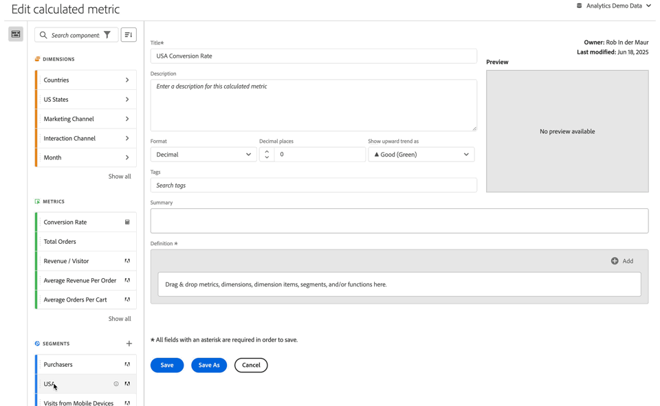

# Criar métricas calculadas {#build-metrics}

O Adobe Analytics fornece uma tela para arrastar e soltar dimensões, métricas, segmentos e funções para criar métricas personalizadas com base na lógica de hierarquia de containers, regras e operadores. Esta ferramenta de desenvolvimento integrado permite criar e salvar métricas calculadas simples e complexas.

É possível usar o construtor de métricas calculadas para criar ou editar métricas calculadas. Quando criadas dessa forma, as métricas calculadas ficam disponíveis na lista de componentes e podem ser usadas em projetos por toda a organização. Como alternativa, é possível criar rapidamente uma métrica calculada que esteja disponível somente para o projeto em que foi criada, conforme descrito na seção [Criar métricas calculadas para um único projeto](/help/analyze/analysis-workspace/components/apply-create-metrics.md#create-calculated-metrics-for-a-single-project) em [Métricas](/help/analyze/analysis-workspace/components/apply-create-metrics.md).

[Criar uma métrica calculada](../cm-workflow.md) descreve as diferentes opções disponíveis para criar uma nova métrica calculada.

## Áreas do construtor de métricas calculadas

A caixa de diálogo **[!UICONTROL Criador de métricas calculadas]** é usada para criar novas métricas calculadas ou editar métricas calculadas existentes. A caixa de diálogo é denominada **[!UICONTROL Nova métrica calculada]** ou **[!UICONTROL Editar métrica calculada]** para métricas calculadas criadas ou gerenciadas por meio do gerenciador de [[!UICONTROL métricas calculadas]](../cm-manager.md).

>[!BEGINTABS]

>[!TAB Construtor de métrica calculada]

>[!TAB Criar ou editar métrica calculada]

>[!ENDTABS]

1. Especifique os seguintes detalhes ( é obrigatório):

   | Elemento | Descrição |
   | --- | --- |
   | **[!UICONTROL Conjunto de relatórios]** | Você pode selecionar o conjunto de relatórios para a métrica calculada.  A métrica calculada que você define está disponível nos projetos do Espaço de trabalho com base no conjunto de relatórios selecionado. |
   | **[!UICONTROL Métrica somente do projeto]** | Uma caixa de informações aparece na parte superior desta caixa de diálogo ao editar uma métrica calculada que foi criada para um único projeto, conforme descrito em [Criar métricas calculadas para um único projeto](/help/analyze/analysis-workspace/components/apply-create-metrics.md#create-calculated-metrics-for-a-single-project). 
Se quiser disponibilizar essa métrica calculada para todos os projetos, selecione a opção **[!UICONTROL Disponibilizar essa métrica para todos os seus projetos e adicioná-la à sua lista de componentes]**.
 |
   | **[!UICONTROL Título]**  | Nomeie a métrica calculada, por exemplo, como `Conversion Rate`. |
   | **[!UICONTROL Descrição]** | Forneça uma descrição para o segmento, por exemplo, `Calculated metric to define the conversion rate.` Não há necessidade de descrever a fórmula para a métrica calculada, pois a fórmula já é disponibilizada automaticamente em [!UICONTROL Resumo]. |
   | **[!UICONTROL Formato]** | Selecione um formato para a métrica calculada: você pode selecionar entre **[!UICONTROL Decimal]**, **[!UICONTROL Hora]**, **[!UICONTROL Porcentagem]** e **[!UICONTROL Moeda]**. |
   | **[!UICONTROL Casas decimais]** | Especifique a quantidade de casas decimais para o formato selecionado. Habilitado somente quando o formato selecionado é “Decimal”, “Moeda” ou “Porcentagem”. |
   | **[!UICONTROL Exibir tendência ascendente como]** | Especifique se uma tendência ascendente da métrica calculada é exibida como ▲ **[!UICONTROL Boa (Verde)]** ou como ▼ **[!UICONTROL Ruim (Vermelho)]**. |
   | **[!UICONTROL Moeda]** | Especifique a moeda da métrica calculada. Habilitado somente quando o formato selecionado é “Moeda”. |
   | **[!UICONTROL Tags]** | Para organizar a métrica calculada, crie ou aplique uma ou mais tags. Comece a digitar para encontrar as tags existentes que você pode selecionar. Ou pressione **[!UICONTROL ENTER]** para adicionar uma nova tag. Selecione  para remover uma tag. |
   | **[!UICONTROL Pré-visualizar]** | A visualização abrange os últimos 90 dias e é uma maneira de medir se você definiu a sua métrica corretamente. |
   | **[!UICONTROL Resumo]** | Exibe um resumo da definição da métrica calculada.  Por exemplo:  **[!UICONTROL Total de pedidos]**   **[!UICONTROL Sessões]**. |
   | **[!UICONTROL Definição]**  | Defina o segmento usando o [Criador de definições](#definition-builder). |

1. Para verificar se a definição da sua métrica calculada está correta, use a **[!UICONTROL Visualização]** atualizada constantemente dos resultados da métrica calculada. A **[!UICONTROL Visualização]** abrange os últimos 90 dias e avalia continuamente a definição da sua métrica calculada.

   A **[!UICONTROL Compatibilidade do produto]** indica a compatibilidade da métrica calculada com as funcionalidades do Adobe Analytics. Consulte [Compatibilidade da métrica](/help/components/calculated-metrics/cm-compatibility.md) para obter mais informações.

1. Selecione:
   * Clique em **[!UICONTROL Salvar]** para salvar a métrica calculada.
   * Clique em **[!UICONTROL Salvar como]** para salvar uma cópia da métrica calculada.
   * Clique em **[!UICONTROL Cancelar]** para cancelar as alterações feitas em uma métrica calculada ou a criação de uma nova métrica calculada.

## Construtor de definições

Use o Criador de definições para arrastar e soltar dimensões, métricas, segmentos e funções para criar métricas personalizadas com base na lógica, nas regras e nos operadores da hierarquia do container. Nesse processo de criação, você pode usar métricas padrão, métricas definidas pela Adobe, métricas calculadas, segmentos, dimensões e funções. Todos esses componentes estão disponíveis no painel de componentes do criador de métricas calculadas. Você também pode usar operadores e containers na definição.

Somente métricas são definidas como componentes singulares na área **[!UICONTROL Definição]**. Todos os outros componentes são definidos como um container, uma métrica de encapsulamento ou outros containers. Consulte [Containers](#containers) para mais informações.

### Métricas

Para adicionar uma métrica:

* Arraste e solte um componente  **[!UICONTROL Métricas]** do painel de componentes para **[!UICONTROL Arraste e solte métricas, dimensões, itens de dimensão, segmentos e/ou funções aqui]**. Você pode usar a  na barra de componentes para procurar componentes específicos.

Se você usar uma métrica calculada como parte da sua definição, a métrica calculada será expandida.

Para modificar uma métrica:

1. Selecione a  em um componente de métrica, na área **[!UICONTROL Definição]**.
1. Na caixa de diálogo pop-up, é possível definir o tipo de métrica e um modelo de atribuição. Confira [Tipo de métrica e atribuição](m-metric-type-alloc.md).

Para excluir uma métrica:

* Selecione  na métrica.

### Operadores

Os operadores permitem especificar o operador entre componentes ou containers. Os operadores aparecem automaticamente entre

* duas ou mais métricas em um container,
* dois ou mais containers em um container,
* uma ou mais métricas e um ou mais containers em um container.

Você pode selecionar:

| Símbolo | Operador |
|:---:|---|
|  | Dividir (padrão) |
|  | Multiplicar |
|  | Subtrair |
|  | Adicionar |

### Número estático

É possível adicionar um número estático à definição da métrica calculada. Para adicionar um número estático:

* Selecione  **[!UICONTROL Adicionar]** de dentro de um container.
* Selecione **[!UICONTROL Número estático]**. Um container de número estático é exibido.
* Selecione [!UICONTROL *Clique para adicionar um valor*] e digite um valor.

### Containers

Adicione dimensões, segmentos e funções como containers a uma definição de métrica calculada. Você também pode adicionar um container genérico. Os contêineres funcionam como uma expressão matemática e determinam a ordem das operações. Qualquer coisa que estiver um container será processada antes do próximo componente ou container.

#### Container de segmento

Use o conceito de um container de segmento para criar uma [métrica segmentada](metrics-with-segments.md). É possível criar um container de segmento usando um segmento tradicional ou um segmento criado a partir de uma dimensão.

* Para adicionar um container de segmento a partir de uma dimensão:

  1. Arraste e solte um componente  **[!UICONTROL Dimensões]** do painel de componentes para **[!UICONTROL Arraste e solte métricas, dimensões, itens de dimensão, segmentos e/ou funções aqui]**. Você pode usar a  na barra de componentes para procurar componentes específicos.
  1. No pop-up **[!UICONTROL Criar segmento a partir da dimensão]**, defina a condição para o segmento. Selecione um valor na lista de operadores ou insira um valor. Por exemplo, **[!UICONTROL Mês]** **[!UICONTROL é igual a]**  `Sep 2024`.
  1. Selecione **[!UICONTROL Concluído]**. Um container de segmento é adicionado à **[!UICONTROL Definição]**.

* Para adicionar um container de segmento a partir de um segmento, é possível usar:

  * Arraste e solte um componente  **[!UICONTROL Segmentos]** do painel de componentes para **[!UICONTROL Arraste e solte métricas, dimensões, itens de dimensão, segmentos e/ou funções aqui]**. Você pode usar a  na barra de componentes para pesquisar segmentos específicos.
    Isso adiciona automaticamente um container de segmento à **[!UICONTROL Definição]** usando o nome do segmento.

  * Arraste e solte um componente de  **[!UICONTROL Segmento]** do painel de componentes em um container genérico. O container será transformado em um container de segmento.

  * Selecione  **[!UICONTROL Adicionar]** de dentro de um container:

    1. Selecione **[!UICONTROL Segmento]**. Um container de segmento é adicionado à **[!UICONTROL Definição]**.
    1. No novo container de segmento, selecione um segmento no menu suspenso [!UICONTROL *Selecionar...*].

  >[!TIP]
  >
  >É possível adicionar mais de um segmento a um container.

  Os segmentos no container são nomeados com base no componente de segmento. Por exemplo,  **[!UICONTROL Sessões da web]**. Selecione  para exibir uma janela pop-up com detalhes sobre o segmento. Na janela pop-up, selecione  para editar a definição do segmento.

Para remover um segmento de um container:

* Selecione  ao lado do nome do segmento.

Consulte [Métricas segmentadas](metrics-with-segments.md) para obter mais detalhes e exemplos.

#### Container de função

Para adicionar um container de função, é possível usar:

* Arrastar e soltar:

  1. Arraste e solte um componente  **[!UICONTROL Funções]** do painel de componentes para **[!UICONTROL Arraste e solte métricas, dimensões, itens de dimensão, segmentos e/ou funções aqui]**. Você pode usar a  na barra de componentes para procurar funções específicas.
  1. Automaticamente, um container de função é adicionado à **[!UICONTROL Definição]** usando o nome da função.

* Selecione  **[!UICONTROL Adicionar]** em um container:

  1. Selecione **[!UICONTROL Função]**.
  1. No container, selecione uma função no menu suspenso [!UICONTROL *Selecionar...*].

O container de função recebe o nome do componente de função. Por exemplo,  **[!UICONTROL SQUARE ROOT (metric)]**. Selecione  para exibir uma janela pop-up com detalhes sobre a função. Escolha **[!UICONTROL Saiba mais]** para obter mais informações sobre a função.

Consulte [Usar funções](cm-using-functions.md) para obter detalhes sobre como usar funções e quais funções estão disponíveis para criar uma métrica calculada.

#### Container genérico

Para adicionar um container genérico:

* Selecione  **[!UICONTROL Adicionar]** em um container
* Escolha **[!UICONTROL Container]**. Um novo container genérico vazio é adicionado à **[!UICONTROL Definição]**. É possível usar um container genérico para aninhar ou criar uma hierarquia na definição da métrica calculada.

#### Excluir um container

Para excluir um container, selecione  no nível do container.

>[!MORELIKETHIS]
>
>[Usar funções](cm-using-functions.md)
>[Segmentos &#x200B;](/help/components/segmentation/seg-overview.md)
>
