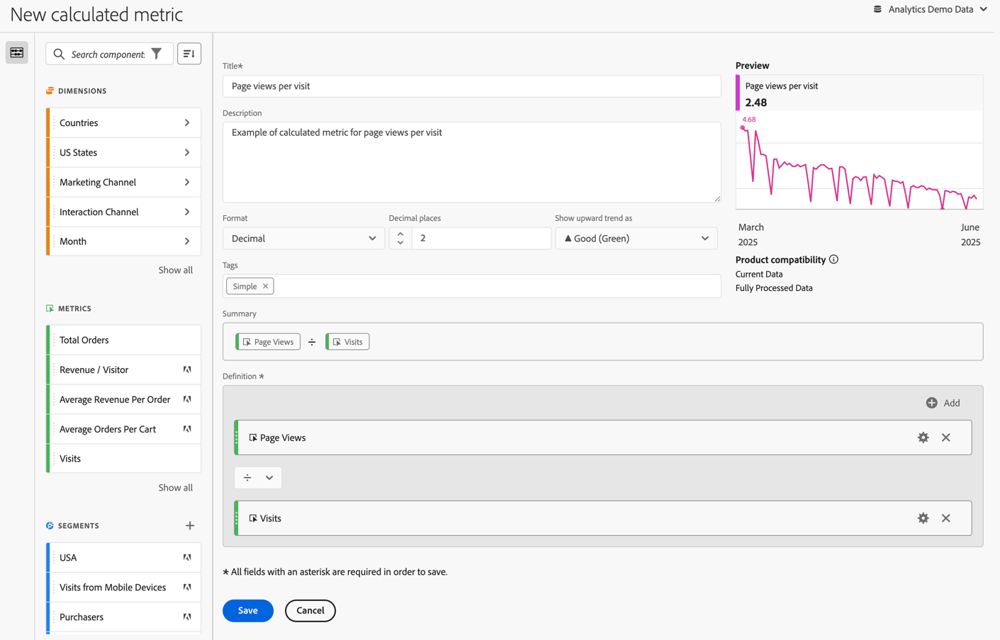

# Criar uma métrica calculada simples

As informações a seguir explicam como criar uma métrica simples de *Exibições de página por visita*.

1. Comece a criar uma métrica, conforme descrito em [Criar métricas](/help/components/calculated-metrics/workflow/c-build-metrics/cm-build-metrics.md).
1. Nomeie a métrica `Page Views per Visit` ou algo semelhante.
1. Forneça à métrica uma **[!UICONTROL Descrição]** simples para mostrar para que a métrica é usada.
1. Selecione o **[!UICONTROL Formato]** correto. Para este exemplo, escolha **[!UICONTROL Decimal]**.
1. Decida quantas casas decimais o relatório deve exibir.
1. No menu suspenso **[!UICONTROL Mostrar tendência ascendente como]**, selecione ▲ **[!UICONTROL Bom (Verde)]**.
1. Adicione uma **[!UICONTROL tag]** para organizar suas métricas.
1. Para esta métrica calculada, arraste primeiro as **[!UICONTROL Exibições de página]** dos componentes de **[!UICONTROL Métricas]** para a seção **[!UICONTROL Definição]** da tela.
1. Em seguida, arraste **[!UICONTROL Visitas]** dos componentes de **[!UICONTROL Métricas]** e solte a métrica abaixo de **[!UICONTROL Exibições de página]** (aguarde até que a linha azul apareça antes de soltar a métrica).
1. Selecione o operador dividir . (Dividir é o operador padrão.)
1. Você pode ver uma **[!UICONTROL Visualização]** da métrica enquanto está criando a métrica.
1. [Compatibilidade do produto](/help/components/calculated-metrics/cm-compatibility.md) mostra se a métrica é compatível com os Dados Atuais ou somente com os Dados Totalmente Processados.

   
1. Selecione **[!UICONTROL Salvar]**.

   Observe que a fórmula **[!UICONTROL Resumo]** é atualizada sempre que você faz uma alteração na definição da métrica.

1. (Opcional) Para compartilhar, aprovar, adicionar ou remover marcas de formatação, renomear ou excluir uma métrica, você pode acessar o [Gerenciador de métricas calculadas](/help/components/calculated-metrics/workflow/cm-manager.md).

