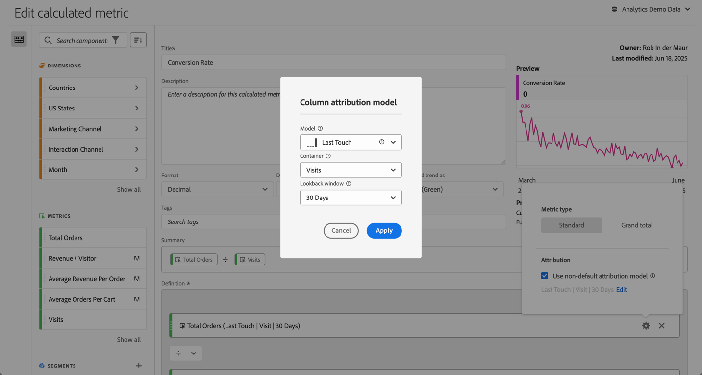

# Tipo de métrica e atribuição {#metric-type-attribution}

Você pode configurar o tipo de métrica e o [modelo de atribuição](#attribution-models) para uma métrica em uma definição de métrica calculada.

1. Selecione a  no componente de métrica.
1. Na caixa de diálogo pop-up:

   

   * Especifique o **[!UICONTROL Tipo de métrica]**:

     | Tipo de métrica | Definição |
     |---|---|
     | **[!UICONTROL Padrão]** | Se uma fórmula consistir de uma única métrica padrão, ela exibirá dados idênticos à sua métrica não calculada equivalente. Métricas padrão são úteis ao criar métricas calculadas específicas para cada item da linha.  
Por exemplo,  **[!UICONTROL Pedidos]**   **[!UICONTROL Visitas]** pega os pedidos daquele item de linha específico e os divide pelo número de visitas daquele item de linha específico. |
     | **[!UICONTROL Total geral]** | Use o **[!UICONTROL Total geral]** para informar o período de relatórios em cada item da linha. Se uma fórmula consistir em uma única métrica de total geral, a métrica calculada exibirá o mesmo número de total geral em cada item da linha. As métricas de total geral são úteis quando você deseja criar métricas calculadas que se comparam aos dados totais. 
Por exemplo,  **[!UICONTROL Pedidos]**   **[!UICONTROL Visitas totais]** mostra a proporção de pedidos em relação a todas as visitas, não apenas as visitas ao item de linha específico. Neste exemplo, você especifica **[!UICONTROL Total geral]** para a métrica  **[!UICONTROL Visitas]** na sua métrica calculada, que a transformará automaticamente em  **[!UICONTROL Total de visitas]**. |

   * Especifique a **[!UICONTROL atribuição]**.

      1. Você também pode:

         * Desabilitar a opção **[!UICONTROL Usar modelo de atribuição não padrão]** para usar o modelo de atribuição de coluna padrão, que é Último contato, com uma janela de pesquisa de 30 dias.
         * Habilitar a opçã o **[!UICONTROL Usar modelo de atribuição não padrão]**. Na caixa de diálogo **[!UICONTROL Modelo de atribuição de coluna]**,

            * Selecione um **[!UICONTROL Modelo]** nos [modelos de atribuição](#attribution-models).
            * Selecione um **[!UICONTROL Container]** nas opções de [container](#container).
            * Selecione uma **[!UICONTROL Janela de retrospectiva]** nas opções da [janela de retrospectiva](#lookback-window). Se você selecionar **[!UICONTROL Hora personalizada]**, poderá definir o período em **[!UICONTROL Minuto(s)]** até **[!UICONTROL Trimestre(s)]**.

      1. Selecione **[!UICONTROL Aplicar]** para aplicar o modelo de atribuição não padrão. Selecione Cancelar para cancelar.

     Se você já tiver definido um modelo de atribuição não padrão, selecione **[!UICONTROL Editar]** para modificar a seleção.

Consulte [Exemplo](#example) para ver um exemplo de uso de um modelo de atribuição, container e janela de pesquisa.

## Modelos de atribuição {#attribution-models}

>[!CONTEXTUALHELP]
>id="components_calculatedmetrics_nondefaultattributionmodel"
>title="Usar modelo de atribuição não-padrão"
>abstract="Habilite um modelo de atribuição não padrão para a métrica selecionada."

>[!CONTEXTUALHELP]
>id="components_calculatedmetrics_attributionmodel"
>title="Modelo"
>abstract="Selecione um modelo de atribuição para a métrica."

>[!CONTEXTUALHELP]
>id="components_calculatedmetrics_attribution_lasttouch"
>title="Último contato"
>abstract="100% do crédito vai para o último valor de dimensão visto por um visitante."

>[!CONTEXTUALHELP]
>id="components_calculatedmetrics_attribution_firsttouch"
>title="Primeiro contato"
>abstract="100% do crédito vai para o primeiro valor de dimensão visto por um visitante."

>[!CONTEXTUALHELP]
>id="components_calculatedmetrics_attribution_linear"
>title="Linear"
>abstract="O crédito é distribuído uniformemente em todos os valores de dimensão."

>[!CONTEXTUALHELP]
>id="components_calculatedmetrics_attribution_participation"
>title="Participação"
>abstract="100% de crédito para cada valor de dimensão visto por um visitante. Os totais da coluna estão exagerados."

>[!CONTEXTUALHELP]
>id="components_calculatedmetrics_attribution_sametouch"
>title="Mesmo contato"
>abstract="O crédito é fornecido somente para valores de dimensão que ocorrem no mesmo evento que a conversão."

>[!CONTEXTUALHELP]
>id="components_calculatedmetrics_attribution_instance"
>title="Mesmo contato"
>abstract="O crédito é fornecido somente para valores de dimensão que ocorrem no mesmo evento que a conversão."

>[!CONTEXTUALHELP]
>id="components_calculatedmetrics_attribution_ushaped"
>title="Forma de U"
>abstract="40% do crédito é atribuído ao primeiro valor de dimensão, 40% ao último, 20% é compartilhado pelo meio."

>[!CONTEXTUALHELP]
>id="components_calculatedmetrics_attribution_jcurve"
>title="Curva J"
>abstract="60% do crédito é atribuído ao valor da última dimensão, 20% ao primeiro, 20% é compartilhado pelo meio."

>[!CONTEXTUALHELP]
>id="components_calculatedmetrics_attribution_jshaped"
>title="Curva J"
>abstract="60% do crédito é atribuído ao valor da última dimensão, 20% ao primeiro, 20% é compartilhado pelo meio."

>[!CONTEXTUALHELP]
>id="components_calculatedmetrics_attribution_inversej"
>title="J invertido"
>abstract="60% do crédito é atribuído ao primeiro valor de dimensão, 20% ao último, 20% é compartilhado pelo meio."

>[!CONTEXTUALHELP]
>id="components_calculatedmetrics_attribution_reversejshaped"
>title="J invertido"
>abstract="60% do crédito é atribuído ao primeiro valor de dimensão, 20% ao último, 20% é compartilhado pelo meio."

>[!CONTEXTUALHELP]
>id="components_calculatedmetrics_attribution_timedecay"
>title="Declínio de tempo"
>abstract="Os valores de dimensão mais próximos do tempo a uma conversão recebem mais crédito."

>[!CONTEXTUALHELP]
>id="components_calculatedmetrics_attribution_custom"
>title="Personalizado"
>abstract="Defina sua própria posição com base na ponderação de atribuição."

>[!CONTEXTUALHELP]
>id="components_calculatedmetrics_attribution_positionbased"
>title="Personalizado"
>abstract="Defina sua própria posição com base na ponderação de atribuição."

>[!CONTEXTUALHELP]
>id="components_calculatedmetrics_attribution_algorithmic"
>title="Algorítmico"
>abstract="O crédito é determinado dinamicamente em um algoritmo estatístico."

{{attribution-models-details}}

## Container {#container}

>[!CONTEXTUALHELP]
>id="components_calculatedmetrics_attribution_container"
>title="Container"
>abstract="Selecione um container para definir o escopo desejado da atribuição."

{{attribution-container}}

## Janela de pesquisa {#lookback-winwow}

>[!CONTEXTUALHELP]
>id="components_calculatedmetrics_attribution_lookbackwindow"
>title="Janela de pesquisa"
>abstract="Essa configuração determina a janela de atribuição de dados que será aplicada a cada conversão."

{{attribution-lookback-window}}

## Exemplo

{{attribution-example}}

<!--
When [building a calculated metric](/help/components/calculated-metrics/workflow/c-build-metrics/cm-build-metrics.md), you can specify the metric type and the attribution model.

## Metric type

To specify the metric type when building a calculated metric:

1. Select the gear icon next to the metric whose type you want to select.

    

1. Choose from the following options:

   |  Metric Type  | Definition  |
   |---|---|
   |  Standard  | These metrics are the same metrics used in standard [!DNL Analytics] reporting. If a formula consisted of a single standard metric, it displays identical data to its non-calculated-metric counterpart. Standard metrics are useful for creating calculated metrics specific to each individual line item. For example, [Orders] / [Visits] takes orders for that specific line item and divides it by the number of visits for that specific line item.  |
   |  Grand total  | Use Grand total for the reporting period in every line item. If a formula consisted of a single Grand total metric, it displays the same total number on every line item. Grand total metrics are useful for creating calculated metrics that compare against site total data. For example, [Orders] / [Total Visits] shows the proportion of orders against ALL visits to your site, not just the visits to the specific line item.  |

## How linear allocation works

[Attribution](/help/analyze/analysis-workspace/attribution/overview.md) is how allocation models in calculated metrics are evaluated.

For a full list of non-default attribution models and lookback windows supported, see [Attribution models and lookback windows](/help/analyze/analysis-workspace/attribution/models.md).

The following example illustrates how calculated metrics with linear allocations work in reporting: 

| | Hit 1 | Hit 2 | Hit 3 | Hit 4 | Hit 5 | Hit 6 | Hit 7 |
|--- |--- |--- |--- |--- |--- |--- |--- |
|Data Sent In|PROMO A|-|PROMO A|PROMO B|-|PROMO C|$10|
|Last Touch eVar|PROMO A|PROMO A|PROMO A|PROMO B|PROMO B|PROMO C|$10|
|First Touch eVar|PROMO A|PROMO A|PROMO A|PROMO A|PROMO A|PROMO A|$10|
|Example prop|PROMO A|-|PROMO A|PROMO B|-|PROMO C|$10|

In this example, the values A, B, and C were sent into a variable on hits 1, 3, 4, and 6 before a $10 purchase was made on hit 7. In the second row, those values persist across hits on a last touch visit basis. The third row illustrates a first-touch visit persistence. Finally, the last row illustrates how data would be recorded for a prop which does not have persistence.

-->