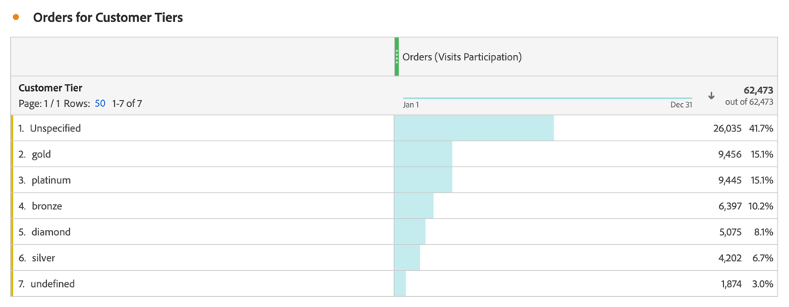

# Métricas de participação

As Métricas de participação são usadas para quantificar como os valores individuais de uma dimensão (como Exibições de página) contribuem para, ou participam em visitas que contêm uma métrica específica (como Pedidos).

As etapas abaixo mostram como criar uma métrica de participação.

1. [Crie uma métrica calculada](../cm-workflow.md) e, no [Construtor de métricas calculadas](cm-build-metrics.md), nomeie a métrica `Orders (Visit Participation)` ou algo semelhante.
1. Arraste uma métrica contendo um evento bem-sucedido, por exemplo [!DNL Online Orders], para a área [!UICONTROL **[!UICONTROL Definição]**].
1. Selecione  para a métrica.
1. Na janela pop-up exibida, selecione **[!UICONTROL Usar um modelo de atribuição não padrão]** para definir o [modelo de atribuição](m-metric-type-alloc.md#attribution-models) desse evento para **[!UICONTROL Participação]** e selecione **[!UICONTROL Visitas]** para o [!UICONTROL Contêiner]. Selecione **[!UICONTROL Aplicar]** para confirmar.

   

   **(Partipation|Visits|30 Days)** é adicionado ao nome do componente de métrica.

1. Selecione [!UICONTROL **Salvar**] para salvar a métrica.
1. Use a métrica calculada em seu relatório. Por exemplo, use a métrica [!DNL Orders (Session Participation)] calculada em um relatório para mostrar qual Camada de cliente contribuiu para (ou participou de) sessões que continham um pedido.

   

<!--

The following information explains how to create a metric that shows which pages contributed to (or participated in) visits that contained an order.

This type of information could be useful for any content owner.

>[!NOTE]
>
>You can enable participation metrics in the Admin Tools, but only for custom events 1 - 100.

1. Begin creating a calculated metric, as described in [Build metrics](/help/components/calculated-metrics/workflow/c-build-metrics/cm-build-metrics.md).

1. In the Calculated metrics builder, name the metric "Participation".

1. Drag the success event "Orders" into the Definition canvas.

1. Change the [attribution model](/help/components/calculated-metrics/workflow/c-build-metrics/m-metric-type-alloc.md) of that event to **[!UICONTROL Participation]** under the **[!UICONTROL Settings]** gear. Select **[!UICONTROL Visit]** lookback. The definition should look similar to this:

   

1. Select [!UICONTROL **Save**] to save the metric.

1. Use the calculated metric in a **[!UICONTROL Pages]** report.

    

1. (Optional) Share the metric with other users in your organization, as described in [Share calculated metrics](/help/components/calculated-metrics/workflow/cm-sharing.md).
-->