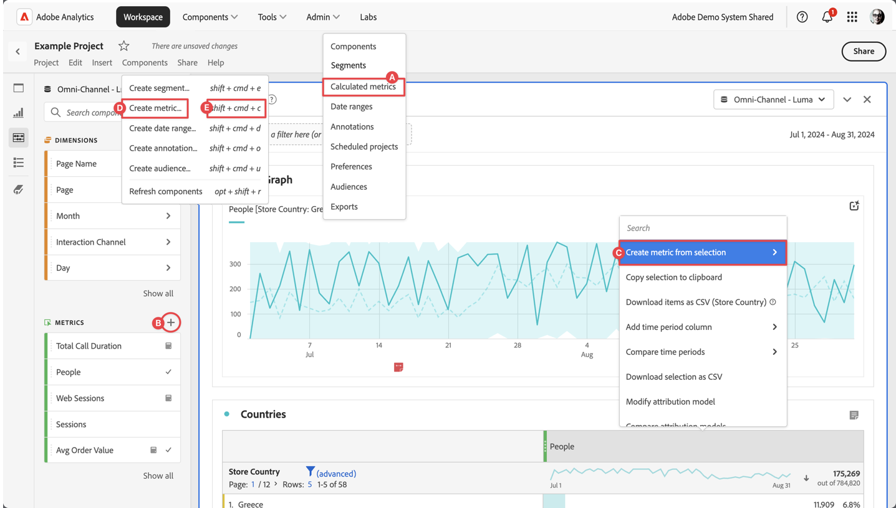

# Criar métricas calculadas

Por padrão, somente administradores podem criar métricas calculadas. Os usuários têm o direito de visualizar métricas calculadas de maneira semelhante à forma como os usuários visualizam outros componentes (como segmentos, anotações e muito mais).

Você pode criar uma métrica calculada das seguintes maneiras:

* **A**. Na interface principal, selecione **[!UICONTROL Componentes]** e selecione **[!UICONTROL Métricas calculadas]**. Selecione  [!UICONTROL **[!UICONTROL Add]**] no gerenciador [[!UICONTROL Métricas calculadas]](cm-manager.md).
* **B**. Em um projeto do Workspace, no painel esquerdo Componentes, selecione  em  **Métricas**.
* **C**. Em um projeto do Workspace, no menu de contexto no cabeçalho da coluna de métricas, selecione **[!UICONTROL Criar métrica a partir da seleção]**. No submenu, você pode selecionar uma função ou selecionar **[!UICONTROL Abrir no construtor de métrica calculada]**.  Se você selecionar uma função, a métrica calculada será definida como uma métrica somente de projeto. Ao editar posteriormente esta métrica, por meio do pop-up [Informações do componente](/help/analyze/analysis-workspace/components/use-components-in-workspace.md), você verá uma notificação no [Construtor de métrica calculada](c-build-metrics/cm-build-metrics.md).
* **D**. Em um projeto do Workspace, selecione **[!UICONTROL Componentes]** no menu e selecione **[!UICONTROL Criar métrica]**.
* **E**. Em um projeto do Workspace, use o atalho **[!UICONTROL shift+cmd+c]** (macOS) ou **[!UICONTROL shift+ctrl+c]** (Windows).

Para definir a nova métrica calculada, use o [Construtor de métrica calculada](c-build-metrics/cm-build-metrics.md).

## Fluxo de trabalho

Antes de criar métricas calculadas, considere cuidadosamente o seguinte fluxo de trabalho:

| Tarefa de fluxo de trabalho | Descrição |
| --- | --- |
| Planejar métricas calculadas | Especialmente para métricas que serão oficialmente aprovadas, o planejamento faz sentido destacar quais métricas calculadas serão amplamente usadas e como serão definidas. |
| [Compilação](c-build-metrics/cm-build-metrics.md) métricas calculadas | Crie e edite métricas calculadas e calculadas avançadas para usar nos componentes do [!DNL Analytics].  Consulte [exemplos](c-build-metrics/cm-build-metrics.md) de como criar métricas calculadas. |
| [Marca](cm-tagging.md) métricas calculadas | Marque métricas calculadas para facilitar a organização e o compartilhamento. Consulte como planejar e atribuir tags para pesquisas e organização simples e avançada. |
| [Aprovar](cm-approving.md) métricas calculadas | Aprove métricas calculadas para transformá-las em canônicas. |
| Usar métricas calculadas | Use as métricas calculadas em seus projetos. |
| [Compartilhar](cm-sharing.md) métricas calculadas | Compartilhe suas métricas calculadas com outros indivíduos, grupos ou organizações. |
| [Filtrar](cm-filter.md) métricas calculadas | Filtrar métricas calculadas por tags, proprietários e outros filtros (Mostrar tudo, Meus, Compartilhados comigo, Favoritos e Aprovados). |
| Marcar métricas calculadas como [favoritos](cm-finding.md) | Outra maneira de organizá-los para facilitar o uso é marcar as métricas como favoritos. |
