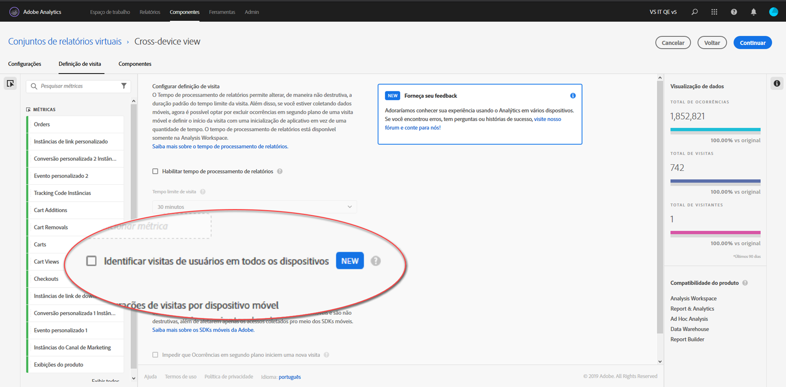

# Configuração do análise entre dispositivos

> [!NOTE] A documentação do Análise entre dispositivos está sujeita a alterações à medida que o recurso é desenvolvido. Consulte regularmente para atualizações.

Depois que todos os pré-requisitos forem atendidos, use as seguintes etapas para ativar a Análise entre dispositivos. Você deve pertencer a um grupo de Administrador de perfil de produto ou ter privilégios de administrador no Adobe Analytics para seguir essas etapas.

> [!IMPORTANT] Todos os pré-requisitos devem ser cumpridos antes de seguir essas etapas. Se todos os pré-requisitos não forem cumpridos, o recurso não estará disponível ou não funcionará. Consulte [Análise entre dispositivos](cda-home.md) para pré-requisitos e limitações.

## Escolha o conjunto de relatórios entre dispositivos que será habilitado para CDA

Quando sua organização for provisionada para usar o CDA, você escolhe qual conjunto de relatórios usar. Essa escolha pode ser enviada por meio do seu Gerente de contas da Adobe. A Adobe ativa o conjunto de relatórios escolhido para o processamento CDA.

## Criar um conjunto de relatórios virtual em vários dispositivos para visualizar a visualização entre dispositivos

Os administradores com acesso a criar conjuntos de relatórios virtuais podem criar conjuntos de relatórios virtuais da CDA da seguinte maneira:

1. Navegue até [experiencecloud.adobe.com](https://experiencecloud.adobe.com) e faça logon usando suas credenciais adobeid.
2. Clique no ícone de 9 grade na parte superior e clique em Analytics.
3. Passe o mouse sobre os Componentes na parte superior e clique em Conjuntos de relatórios virtuais.
4. Clique em Adicionar.
5. Insira um nome para o conjunto de relatórios virtual e verifique se o conjunto de relatórios habilitado para CDA está selecionado.
6. Clique na caixa de seleção «Ativar processamento de tempo do relatório», que permite mais opções incluindo a Análise entre dispositivos.
7. Clique na caixa de seleção «Unir visitas do usuário em vários dispositivos».
8. Clique em Continuar, conclua a configuração do conjunto de relatórios virtual e clique em Salvar.

## Adições e alterações em conjuntos de relatórios virtuais entre dispositivos

Quando a Análise entre dispositivos estiver ativada em um conjunto de relatórios virtual, observe as seguintes alterações:

* Um novo ícone de dispositivo cruzado aparece ao lado do nome do conjunto de relatórios virtual. Este ícone é exclusivo para conjuntos de relatórios virtuais entre dispositivos.
* Novas métricas rotuladas como "Pessoas" e "Dispositivos únicos" estão disponíveis.
* A métrica "Visitantes únicos" não está disponível, já que é substituída por Pessoas e Dispositivos únicos.
* Ao construir segmentos, o contêiner do segmento "Visitante" é substituído por um contêiner "Pessoa".

## A métrica calculada de compactação

A capacidade de Análise entre dispositivos em vários dispositivos depende de uma ampla variedade de fatores. A eficácia da capacidade do recurso de unir dados pode ser medida com uma métrica calculada chamada compactação. Os fatores que contribuem para a compactação incluem:

* Usando o gráfico de cooperação ou o gráfico privado: Geralmente, as organizações que usam o device co-op tendem a ver melhores índices de compressão do que as organizações usando o gráfico privado.
* Taxa de logon: Quanto mais usuários fizerem logon no seu site, mais a Adobe pode identificar e unir visitantes em todos os dispositivos. Sites com baixa taxa de logon também têm taxas de compressão baixas.
* Cobertura da Experience Cloud ID: Somente os visitantes com uma ECID podem ser encaixados. Uma porcentagem menor de visitantes do site usando um ECID correlaciona-se com taxas de compactação menores.
* Uso de vários dispositivos: Se os visitantes do site não usarem vários dispositivos, você poderá ver taxas de compactação menores.
* Geração de relatórios: A compactação por dia geralmente é menor que a compactação por mês ou ano. As chances de um indivíduo usar vários dispositivos se tornam menores em um único dia do que em um mês inteiro. A segmentação, a filtragem ou o uso de dimensões de detalhamento também podem mostrar uma taxa de compactação menor.

Para visualizar a compactação de sua organização para um determinado período:

1. Clique em Espaço de trabalho na parte superior e clique em «Criar novo projeto».
2. Comece com um Projeto em branco e clique em Criar.
3. Arraste a métrica Dispositivos únicos para a área da área de desenho denominada "Soltar uma métrica aqui".
4. Arraste a métrica de Pessoas até a tela diretamente à direita do cabeçalho da métrica Dispositivos únicos, para que as duas métricas sejam lado a lado.
5. Clique no símbolo «+» ao lado das métricas disponíveis à esquerda para abrir o construtor de Métrica calculada.
6. Dê a esta métrica calculada as seguintes configurações:
   * Nome: Compactação entre dispositivos
   * Formato: Porcentagem
   * Casas decimais: 2
   * Definição: `[Static Number: 1] minus [People] divided by [Unique Devices]`
      > [!NOTE] Clique em «Adicionar» no canto superior direito da área de definição para adicionar um número estático. Arraste Pessoas e Dispositivos únicos da lista de métricas disponíveis à esquerda.
7. Clique em Salvar.
8. Arraste a nova métrica calculada até a tela diretamente à direita do cabeçalho da métrica de Pessoas, para que todas as três métricas sejam lado a lado.
9. Opcional: A área de trabalho carrega a dimensão Dia por padrão. Arraste uma dimensão de data alternativa, como semana ou mês, sobre a dimensão Dia, caso uma granularidade de tempo diferente seja desejada.
