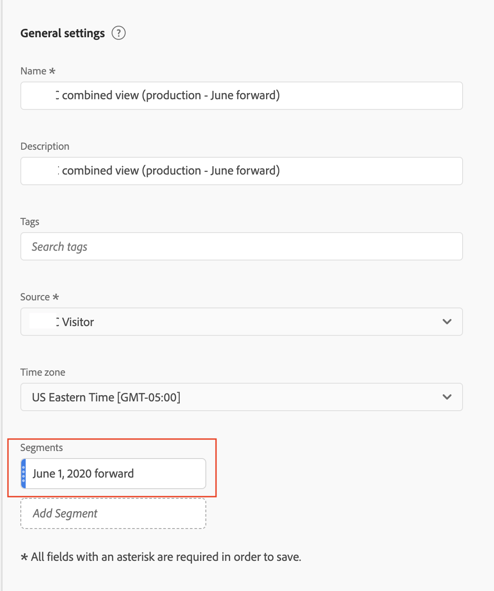

# Limitar um conjunto de relatórios virtuais a determinadas datas

{{available-existing-customers}}

Quando ativamos a compilação, ela começa em uma data específica. Vamos supor que a data seja 1º de junho. O conjunto de relatórios virtuais da CDA conterá dados não compilados anteriores a 1° de junho. Talvez você queira ocultar os dados no Conjunto de relatórios virtuais anteriores a 1° de junho para que sua análise possa se concentrar em intervalos de datas após o início da compilação.

É possível limitar os dados do Conjunto de relatórios virtual a determinadas datas fazendo o seguinte:

## Etapa 1: Criar conjunto de relatórios virtual com um intervalo de datas diário contínuo

Ao configurar o Conjunto de relatórios virtuais, em Componentes, adicione um intervalo de datas com início fixo, com um intervalo de datas diário contínuo. O início fixo deve ser o dia em que a compilação começou.

## Etapa 2: Criar um segmento &quot;excluir-excluir&quot;

Em seguida, crie um segmento de ocorrência que coloque o intervalo de datas em um container de exclusão dentro de outro container de exclusão. É um &quot;excluir-excluir&quot;.

O motivo para &quot;excluir-excluir&quot; é que os intervalos de datas devem substituir o intervalo de datas do relatório. Portanto, se você incluir apenas a partir do dia 1º de junho, ele sempre fará com que o intervalo de datas do relatório seja de 1º de junho em diante. Essa ação causará resultados indesejáveis. Quando você &quot;exclui-exclui&quot;, isso substitui esse comportamento e apenas limita os dados que podem ser obtidos do intervalo de datas apropriado.

## Etapa 3: aplique esse segmento ao conjunto de relatórios virtuais do Cross-device Analytics

## Etapa 4: Ver os resultados nos relatórios

Observe que os relatórios agora começam na data desejada, no mesmo dia em que a compilação foi implementada pela primeira vez:

