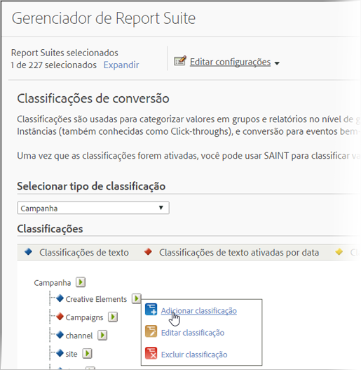

# Visão geral das classificações

Classificação é uma forma de categorização de dados variáveis do Analytics, que exibe os dados de diferentes maneiras quando você gera os relatórios.

Visão geral em vídeo de [Classificações do Analytics](https://video.tv.adobe.com/v/16853/?captions=por_br).

**[!UICONTROL Administração]** > **[!UICONTROL Conjuntos de relatórios]** > **[!UICONTROL Editar configurações]** > *`<Traffic or Conversion>`*

Ao classificar, você estabelece uma relação entre a variável e os metadados relacionados a ela. Na maioria das vezes, as classificações são usadas em campanhas. Os dados coletados por meio das informações de variáveis (eVars, props e eventos) podem ser centralizados aplicando os metadados aos valores coletados nas variáveis.

Depois de classificado, qualquer relatório que você puder gerar usando a variável-chave também poderá ser gerado com os atributos associados. Por exemplo, é possível classificar [!UICONTROL IDs de produto] com outros atributos de produto, como nome do produto, cor, tamanho, descrição e SKU. O aumento dos dados de relatórios e análises com outros atributos oferece oportunidades de relatórios mais profundos e complexos.

Após criar as classificações, você pode aproveitar os novos atributos de dados em todo o Adobe Analytics.

## Exemplo de códigos de rastreamento

Digamos que, em vez de visualizar campanhas só pelo código de rastreamento, você queira ver os resultados da campanha pelo mecanismo de pesquisa, palavras-chave e canal de campanha. Em vez de dedicar variáveis de conversão a cada um deles, você poderá criar três classificações da variável de campanha para representar o mecanismo de pesquisa, palavras-chave e canal de campanha. Essa estratégia permite ver os eventos bem-sucedidos do site por todas as quatro variáveis, sem outra marcação.

Os relatórios e análises contêm classificações pré-definidas para a variável do código de rastreamento, que oferece relatórios baseados na classificação, chamados Elementos Criativos e Campanhas. É preciso configurar manualmente as classificações para todas as outras variáveis de conversão e de tráfego.

Consulte [Classificações de tráfego](/help/admin/admin/c-traffic-variables/traffic-classifications.md) e [Classificações de conversão](https://docs.adobe.com/content/help/pt-BR/analytics/admin/admin-tools/conversion-variables/conversion-classifications.html).

A tabela a seguir descreve os diferentes tipos de classificação disponíveis e os tipos de variáveis que os suportam. Revise as informações em   [Estrutura de arquivo geral](/help/components/classifications/importer/c-saint-data-files.md) antes do upload dos arquivos de dados.

<table id="table_279728C28D9C40EE832ACC9F211B5F17"> 
 <thead> 
  <tr> 
   <th colname="col1" class="entry"> 
TIPO 
 </th> 
   <th colname="col2" class="entry"> 
DISPONIBILIDADE 
 </th> 
   <th colname="col3" class="entry"> 
DESCRIÇÃO 
 </th> 
  </tr> 
 </thead>
 <tbody> 
  <tr> 
   <td colname="col1"> 
  Texto 
 </td> 
   <td colname="col2"> 
Variáveis de conversão e de tráfego 
 </td> 
   <td colname="col3"> 
As classificações de texto definem uma categoria que permite a você agrupar dados variáveis para a geração de relatórios. 
 
Por exemplo: se você vende camisetas, talvez queira categorizar as vendas (conversão) por cor, tamanho e estilo, para que possa gerar relatórios que o permitam ver as vendas de camisetas organizadas por essas categorias. 
 </td> 
  </tr> 
  <tr> 
   <td colname="col1"> 
  Texto ativado por data 
 
Observação: na Versão de manutenção do Analytics de 10 de maio de 2018, a Adobe começou a limitar a funcionalidade de classificações habilitadas por data. Esses tipos de classificações foram removidos das interfaces Admin e Importador de classificações. Nenhuma classificação habilitada por data pode ser adicionada. As classificações existentes ainda podem ser gerenciadas (atualizadas, excluídas) por meio do fluxo de trabalho de classificação padrão, e continuarão disponíveis nos relatórios. 
 </td> 
   <td colname="col2"> 
Variáveis de conversão 
 </td> 
   <td colname="col3"> 
Uma classificação de texto ativada por data permite que você atribua intervalos de datas a uma classificação de texto. Isso é comumente utilizado em classificações de campanha, de modo que você pode aproveitar a exibição do gráfico de Gantt no relatório Campanhas. 
 
É possível incluir as datas da campanha atual no arquivo de dados que preenche os dados de classificação. 
 
O Reports &amp; Analytics coleta códigos de rastreamento da campanha mesmo se a data final da campanha já tiver passado, mas os dados da campanha coletados após sua data final não são associados à campanha. 
 </td> 
  </tr> 
  <tr> 
   <td colname="col1"> 
  Numérico 
Observação: na Versão de manutenção do Analytics de 10 de maio de 2018, a Adobe começou a limitar a funcionalidade de classificações numéricas. Esses tipos de classificações foram removidos das interfaces Admin e Importador de classificações. Nenhuma classificação numérica pode ser adicionada. As classificações existentes ainda podem ser gerenciadas (atualizadas, excluídas) por meio do fluxo de trabalho de classificação padrão, e continuarão disponíveis nos relatórios. 
 
 </td> 
   <td colname="col2"> 
Variáveis de conversão 
 </td> 
   <td colname="col3"> 
As classificações numéricas permitem que você aplique valores numéricos fixos para os relatórios de Conversão. Essas classificações aparecem como métricas nos relatórios. 
 
Ao estudar a possibilidade de adicionar uma classificação numérica, o valor numérico deve ser fixo e imutável ao longo do tempo. 
 </td> 
  </tr> 
 </tbody> 
</table>

