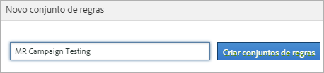
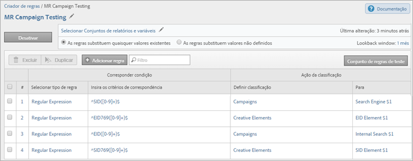

# Conjuntos de regras de classificação (herdados)

{{classification-rulebuilder-deprecation}}

*Esta página explica os conjuntos de regras de classificação como parte do [Construtor de regras de classificação](classification-rule-builder.md). Consulte [Conjuntos de classificação](../sets/overview.md) para obter o método atual de classificação de dados no Adobe Analytics.*

Um conjunto de regras é um grupo de regras de classificação para uma variável específica. Aplique uma variável ao conjunto de regras. Se quiser criar vários conjuntos de regras para uma variável, aplique cada conjunto de regras a vários conjuntos de relatórios.

## Página do criador de regras de classificação {#section_C60B0888C76D49C596EF19F11808B718}

**[!UICONTROL Analytics]** > **[!UICONTROL Administração]** > **[!UICONTROL Construtor de regras de classificação]**

Os campos e opções a seguir estão disponíveis no [!UICONTROL Construtor de regras de classificação].

<table id="table_A5D92409969747E39E041216A5AA32CD"> 
 <thead> 
  <tr> 
   <th colname="col1" class="entry"> Elemento </th> 
   <th colname="col2" class="entry"> Descrição </th> 
  </tr> 
 </thead>
 <tbody> 
  <tr> 
   <td colname="col1"> 
<a href="/help/components/classifications/crb/classification-rule-set.md"  > Adicionar conjunto de regras</a> 
 </td> 
   <td colname="col2"> 
Cria um conjunto de regras. 
 </td> 
  </tr> 
  <tr> 
   <td colname="col1"> 
Regras 
 </td> 
   <td colname="col2"> Exibe o número de regras contidas no conjunto. </td> 
  </tr> 
  <tr> 
   <td colname="col1"> 
Status 
 </td> 
   <td colname="col2"> Exibe o status da atividade do conjunto de regras, como Rascunho ou Ativo. As regras ativas são processadas diariamente, examinando os dados de classificação normalmente há um mês. As regras verificam novos valores automaticamente e fazem upload das classificações. </td> 
  </tr> 
  <tr> 
   <td colname="col1"> 
Última alteração 
 </td> 
   <td colname="col2"> Indica quando o conjunto de regras foi editado. </td> 
  </tr> 
  <tr> 
   <td colname="col1"> 
Duplicar 
 </td> 
   <td colname="col2"> Duplica (copia) um conjunto de regras, de modo que você possa aplicar o conjunto de regras a outra variável, ou à mesma variável em um conjunto de relatório diferente. </td> 
  </tr> 
 </tbody> 
</table>

## Criar um conjunto de regras de classificação {#create-classification-rule-set}

Atribua um nome ao conjunto de regras de classificação, aplique a variável e defina as configurações de substituição.

1. (Pré-requisito) Defina a estrutura de classificação em **[!UICONTROL Administração]** > **[!UICONTROL Conjuntos de relatórios]**.

   As variáveis serão exibidas no painel [!UICONTROL Novo conjunto de regras] somente após terem pelo menos uma classificação definida para aquelas variáveis.

   É possível criar classificações em uma variável em **[!UICONTROL Admin]** > **[!UICONTROL Conjuntos de relatório]** > **[!UICONTROL Tráfego]** > **[!UICONTROL Classificações de tráfego]** (ou **[!UICONTROL Conversão]** > **[!UICONTROL Classificações de conversão]**). Depois, selecione a variável e clique em **[!UICONTROL Adicionar classificação]**.

1. Para criar um conjunto de regras, clique em **[!UICONTROL Administração]** > **[!UICONTROL Construtor de regras de classificação]** > **[!UICONTROL Adicionar conjunto de regras]**.

   

1. Dê um nome ao conjunto de regras e clique em **[!UICONTROL Criar conjuntos de regras]**.
1. Selecione o conjunto de regras a ser editado.

   

1. Clique em **[!UICONTROL Selecionar Conjuntos de relatórios e variáveis]**.

   O conjunto de relatórios e a lista de variáveis são preenchidos com todas as variáveis classificadas disponíveis em todos os conjuntos de relatórios na sua empresa de logon. Uma única variável em um conjunto de relatórios pode pertencer a apenas um conjunto de regras.

   Consulte *`Variable`* nas definições da página [Construtor de regras de classificação](/help/components/classifications/crb/classification-rule-definitions.md) para obter mais informações.
1. Especifique os conjuntos de relatórios e as variáveis disponíveis para uso e clique em **[!UICONTROL Salvar]**.
1. Continue [adicionando regras de classificação](/help/components/classifications/crb/classification-rule-set.md) ao conjunto de regras.
