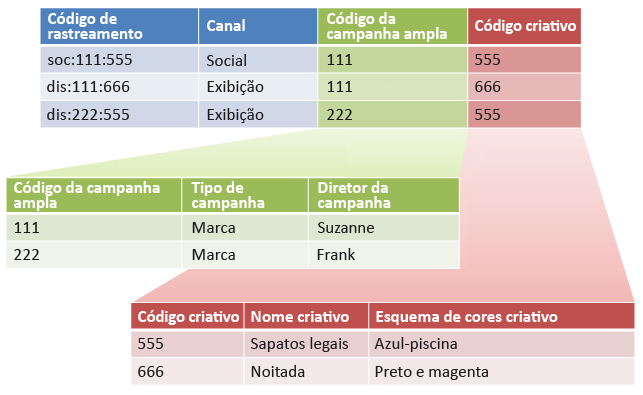

# Subclassificações e o construtor de regras (herdado)

{{classification-rulebuilder-deprecation}}

É possível combinar o Construtor de regras de classificação com subclassificações se você garantir que cada subclassificação tenha um valor principal.

É possível combinar o Construtor de regras de classificação com subclassificações para simplificar o gerenciamento de classificações e reduzir o número de regras necessário. Você pode querer fazer isso se o código de rastreamento consiste em códigos que você deseja classificar separadamente.

Consulte [Subclassificação](/help/components/classifications/importer/subclassifications.md) para informações conceituais sobre subclassificações.

## Exemplo

Assume o seguinte código de rastreamento:

`channel:broad_campaign:creative`

Uma hierarquia de classificação permite aplicar uma classificação a uma classificação (chamada de *`sub-classification`*). Ou seja, você pode utilizar o importador como um banco de dados de relações com várias tabelas. Uma tabela mapeia códigos de rastreamento completos e o outro mapeia essas teclas para outras tabelas.

Depois que essa estrutura estiver estabelecida, você poderá usar o [Construtor de regras de classificação](/help/components/classifications/crb/classification-rule-builder.md) para carregar arquivos pequenos que atualizam apenas as tabelas de pesquisa (as tabelas verde e vermelha na imagem anterior). Em seguida, você pode utilizar o construtor de regras para manter a tabela de classificação principal atualizada.

A seguinte tarefa descreve como fazer isso.

## Configurar subclassificações usando o Construtor de regras

Exemplo de etapas que descrevem como você pode fazer upload de subclassificações usando o Construtor de regras.

1. Criar classificações e subclassificações no Gerenciador de classificações.

   Exemplo:

   

1. No [Construtor de regras de classificações](/help/components/classifications/crb/classification-rule-builder.md), classifique a chave de subclassificação do código de rastreamento original.

   Isso é realizado utilizando uma expressão regular. Neste exemplo, a regra para preencher *`Broad Campaign code`* usaria esta expressão regular:

   | `#` | Tipo de regra | Corresponder | Definir a classificação | Para |
   |---|---|---|---|---|
   |   | Expressão regular | `[^\:]:([^\:]):([^\:])` | Código de campanha ampla | `$1` |
   |   | Expressão regular | `[^\:]:([^\:]):([^\:])` | Código criativo | `$2` |

   >[!NOTE]
   >
   >Nesse ponto, você não preenche as subclassificações *`Campaign Type`* e *`Campaign Director`*.

1. Fazer upload de um arquivo de classificação que inclui somente as subclassificações especificadas.

   Consulte [Classificações de vários níveis](/help/components/classifications/importer/subclassifications.md).

   Exemplo:

   | Chave | Canal | Código de campanha ampla | Código de campanha&amp;Hat;Tipo de campanha | Código de campanha&amp;Hat;Diretor de campanha | ... |
   |---|---|---|---|---|---|
   | &#42; |  | 111 | Marca | Suzanne |  |
   | &#42; |  | 222 | Marca | Frank |  |

1. Para manter as tabelas de pesquisa, carregue um pequeno arquivo (como mostrado acima).

   Esse arquivo é carregado quando, por exemplo, um novo *`Broad Campaign code`* é introduzido. Esse arquivo seria aplicado aos valores classificados anteriormente. Da mesma forma, se você criar uma nova subclassificação (como *`Creative Theme`* como uma subclassificação de *`Creative code`*), você fará upload somente do arquivo de subclassificação, em vez do arquivo de classificação inteiro.

   Em relatórios, essas subclassificações funcionam exatamente como classificações de nível superior. Isso diminui a responsabilidade administrativa necessária para usá-las.
