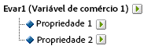

# Subclassificações

{{classification-importer-deprecation}}

O Adobe Analytics suporta modelos de classificação de nível único e múltiplo. Uma hierarquia de classificação permite aplicar uma classificação a uma classificação.

>[!NOTE]
>
>Subclassificação é a capacidade de criar classificações das classificações. No entanto, não é o mesmo que [!UICONTROL Hierarquia de Classificação] usada para criar relatórios de [!UICONTROL Hierarquia]. Para obter mais informações sobre hierarquias de classificação, consulte [Hierarquias de classificação](/help/admin/tools/manage-rs/edit-settings/conversion-var-admin/classification-hierarchies.md).

Por exemplo:

Cada classificação neste modelo é independente e corresponde a um novo sub-relatório para a variável de relatório selecionada. Além disso, cada classificação constitui uma coluna de dados no arquivo de dados, com o nome da classificação como o cabeçalho da coluna. Por exemplo:

| CHAVE | PROPRIEDADE 1 | PROPRIEDADE 2 |
|---|---|---|
| 123 | ABC | A12B |
| 456 | DEF | C3D4 |

Para obter mais informações sobre o arquivo de dados, consulte [Arquivos de dados de classificação](/help/components/classifications/importer/c-saint-data-files.md).

As classificações de vários níveis são compostas por classificações principais e secundárias. Por exemplo:

**Classes pais:** uma classe pai é qualquer classe que tenha uma classe filha associada. Uma classificação pode ser tanto pai como filha. As classificações principais de nível superior correspondem às classificações de nível único.

**Classes filhas:** uma classe filha é qualquer classe que tenha outra classificação como pai em vez da variável. As classificações secundárias fornecem informações adicionais sobre a classificação principal. Por exemplo, uma classificação [!UICONTROL Campanhas] pode ter uma classificação secundária Proprietário da campanha. As classificações [!UICONTROL numéricas] também funcionam como métricas nos relatórios de classificação.

Cada classificação, principal ou secundária, constitui uma coluna de dados no arquivo de dados. O cabeçalho de coluna para uma classificação secundária usando o seguinte formato de nomenclatura:

`<parent_name>^<child_name>`

Para obter mais informações sobre o formato do arquivo de dados, consulte [Arquivos de dados de classificação](/help/components/classifications/importer/c-saint-data-files.md).

Por exemplo:

| CHAVE | PROPRIEDADE 1 | Propriedade 1^Propriedade 1-1 | Propriedade 1^Propriedade 1-2 | Propriedade 2 |
|---|---|---|---|---|
| 123 | ABC | Verde | Pequena | A12B |
| 456 | DEF | Vermelho | Grande | C3D4 |

Embora o modelo de arquivo para uma classificação de vários níveis seja mais complexo, o potencial das classificações de vários níveis é que níveis separados podem ser carregados como arquivos separados. Essa abordagem pode ser usada para minimizar a quantidade de dados que precisam ser carregados periodicamente (diariamente, semanalmente e assim por diante), agrupando os dados em níveis de classificação que mudam com o tempo em relação aos que não mudam.

>[!NOTE]
>
>Se a coluna [!UICONTROL Chave] em um arquivo de dados estiver em branco, a Adobe automaticamente gera chaves exclusivas para cada linha de dados. Para evitar uma possível corrupção de arquivo ao fazer upload do arquivo de dados com dados de classificação de segundo nível ou maior, preencha cada linha da coluna [!UICONTROL Chave] com um asterisco (*).

## Exemplos

>[!NOTE]
>
>Os dados de classificação do produto estão limitados aos atributos de dados diretamente relacionados ao produto. Os dados não se limitam à forma como os produtos são categorizados ou vendidos no site. Elementos de dados como categorias de venda, nós de navegação do site ou itens de venda não são dados de classificação do produto. Em vez disso, esses elementos são capturados nas variáveis de conversão do relatório.

Ao carregar arquivos de dados para esta classificação de produto, você pode fazer upload dos dados de classificação como um único arquivo ou como vários arquivos (veja abaixo). Separando o código de cor no arquivo 1 e o nome da cor no arquivo 2, os dados do nome da cor (que podem ter apenas algumas linhas) precisam ser atualizados somente quando novos códigos de cor são criados. Isso elimina o campo de nome de cor (CÓDIGO^COR) do arquivo 1, que é atualizado com mais frequência, e reduz o tamanho e a complexidade do arquivo ao gerar o arquivo de dados.

### Classificação do produto - Arquivo simples {#section_E8C5E031869C449F9B636F5EB3BFEC17}

| CHAVE | NOME DO PRODUTO | DETALHES DO PRODUTO | GÊNERO | TAMANHO | CÓDIGO | CÓDIGO^COR |
|---|---|---|---|---|---|---|
| 410390013 | Polo-SS | Camisa Polo Masculina, Manga Curta (M,01) | M | M | 01 | Pedra |
| 410390014 | Polo-SS | Camisa Polo Masculina, Manga Curta (L,03) | M | L | 03 | Heather |
| 410390015 | Polo-LS | Camisa Polo Feminina, Manga Longa (S,23) | F | S | 23 | Água |

### Classificação do produto - Vários arquivos (Arquivo 1) {#section_A99F7D0F145540069BA4EEC0597FF13F}

| CHAVE | NOME DO PRODUTO | DETALHES DO PRODUTO | GÊNERO | TAMANHO | CÓDIGO |
|---|---|---|---|---|---|
| 410390013 | Polo-SS | Camisa Polo Masculina, Manga Curta (M,01) | M | M | 01 |
| 410390014 | Polo-SS | Camisa Polo Masculina, Manga Curta (L,03) | M | L | 03 |
| 410390015 | Polo-LS | Camisa Polo Feminina, Manga Longa (S,23) | F | S | 23 |

### Classificação do produto - Vários arquivos (Arquivo 2) {#section_19ED95C33B174A9687E81714568D56A3}

| CHAVE | CÓDIGO | CÓDIGO^COR |
|---|---|---|
| &#42; | 01 | Pedra |
| &#42; | 03 | Heather |
| &#42; | 23 | Água |
