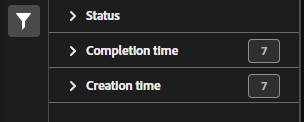

# Gerenciador de consolidações do conjunto de classificações

Se você tiver vários conjuntos de classificações que contenham dados semelhantes, é possível consolidá-los em um único conjunto de classificações. Ao consolidar dois ou mais conjuntos de classificações, o Adobe gera um novo conjunto de classificações que contém todos os dados de classificação de cada conjunto de classificações individual. As consolidações são úteis quando você carrega dados em vários conjuntos de relatórios ou dimensões que contêm os mesmos dados de classificação e deseja mesclá-los em um único fluxo de trabalho.

**[!UICONTROL Componentes]** > **[!UICONTROL Conjuntos de classificações]** > **[!UICONTROL Consolidações]**

Depois que uma consolidação é executada, os conjuntos de classificações originais são removidos e o conjunto de classificações consolidadas ocupa seu lugar. Clique em **[!UICONTROL Adicionar]** para [Criar uma consolidação](process.md).

## Filtrar conjuntos de classificação

O lado esquerdo do gerenciador de consolidação do conjunto de classificações fornece configurações de filtro para localizar a consolidação desejada. Clicar no ícone de filtro alterna a visibilidade das configurações de filtro. É possível filtrar consolidações por **[!UICONTROL Status]**, **[!UICONTROL Hora de conclusão]** ou **[!UICONTROL Hora de criação]**.

Opções de filtro adicionais estão disponíveis acima das colunas do gerenciador de consolidação do conjunto de classificações:

* **[!UICONTROL Pesquisar por título]**: Pesquise consolidações por nome.
* **Mostrar/Ocultar colunas**: alternar a visibilidade de qualquer coluna além de [!UICONTROL Nome].

## Colunas do gerenciador de consolidação do conjunto de classificações

As seguintes colunas estão disponíveis no gerenciador de consolidação do conjunto de classificações:

* **[!UICONTROL Nome]**: O nome da consolidação.
* **[!UICONTROL Trabalho atual]**: a tarefa atual. <!-- todo: better description -->
* **[!UICONTROL Status]**: O status da consolidação. <!-- todo: get list of possible statuses -->
* **[!UICONTROL Data de criação]**: A data e a hora em que a consolidação foi criada.
* **[!UICONTROL Data de conclusão]**: A data e a hora em que a consolidação foi concluída (ou falhou).
