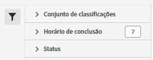

# Gerenciador de processos do conjunto de classificações

O Gerenciador de processos do conjunto de classificações permite visualizar os processos de classificação atuais e concluídos que foram gerados a partir dos conjuntos de classificações. Também é possível usar essa interface para baixar dados de classificação ou modelos para um processo específico ou fazer upload de dados adicionais para um processo.

>[!NOTE]
>
>Esse recurso está disponível para todos os clientes na arquitetura do Conjunto de classificações. Entre em contato com o Atendimento ao cliente da Adobe ou com a equipe de conta da Adobe para obter mais informações.

**[!UICONTROL Componentes]** > **[!UICONTROL Conjuntos de classificações]** > **[!UICONTROL Processos]**

Observe que não é possível criar processos a partir dessa interface. Em vez disso, você pode criar processos fazendo upload de dados em um conjunto de classificações, solicitando um arquivo de download ou arquivo de modelo.

## Filtrar conjuntos de classificações

O lado esquerdo do Gerenciador de processos do conjunto de classificações fornece configurações de filtro para localizar o processo desejado. Clicar no ícone de filtro alterna a visibilidade das configurações de filtro. Você pode filtrar os conjuntos de classificações por **[!UICONTROL Conjunto de classificações]**, **[!UICONTROL Hora de conclusão]** ou **[!UICONTROL Status]**.

Opções de filtro adicionais estão disponíveis acima das colunas do Gerenciador de processos do conjunto de classificações:

* **[!UICONTROL Pesquisar por título]**: pesquisar processos por nome de arquivo.
* **[!UICONTROL Carregar mais]**: inicialmente, o Gerenciador de processos do conjunto de classificações exibe até 1000 processos. Clique nesse botão para carregar mais 1000 processos.
* **Mostrar/Ocultar colunas**: alternar a visibilidade de qualquer coluna além de [!UICONTROL Nome do arquivo] e [!UICONTROL Hora de conclusão].

## Colunas do Gerenciador de processos do conjunto de classificações

As seguintes colunas estão disponíveis no Gerenciador de processos do conjunto de classificações:

* **[!UICONTROL Nome do arquivo]**: o nome do arquivo de upload ou download.
* **[!UICONTROL Conjunto de classificações]**: o nome do conjunto de classificações ao qual o arquivo se aplica. Você pode clicar no nome do conjunto de classificações para acessar suas [configurações](settings.md).
* **[!UICONTROL Tamanho]**: o tamanho do arquivo.
* **[!UICONTROL Status]**: o status do processo do arquivo.
   * **[!UICONTROL Criado]**: o processo foi enviado.
   * **[!UICONTROL Em fila]**: o arquivo está pronto para ser processado e aguarda um servidor de classificação processar o arquivo.
   * **[!UICONTROL Validado]**: o arquivo é válido e está aguardando para ser processado.
   * **[!UICONTROL Falha na validação]**: o arquivo está formatado incorretamente ou é inválido. O arquivo não passa pelo processamento.
   * **[!UICONTROL Processamento]**: o arquivo está sendo processado ativamente pela Adobe.
   * **[!UICONTROL Falha no processamento]**: falha no processamento do arquivo.
   * **[!UICONTROL Concluído]**: o processamento está concluído. Os dados de classificação são visíveis no relatório.
   * **[!UICONTROL Falha]**: falha genérica não relacionada à validação ou ao processamento.
* **[!UICONTROL Tipo]**: o tipo do processo.
* **[!UICONTROL Download de arquivo]**: aplica-se somente a processos de download, como o download de dados de classificação ou modelos. Quando um download está pronto, esta coluna fornece um link de download.
* **[!UICONTROL Hora de conclusão]**: a data e a hora em que o processo foi concluído (ou falhou).
