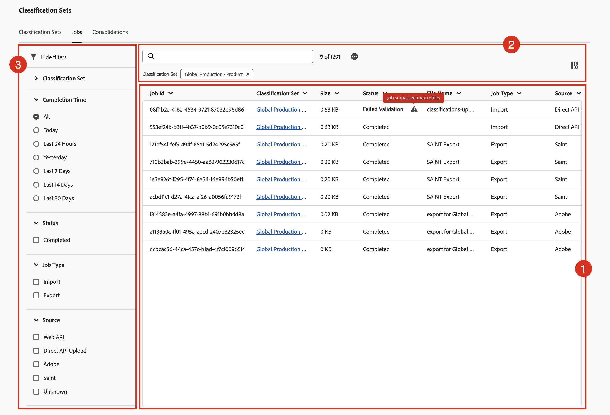

# Exibir e agir em processos de classificação

O gerenciador de processos de classificação mostra os processos de classificação atuais e concluídos que são gerados para os conjuntos de classificação. Também é possível usar o gerenciador para baixar dados de classificação ou modelos para um trabalho específico.

Para exibir e agir sobre ordens de produção de classificação:

1. Selecione **[!UICONTROL Componentes]** na interface principal e **[!UICONTROL Conjuntos de classificações]**.
1. Em **[!UICONTROL Conjuntos de classificações]**, selecione a guia **[!UICONTROL Trabalhos]**.

## Gerenciador de processos de classificação

O gerenciador **[!UICONTROL Conjuntos de Classificações - Trabalhos]** tem os seguintes elementos de interface:

### Lista de trabalhos de classificação

A lista **[!UICONTROL de]** Trabalhos de classificação➊ exibe os trabalhos de classificação. A lista tem as seguintes colunas:

| Coluna | Descrição |
|---|---|
| **[!UICONTROL Id Do Trabalho]** | O identificador do trabalho de classificação. |
| **[!UICONTROL Conjunto de classificações]** | O conjunto de classificações associado ao trabalho de classificação. |
| **[!UICONTROL Tamanho]** | O tamanho do arquivo que foi exportado ou importado como parte do trabalho de classificação. |
| **[!UICONTROL Status]** | O status do trabalho de classificação. Os valores possíveis são: **[!UICONTROL Criado]**, **[!UICONTROL Em fila]**, **[!UICONTROL Validado]**, **[!UICONTROL Falha na validação]**, **[!UICONTROL Processando]**, **[!UICONTROL Processamento concluído]**, **[!UICONTROL Falha no processamento]**, **[!UICONTROL Concluído]** ou **[!UICONTROL Progresso]**. |
| **[!UICONTROL Nome do arquivo]** | Identifica o nome ou a funcionalidade usada para importar ou exportar o arquivo como parte do trabalho de classificação. Os valores possíveis são: <ul><li>*sem valor*</li><li>O nome do arquivo que é processado como parte do trabalho de classificação.</li><li>**[!UICONTROL Exportação do SAINT]**: o trabalho é uma exportação da [interface de Classificações herdada](/help/components/classifications/importer/c-working-with-saint.md).</li><li>**[!UICONTROL exportar para _conjunto de classificações_ em _carimbo de data/hora_]**: o trabalho é um download da interface [esquema](manage/schema.md#download).</li></ul> |
| **[!UICONTROL Tipo de trabalho]** | O tipo de trabalho de classificação. Os valores possíveis são: **[!UICONTROL Import]** ou **[!UICONTROL Export]**. |
| **[!UICONTROL Origem]** | A origem do trabalho de classificação. Os valores possíveis são: **[!UICONTROL API da Web]**, **[!UICONTROL Upload de API Direta]**, **[!UICONTROL Adobe]**, **[!UICONTROL SAINT]** ou **[!UICONTROL Desconhecido]**. |
| **[!UICONTROL Linhas Modificadas]** | O número de linhas modificadas que o trabalho de classificação modificou. |
| **[!UICONTROL Total de linhas]** | O número total de linhas que o trabalho de classificação processou. |
| **[!UICONTROL Hora de conclusão]** | A hora de conclusão do trabalho de classificação. |
| **[!UICONTROL Download de arquivo]** | Use  para baixar o arquivo (modelo ou dados) associado ao trabalho de classificação. |

Para redimensionar uma coluna na lista de trabalhos de classificação, é possível:

* Passe o mouse sobre o separador de colunas e arraste o separador de colunas para a largura de coluna desejada.
* Selecione  e selecione **[!UICONTROL Redimensionar coluna]**. Uma linha vertical com botão de redimensionamento permite redimensionar a coluna para o desejado com.

Para classificar uma coluna na lista de trabalhos de classificação

* Selecione  e selecione **[!UICONTROL Classificar em Ordem Crescente]** ou **[!UICONTROL Classificar em Ordem Decrescente]**. Uma seta (^ configurada) indica qual coluna e como a coluna é classificada.

### Botões Pesquisar e

Na área ➋ na parte superior da lista de trabalhos de classificação, você pode:

* Pesquise  para trabalhos de classificação. Os resultados são mostrados na lista de trabalhos de classificação. Selecione  para limpar a pesquisa.
* Remova qualquer filtro aplicado à lista de trabalhos de classificação. Selecione  para remover um filtro.
* Selecione  para carregar mais 1000 trabalhos de classificação. Inicialmente, a lista do conjunto de classificações exibe até 1000 processos de classificação.
* Defina as colunas da lista de trabalhos dos conjuntos de classificação. Selecione  e, na caixa de diálogo **[!UICONTROL Personalizar tabela]**, selecione as colunas a serem exibidas sob **[!UICONTROL Selecione as colunas a serem exibidas]**. Selecione **[!UICONTROL Aplicar]** para aplicar as configurações de coluna.

### Painel de filtro

Selecione  para mostrar o painel de filtro ➌ que permite filtrar a lista de trabalhos de classificação. Você pode filtrar por:

* **[!UICONTROL Conjunto de classificações]**. Selecione um ou mais conjuntos de classificações para filtrar a lista de trabalhos de classificação.
* **[!UICONTROL Hora de conclusão]**. Selecione um dos valores possíveis para filtrar a lista de trabalhos de classificação no momento da conclusão.
* **[!UICONTROL Status]**. Selecione um dos valores possíveis para filtrar a lista de trabalhos de classificação no status.
* **[!UICONTROL Tipo de Trabalho]**. Selecione um dos valores possíveis para filtrar a lista de trabalhos de classificação no tipo de trabalho.
* **[!UICONTROL Source]**. Selecione um dos valores possíveis para filtrar a lista de trabalhos de classificação na origem.

Selecione  **[!UICONTROL Ocultar filtros]** para ocultar o painel de filtros.

Observe que os filtros mostrados no painel Filtros refletem as opções para os trabalhos de classificação pré-carregados.

<!--

**[!UICONTROL Components]** > **[!UICONTROL Classification sets]** > **[!UICONTROL Jobs]**

You cannot create jobs from this interface. Create jobs by uploading data to a classification set (either manually or through a configured external location), requesting a download file, or requesting a template file.

## Filter classification sets

The left side of the Classification set job manager provides filter settings to locate the desired job. Clicking the filter icon toggles the filter settings visibility. You can filter Classification sets by **[!UICONTROL Classification set]**, **[!UICONTROL Completion time]**, **[!UICONTROL Status]**, **[!UICONTROL Job Type]**, or **[!UICONTROL Source]**.

Additional filter options are available above the Classification set job manager columns:

* **[!UICONTROL Search by title]**: Search for jobs by filename.
* **[!UICONTROL Load more]**: The Classification set job manager initially displays up to 1000 jobs. If more jobs exist, click this button to load 1000 more jobs.
* **Show/Hide columns**: Toggle visibility for any column besides [!UICONTROL Filename] and [!UICONTROL Completion time].

## Classification set job manager columns

The following columns are available in the Classification set job manager:

* **[!UICONTROL Filename]**: The name of the upload or download file.
* **[!UICONTROL Classification set]**: The name of the Classification set that the file applies to. You can click the Classification set name to reach the Classification set's [Settings](manage/settings.md).
* **[!UICONTROL Size]**: The size of the file.
* **[!UICONTROL Status]**: The status of the job processing the file.
  * **[!UICONTROL Created]**: The job was submitted.
  * **[!UICONTROL Queued]**: The file is ready to be processed, and is waiting for a classification server to process the file.
  * **[!UICONTROL Validated]**: The file is valid and is waiting to be processed.
  * **[!UICONTROL Failed validation]**: The file is formatted incorrectly or otherwise invalid. The file does not go through processing.
  * **[!UICONTROL Processing]**: The file is actively being processed by Adobe.
  * **[!UICONTROL Failed processing]**: The file failed processing.
  * **[!UICONTROL Complete]**: Processing is complete. Classification data is visible in reporting.
  * **[!UICONTROL Failed]**: Generic failure not related to validation or processing.
* **[!UICONTROL Job type]**: The type of job.
* **[!UICONTROL Source]**: The job source.
* **[!UICONTROL File download]**: Only applies to download jobs, such as downloading classification data or downloading templates. When a download is ready, this column provides a download link.
* **[!UICONTROL Modified lines]**: The number of modified lines.
* **[!UICONTROL Completed lines]**: The number of completed lines.
* **[!UICONTROL Completion time]**: The date and time that the job completed (or failed).
-->