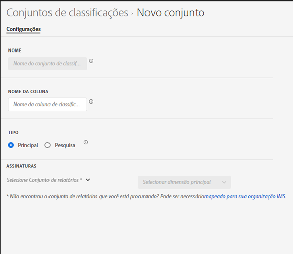

# Criar um conjunto de classificação

Você pode usar o Gerenciador de conjuntos de classificações para criar um conjunto de classificações.

**[!UICONTROL Componentes]** > **[!UICONTROL Conjuntos de classificações]** > **[!UICONTROL Conjuntos]** > **[!UICONTROL Adicionar]**

Ao criar um conjunto de classificações, os seguintes campos estarão disponíveis.

* **[!UICONTROL Nome]**: um campo de texto usado para identificar o conjunto de classificações. Este campo não pode ser editado após a criação, mas pode ser renomeado posteriormente.
* **[!UICONTROL Nome da coluna]**: o nome da primeira dimensão de classificação que você deseja criar. Esse campo é o nome da dimensão usado no Analysis Workspace e o nome da coluna ao exportar os dados de classificação. Você pode adicionar mais nomes de coluna após a criação do conjunto de classificações.
* **[!UICONTROL Tipo]**: botões de opção que indicam o tipo de classificação. As classificações primárias são normalmente utilizadas; as classificações de pesquisa representam [Subclassificações](../../c-sub-classifications.md).
* **[!UICONTROL Assinaturas]** os conjuntos de relatórios e as dimensões aos quais este conjunto de classificações se aplica. É possível adicionar várias combinações de conjunto de relatórios e dimensões a um conjunto de classificações.

Se um conjunto de classificações existir para um determinado conjunto de relatórios + variável, a classificação é adicionada ao esquema. Uma determinada combinação de conjunto de relatórios + variável não pode pertencer a vários conjuntos de classificação.
