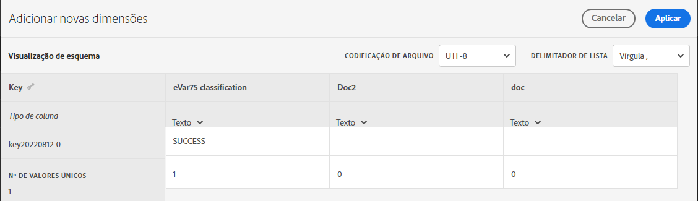
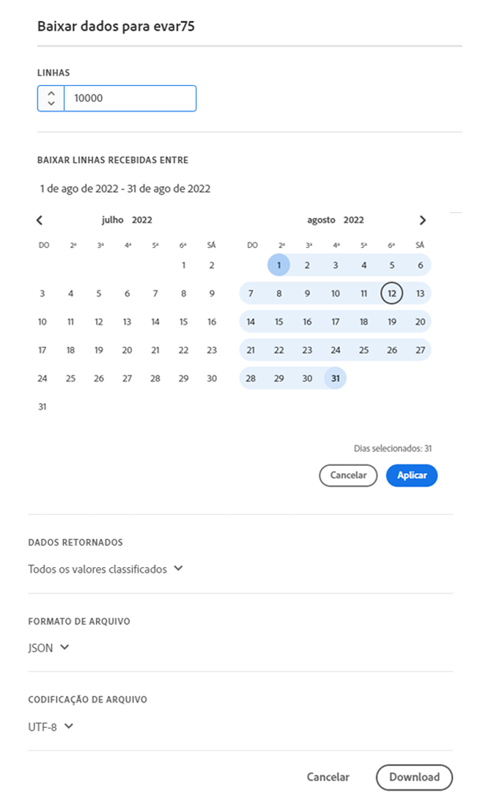
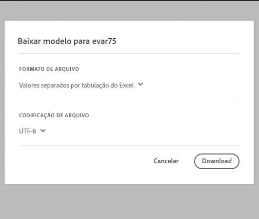

# Esquema

Exibir dimensões de classificação configuradas no momento para este conjunto de classificações.

**[!UICONTROL Componentes]** > **[!UICONTROL Conjuntos de classificações]** > **[!UICONTROL Conjuntos]** > Clique no nome do conjunto de classificações desejado > **[!UICONTROL Esquema]**

Os seguintes botões estão disponíveis:

<!--* **[!UICONTROL Add]**: Adds an empty row so that you can add a classification dimension to the schema.-->
* **[!UICONTROL Upload]**: fazer upload manual dos dados de classificação de uma ou mais dimensões de classificação. `JSON`, `CSV`, `TSV`, e `TAB` arquivos são suportados. O upload de um arquivo válido mostra uma visualização em tabela dos dados que serão classificados.
   * **[!UICONTROL Codificação de arquivo]**: selecione a codificação de arquivo correta usando essa lista suspensa. As opções válidas incluem [!UICONTROL UTF-8] e [!UICONTROL Latin1].
   * **[!UICONTROL Delimitador de lista]**: selecione o delimitador de lista correto. Se estiver usando um arquivo baixado ou um arquivo de modelo, verifique se esse [!UICONTROL delimitador de lista] corresponde ao [!UICONTROL delimitador de lista] de quando o arquivo foi baixado.
   * **[!UICONTROL Aplicar]**: salvar os dados de classificação carregados no conjunto de classificações.

  

* **[!UICONTROL Download]**: baixar os valores principais e suas colunas de classificação.
   * **[!UICONTROL Linhas]**: o número máximo de linhas a serem incluídas no arquivo de download.
   * **[!UICONTROL Baixar linhas recebidas entre]**: um seletor de datas do calendário que permite filtrar os valores principais baseado em quando eles aparecem no relatório. Se um valor principal não tiver sido coletado nesse intervalo de datas, ele não aparecerá no arquivo baixado.
   * **[!UICONTROL Dados retornados]**: uma lista suspensa que permite filtrar os valores principais incluídos no arquivo baixado com base nos dados de classificação associados.
      * **[!UICONTROL Todos os valores classificados]**: inclui linhas em que os dados de classificação estão incluídos em pelo menos uma coluna.
      * **[!UICONTROL Todos os valores não classificados]**: inclui linhas em que os dados de classificação estão ausentes em pelo menos uma coluna.
   * **[!UICONTROL Formato de arquivo]**: uma lista suspensa que determina o formato do arquivo baixado. As opções incluem [!UICONTROL JSON], [!UICONTROL Valores separados por vírgula (CSV)] e [!UICONTROL Valores separados por tabulação do Excel].
   * **[!UICONTROL Codificação de arquivo]**: uma lista suspensa que determina a codificação do arquivo. As opções incluem [!UICONTROL UTF-8] e [!UICONTROL Latin1]. É recomendado usar UTF-8.

  

* **[!UICONTROL Modelo]**: baixar um arquivo de modelo. Esse arquivo é semelhante ao botão [!UICONTROL Download], exceto por não conter dados de classificação ou valores principais.
   * **[!UICONTROL Formato de arquivo]**: uma lista suspensa que determina o formato do arquivo de modelo. As opções incluem [!UICONTROL Valores separados por vírgula (CSV)] e [!UICONTROL Valores separados por tabulação do Excel].
   * **[!UICONTROL Codificação de arquivo]**: uma lista suspensa que determina a codificação do arquivo. As opções incluem [!UICONTROL UTF-8] e [!UICONTROL Latin1]. É recomendado usar UTF-8.
   * **[!UICONTROL Delimitadores de lista]**: uma lista suspensa que determina o delimitador da lista que separa as colunas de classificação em cada linha.

  

* **[!UICONTROL Histórico de tarefas]**: um link de atalho que direciona você para o [Gerente de trabalho](../job-manager.md), mostrando tarefas somente para este conjunto de classificações.
* **[!UICONTROL Automatizar]**: assimile dados automaticamente de locais de armazenamento externo.
   * **[!UICONTROL Conta de localização]**: uma lista suspensa que mostra as contas de localização existentes que sua organização configurou. Um botão está disponível para criar uma conta de localização.
   * **[!UICONTROL Localização]**: uma lista suspensa que mostra locais existentes que sua organização configurou. Um botão está disponível para criar um local.
   * **[!UICONTROL Delimitador]**: o delimitador de coluna para arquivos carregados. As opções incluem [!UICONTROL Vírgula], [!UICONTROL Ponto e vírgula], [!UICONTROL Dois pontos], [!UICONTROL Barra vertical], [!UICONTROL Espaço], [!UICONTROL Barra inclinada], [!UICONTROL Barra invertida], [!UICONTROL Traço]ou [!UICONTROL Sublinhado].
   * **[!UICONTROL Codificação]**: uma lista suspensa que determina a codificação do arquivo. As opções incluem [!UICONTROL UTF-8] e [!UICONTROL Latin1]. É recomendado usar UTF-8.
