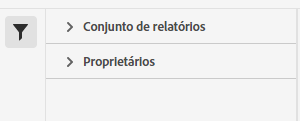

# Gerenciador de conjuntos de classificações

O Gerenciador de conjuntos de classificações permite criar, editar ou excluir conjuntos de classificações.

>[!NOTE]
>
>Esse recurso está disponível para todos os clientes na arquitetura do Conjunto de classificações. Entre em contato com o Atendimento ao cliente da Adobe ou com a equipe de conta da Adobe para obter mais informações.

**[!UICONTROL Componentes]** > **[!UICONTROL Conjuntos de classificações]** > **[!UICONTROL Conjuntos]**

Os conjuntos de classificações consistem em **Assinaturas** (Conjuntos de relatórios aos quais esse Conjunto de classificações se aplica) e **Nomes de classificação** (as dimensões adicionais que contêm dados de classificação).

## Filtrar conjuntos de classificações

O lado esquerdo do Gerenciador de conjuntos de classificações fornece configurações de filtro para localizar o conjunto de classificações desejado. Clicar no ícone de filtro alterna a visibilidade das configurações de filtro. Você pode filtrar conjuntos de classificações por **[!UICONTROL Tags]**, **[!UICONTROL Conjunto de relatórios]** ou **[!UICONTROL Proprietário]**.

## Colunas do Gerenciador de conjuntos de classificações

As seguintes colunas estão disponíveis no Gerenciador de conjuntos de classificações:

* **[!UICONTROL Conjunto de classificações]**: o nome do conjunto de classificações. Clique no nome do conjunto de classificações para [editar suas configurações](settings.md).
* **[!UICONTROL Assinaturas]**: o número de assinaturas ou o número de conjuntos de relatórios aos quais este conjunto de classificações se aplica.
* **[!UICONTROL Proprietário]**: o proprietário do conjunto de classificações.
* **[!UICONTROL Classificações]**: o número de dimensões de classificação que o conjunto de classificações contém.
* **[!UICONTROL Última modificação]**: a data e a hora em que o conjunto de classificações foi modificado pela última vez.

## Criar ou editar opções

Os seguintes botões estão disponíveis no Gerenciador de conjuntos de classificações:

* **[!UICONTROL Adicionar]**: [criar](create.md) um conjunto de classificações.
* **[!UICONTROL Pesquisar por título]**: pesquisar conjuntos de classificações por nome.
* **[!UICONTROL Carregar mais]**: inicialmente, o Gerenciador de conjuntos de classificações exibe até 1000 conjuntos de classificações. Clique nesse botão para carregar mais 1000 conjuntos de classificações.
* **Mostrar/Ocultar colunas**: alternar a visibilidade de qualquer coluna além do [!UICONTROL Conjunto de classificações].

Selecione um ou mais conjuntos de classificações clicando na caixa de seleção ao lado do conjunto de classificações desejado. Selecionar um conjunto de classificações revela as seguintes opções:

* **[!UICONTROL Tag]**: adicione uma ou mais tags ao(s) conjunto(s) de classificações selecionado(s), o que permite organizar ou agrupar conjuntos de classificações para facilitar a localização no futuro.
* **[!UICONTROL Renomear]**: renomear o conjunto de classificações selecionado.
