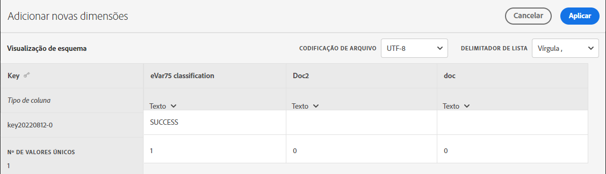

# Configurações do conjunto de classificações

Configure um conjunto de classificações e faça upload ou download de dados.

**[!UICONTROL Componentes]** > **[!UICONTROL Conjuntos de classificações]** > **[!UICONTROL Conjuntos]** > Clique no nome do conjunto de classificações desejado

Duas guias estão disponíveis ao editar um conjunto de classificações: **[!UICONTROL Esquema]** e **[!UICONTROL Configurações]**.

## Configurações 

Os seguintes campos estão disponíveis na guia [!UICONTROL Configurações] e podem ser editados:

* **[!UICONTROL Nome]**: o nome do conjunto de classificações.
* **[!UICONTROL Descrição]**: a descrição do conjunto de classificações.
* **[!UICONTROL Nome do proprietário]**: o nome do proprietário.
* **[!UICONTROL Email do proprietário]**: o endereço de email do proprietário.
* **[!UICONTROL Notificação de problemas]**: uma lista delimitada por vírgulas de endereços de email que são notificados sobre problemas com este conjunto de classificações.
* **[!UICONTROL Tags]**: adicione uma ou mais tags ao(s) conjunto(s) de classificações selecionado(s), o que permite organizar ou agrupar conjuntos de classificações para facilitar a localização no futuro.

Campos adicionais estão disponíveis para fins informativos e não podem ser editados:

* **[!UICONTROL Tipo]**: o tipo de classificação entre [!UICONTROL Primária] e [!UICONTROL Pesquisa]. Normalmente, as classificações primárias são usadas.
* **[!UICONTROL Assinaturas]**: o conjunto de relatórios e a variável aos quais o conjunto de classificações se aplica. Somente um conjunto de relatórios é compatível com um determinado conjunto de classificações no momento; a compatibilidade com vários conjuntos de relatórios está planejada.

## Esquema

Exibir dimensões de classificação atualmente configuradas para esta assinatura. Os seguintes botões estão disponíveis:

* **[!UICONTROL Upload]**: fazer upload manual dos dados de classificação de uma ou mais dimensões de classificação. Arquivos JSON, CSV, TSV e TAB são compatíveis. O upload de um arquivo válido mostra uma visualização em tabela dos dados que serão classificados.
   * **[!UICONTROL Codificação de arquivo]**: Selecione a codificação de arquivo correta usando essa lista suspensa. As opções válidas incluem [!UICONTROL UTF-8] e [!UICONTROL Latin1].
   * **[!UICONTROL Delimitador de lista]**: selecione o delimitador de lista correto. Se estiver usando um arquivo baixado ou um arquivo de modelo, verifique se esse [!UICONTROL delimitador de lista] corresponde ao [!UICONTROL delimitador de lista] de quando o arquivo foi baixado.
   * **[!UICONTROL Aplicar]**: salvar os dados de classificação carregados no conjunto de classificações.

   

* **[!UICONTROL Download]**: baixar os valores principais e suas colunas de classificação.
   * **[!UICONTROL Linhas]**: o número máximo de linhas a serem incluídas no arquivo de download.
   * **[!UICONTROL Baixar linhas recebidas entre]**: um seletor de datas do calendário que permite filtrar os valores principais baseado em quando eles aparecem no relatório. Se um valor principal não tiver sido coletado nesse intervalo de datas, ele não aparecerá no arquivo baixado.
   * **[!UICONTROL Dados retornados]**: Uma lista suspensa que permite filtrar os valores principais incluídos no arquivo baixado com base nos dados de classificação associados.
      * **[!UICONTROL Todos os valores classificados]**: inclui linhas em que os dados de classificação estão incluídos em pelo menos uma coluna.
      * **[!UICONTROL Todos os valores não classificados]**: inclui linhas em que os dados de classificação estão ausentes em pelo menos uma coluna.
   * **[!UICONTROL Formato de arquivo]**: Uma lista suspensa que determina o formato de arquivo no qual o arquivo de download está. As opções incluem [!UICONTROL JSON], [!UICONTROL Valores separados por vírgula (CSV)] e [!UICONTROL Valores separados por tabulação do Excel].
   * **[!UICONTROL Codificação de arquivo]**: Uma lista suspensa que determina a codificação do arquivo. As opções incluem [!UICONTROL UTF-8] e [!UICONTROL Latin1]. É recomendado usar UTF-8.
   * **[!UICONTROL Delimitadores de lista]**: Uma lista suspensa que determina o delimitador da lista que separa as colunas de classificação em cada linha.

   

* **[!UICONTROL Modelo]**: baixar um arquivo de modelo. Esse arquivo é semelhante ao botão [!UICONTROL Download], exceto por não conter dados de classificação ou valores principais.
   * **[!UICONTROL Formato de arquivo]**: Uma lista suspensa que determina o formato de arquivo no qual o arquivo de modelo está. As opções incluem [!UICONTROL Valores separados por vírgula (CSV)] e [!UICONTROL Valores separados por tabulação do Excel].
   * **[!UICONTROL Codificação de arquivo]**: Uma lista suspensa que determina a codificação do arquivo. As opções incluem [!UICONTROL UTF-8] e [!UICONTROL Latin1]. É recomendado usar UTF-8.
   * **[!UICONTROL Delimitadores de lista]**: Uma lista suspensa que determina o delimitador da lista que separa as colunas de classificação em cada linha.
* **[!UICONTROL Histórico de processos]**: um link de atalho que direciona você ao [Gerenciador de processos](job-manager.md), mostrando processos somente para esse conjunto de classificações.

   
