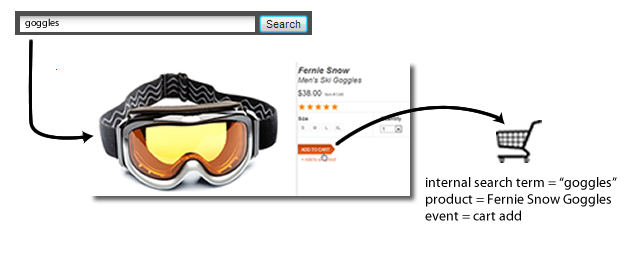

# eVar (merchandising)

*Esta página de ajuda descreve como as eVars de merchandising funcionam como uma [dimensão](overview.md). Para obter informações sobre como implementar eVars de merchandising, consulte [eVar (variável de merchandising)](/help/implement/vars/page-vars/evar-merchandising.md) no guia do usuário de implementação.*

Para ver em detalhes como as eVars de merchandising funcionam, consulte [eVars de merchandising e métodos de descoberta de produtos](/help/admin/tools/manage-rs/edit-settings/conversion-var-admin/merchandising-evars.md).

Ao medir o sucesso de campanhas externas ou termos de pesquisa externos, você normalmente deseja que um único valor receba crédito por qualquer evento bem-sucedido que ocorrer. Por exemplo, se um cliente clicar em um link em uma campanha de email para visitar seu site, todas as compras feitas como resultado deverão ser creditadas a essa campanha.

E quanto aos eventos que são impulsionados por pesquisa interna ou por navegação de categoria quando um cliente procura por vários itens? Por exemplo, um cliente pesquisa por `"goggles"` em seu site e, em seguida, adiciona um par ao carrinho:



Antes do check-out, o cliente pesquisa por `"winter coat"` e, em seguida, adiciona uma jaqueta ao carrinho:


Quando o visitante concluir essa compra, você terá uma pesquisa interna para `"winter coat"` creditada com a compra de um par de óculos (considerando que a eVar usa a alocação padrão de &quot;Mais recente&quot;). Bom para `"winter coat"`, mas ruim para as decisões de marketing:

| Termo de pesquisa interna | Receita |
|---|---|
| casaco de inverno | $157 |

## Como as variáveis de merchandising resolvem esse problema

As eVars de merchandising permitem atribuir o valor atual de uma eVar a um produto quando um evento bem-sucedido ocorre. Este valor permanece vinculado ao produto, mesmo se um ou mais valores novos forem definidos posteriormente para essa eVar específica.

Se o merchandising for habilitado para a eVar no exemplo anterior, o termo de pesquisa `"goggles"` é vinculado aos óculos de neve, e o termo de pesquisa `"winter coat"` é vinculado à jaqueta. As variáveis de merchandising alocam receitas no nível do produto, portanto, cada termo recebe crédito pela quantidade de receita do produto ao qual o termo foi associado:

| Termo de pesquisa interna | Receita |
|---|---|
| casaco de inverno | $119 |
| óculos | $38 |

Consulte [eVars de merchandising](/help/implement/vars/page-vars/evar-merchandising.md) para obter instruções de implementação.

## Instâncias de variáveis de merchandising

A métrica [Instâncias](../metrics/instances.md) não é recomendada para usar em variáveis de merchandising.

* Para variáveis de merchandising que utilizam sintaxe de produto, as instâncias não são aumentadas.
* Para variáveis de merchandising que utilizam a sintaxe de variável de conversão, as instâncias são contabilizadas cada vez que a eVar é definida. No entanto, ela atribui ao item de dimensão `"None"` a menos que os seguintes casos aconteçam na mesma ocorrência:
   * A eVar de merchandising é definida com um valor.
   * A variável `products` é definida com um valor.
   * Um evento de vinculação é configurado.

```js
// This merchandising eVar uses conversion variable syntax, and counts an instance.
// However, if the binding event and products variable are not both set, the instance attributes to "None".
s.eVar1 = "Tower defense";

// This merchandising eVar uses product syntax, and does not count an instance.
s.products = "Games;Wizard tower;;;;eVar2=Tower defense";
```

Como a maioria dos casos de uso para a sintaxe da variável de conversão requer a variável eVar e produtos em diferentes ocorrências, o uso da métrica &quot;Instâncias&quot; não é realista.
