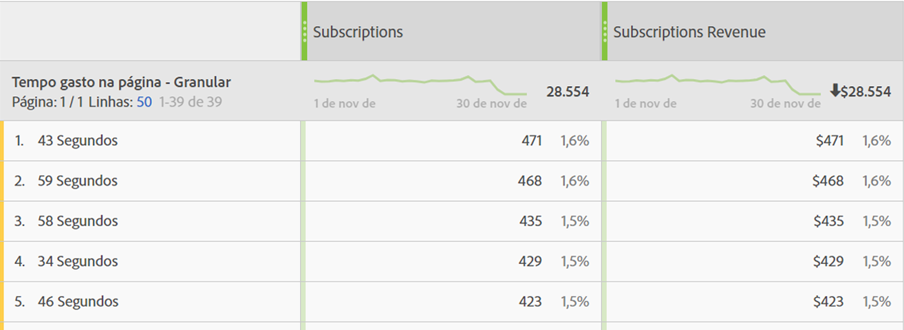

# Tempo gasto na página

A dimensão &#39;Tempo gasto na página&#39; registra a quantidade de tempo que um visitante gastou na página. Ele usa as seguintes etapas para medir o cálculo:

1. Para uma determinada ocorrência, verifique o carimbo de data e hora.
2. Compare essa ocorrência com o carimbo de data e hora da próxima ocorrência na visita. A visualização da página e a contagem de ocorrências de rastreamento de link.
3. A quantidade de tempo decorrido entre essas duas ocorrências contribui para o tempo gasto.

Essa dimensão é importante quando você deseja entender por quanto tempo os visitantes interagem com uma determinada métrica em seu site.

>[!TIP]
>
>O tempo gasto não é medido para a última ocorrência da visita, pois não há solicitação de imagem subsequente para medir o tempo decorrido. Esse conceito também se aplica a visitas que consistem em uma única ocorrência (uma rejeição).

Essa dimensão é baseada em ocorrências, o que significa que o valor é diferente para cada ocorrência. Compare essa dimensão com o [Tempo gasto por visita](time-spent-per-visit.md), que é uma dimensão baseada em visita. Tempo gasto mais alto significa que um visitante ficou mais tempo em uma página (ocorrência).

## Preencher esta dimensão com dados

Essa dimensão funciona imediatamente em todas as implementações. Se um conjunto de relatórios contiver dados, essa dimensão funcionará.

## Itens de dimensão

Existem várias dimensões para o tempo gasto na página:

* **Tempo gasto na página - segmentado**: A quantidade de tempo é armazenada por período. Os itens de dimensão variam de `"Less than 15 seconds"` a `"More than 30 minutes"`. O tempo entre visualizações de página normalmente não dura mais de 30 minutos; no entanto, o tempo entre visualizações de página pode exceder 30 minutos se estiver usando ocorrências com carimbo de data e hora ou fontes de dados.
* **Tempo gasto na página - granular**: Cada número de segundos é um item de dimensão exclusivo.

Consulte Visão geral [do](../metrics/time-spent.md) Tempo gasto para obter mais informações gerais sobre o tempo gasto.
