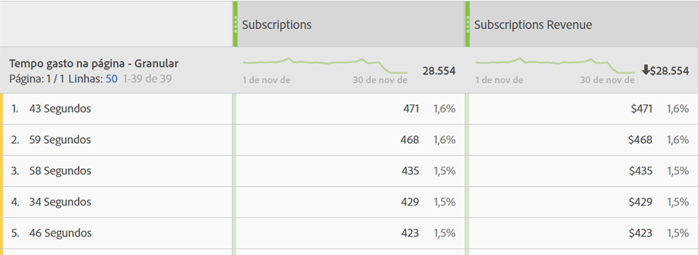

# Tempo gasto na página

A [dimensão](overview.md) de &quot;Tempo gasto na página&quot; registra o tempo que um visitante passou na página. As seguintes etapas são utilizadas para medir o cálculo:

1. Para uma determinada ocorrência, verifique o carimbo de data e hora.
2. Compare essa ocorrência com o carimbo de data e hora da próxima ocorrência na visita. Tanto a visualização de página quanto o rastreamento de link são contabilizados.
3. O tempo decorrido entre essas duas ocorrências contribui para o tempo gasto nessa página.

Essa dimensão é importante quando você deseja entender por quanto tempo os visitantes interagem com uma determinada métrica no site.

>[!TIP]
>
>O tempo gasto não é medido durante a última ocorrência da visita, pois não há solicitação de imagem subsequente para medir o tempo decorrido. Esse conceito também se aplica a visitas que consistem em uma única ocorrência (uma rejeição).

Essa dimensão é baseada em ocorrências, o que significa que o valor é diferente para cada ocorrência. Compare essa dimensão com o [Tempo gasto por visita](time-spent-per-visit.md), que é uma dimensão baseada em visitas. Quanto maior o tempo gasto, mais tempo o visitante passou em uma página (ocorrência).

## Preencher esta dimensão com dados

Essa dimensão funciona imediatamente em todas as implementações. Se um conjunto de relatórios tiver dados, essa dimensão funcionará.

## Itens de dimensão

Existem várias dimensões para o tempo gasto na página:

* **Tempo gasto na página - classificado**: a quantidade de tempo é classificada. Os itens de dimensão variam de `"Less than 15 seconds"` a `"More than 30 minutes"`. O tempo entre ocorrências normalmente não dura mais de 30 minutos. No entanto, esse tempo pode exceder 30 minutos se forem usadas ocorrências com carimbo de data e hora ou fontes de dados.
* **Tempo gasto na página - granular**: cada número de segundos é um item de dimensão exclusivo.

Consulte [Visão geral do tempo gasto](../metrics/time-spent.md) para obter mais informações gerais sobre o tempo gasto.
