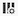

# Gerenciador de locais

O Gerenciador de locais permite exibir, criar, editar ou excluir contas e locais. Eles podem ser usados para qualquer uma das seguintes finalidades:

* Exportando arquivos usando [Feeds de Dados](/help/export/analytics-data-feed/create-feed.md)
* Exportando relatórios usando [Data Warehouse](/help/export/data-warehouse/create-request/dw-request-report-destinations.md)
* Importando esquemas usando [Conjuntos de classificações](/help/components/classifications/sets/overview.md)

## Exibir, filtrar e pesquisar locais

O Gerenciador de locais permite exibir todos os locais criados ou compartilhados com a organização. Os administradores do sistema podem visualizar os locais criados por todos os usuários, independentemente de serem compartilhados ou não.

1. Para acessar o Gerenciador de locais no Adobe Analytics, selecione **[!UICONTROL Componentes]** > **[!UICONTROL Locais]**.

1. (Condicional) Se você for um administrador do sistema, poderá habilitar a opção [!UICONTROL **Exibir locais para todos os usuários**] para exibir locais criados por todos os usuários em sua organização. <!-- Maybe add a screenshot? This is new functionality -->

1. Filtrar ou pesquisar a lista de locais:

   * **Filtro:** Selecione o ícone Filtro para filtrar a lista de locais.

     Você pode filtrar locais por **[!UICONTROL Tipo de Local]**, **[!UICONTROL Conta]** ou **[!UICONTROL Criado por]**.

     

   * **Pesquisa:** no campo de pesquisa, comece a digitar o nome do local que deseja exibir. Os resultados são filtrados à medida que você digita. As seguintes colunas foram pesquisadas: **Nome do Local**, **Tipo de Local**, **Conta** e **Criado por**.

1. (Opcional) Se você tiver mais de 1.000 locais, apenas os primeiros 1.000 serão exibidos. Selecione [!UICONTROL **Carregar mais**] para carregar mais 1.000 locais.

## Configurar colunas no Gerenciador de locais

As seguintes colunas estão disponíveis no Gerenciador de locais. Para personalizar as colunas exibidas na tabela, selecione o ícone **Personalizar tabela** .

* **[!UICONTROL Nome do local]**: o nome do local. Selecione o menu de 3 pontos ao lado de um nome de local para [editar o local](/help/components/locations/configure-import-locations.md) ou excluí-lo.
* **[!UICONTROL Tipo de localização]**: o tipo de conta associado à localização.
* **[!UICONTROL Conta]**: a conta específica associada à localização.
* **Aplicativo**: o tipo de aplicativo com o qual o local pode ser usado (como Feeds de Dados, Data Warehouse ou conjuntos de Classificação).
* **[!UICONTROL Último uso]**: a data em que o local foi usado pela última vez.
* **[!UICONTROL Criado por]**: o usuário que criou o local.
* **[!UICONTROL Data de criação]**: a data de criação do local.

## Criar e gerenciar locais

É possível criar, editar e excluir locais.

### Criar um local

Para obter informações sobre como criar um local, consulte [Configurar locais de importação e exportação da nuvem](/help/components/locations/configure-import-locations.md).

<!-- Do I need to add some steps here about how to create a location and then assign that location to be used with DF, DW, or Classifications sets? Need to hear back from Ron and team whether we are including this functionality -->

### Editar um local

Um local pode ser editado somente pelo usuário que o criou ou por um administrador do sistema.

Para obter informações sobre como editar um local, consulte [Configurar locais de importação e exportação da nuvem](/help/components/locations/configure-import-locations.md).

### Excluir um local

>[!IMPORTANT]
>
>Se um local for excluído, quaisquer arquivos de Feed de dados, relatórios de Data Warehouse ou esquemas de conjunto de classificações associados ao local excluído falharão na próxima vez que forem usados.
>
>Se você excluir um local, deverá [editar seus Feeds de dados](/help/export/analytics-data-feed/create-feed.md), [Data Warehouse relatórios](/help/export/data-warehouse/create-request/dw-request-report-destinations.md) e [Classification sets schemas](/help/components/classifications/sets/manage/schema.md) para usar um local funcional.

Um local pode ser excluído somente pelo usuário que o criou ou por um administrador do sistema.

Para excluir um local no Gerenciador de locais no Adobe Analytics:

1. Selecione **[!UICONTROL Componentes]** > **[!UICONTROL Locais]** e selecione a guia [!UICONTROL **Locais**].

1. Selecione o menu de 3 pontos na coluna [!UICONTROL **Nome do local**] para o local que você deseja excluir.

1. Clique em [!UICONTROL **Excluir**].

## Criar e gerenciar contas

É possível criar, editar e excluir contas.

### Criar uma conta

Para obter informações sobre como criar uma conta, consulte [Configurar contas de importação e exportação da nuvem](/help/components/locations/configure-import-accounts.md).

### Editar uma conta

Uma conta só pode ser editada pelo usuário que a criou ou por um administrador do sistema.

Para obter informações sobre como editar uma conta, consulte [Configurar contas de importação e exportação da nuvem](/help/components/locations/configure-import-accounts.md).

### Exibir chaves de conta

Depois de criar uma conta, você poderá exibir todas as chaves de conta associadas a ela. Talvez seja necessário exibir essas informações se você não concluiu a configuração da conta com seu provedor de nuvem quando você [configurou originalmente a conta](/help/components/locations/configure-import-accounts.md).

Para exibir chaves associadas a uma conta de exportação:

1. No Adobe Analytics, selecione **[!UICONTROL Componentes]** > **[!UICONTROL Locais]** e selecione a guia [!UICONTROL **Contas de localização**].

1. (Condicional) Se você for um administrador do sistema, poderá habilitar a opção [!UICONTROL **Exibir locais para todos os usuários**] para exibir locais criados por todos os usuários em sua organização. <!-- Maybe add a screenshot? This is new functionality -->

1. Selecione o ícone de 3 pontos na conta que deseja editar e selecione [!UICONTROL **Chaves da conta**].

### Excluir uma conta

>[!IMPORTANT]
>
>As contas podem ser excluídas somente se não houver locais usando-as. Antes de excluir uma conta, você deve primeiro excluir todos os locais na conta, conforme descrito em [Excluir um local](#delete-a-location).

Uma conta só pode ser excluída pelo usuário que a criou ou por um administrador do sistema.

Para excluir uma conta:

1. No Adobe Analytics, selecione **[!UICONTROL Componentes]** > **[!UICONTROL Locais]** e selecione a guia [!UICONTROL **Contas de localização**].

1. (Condicional) Se você for um administrador do sistema, poderá habilitar a opção [!UICONTROL **Exibir contas para todos os usuários**] para exibir os locais criados por todos os usuários em sua organização.

1. Selecione o ícone de 3 pontos na conta que deseja editar e selecione [!UICONTROL **Excluir conta**]

## Definir configurações em toda a empresa (somente administradores)

Os administradores do sistema podem impedir que os usuários criem contas e locais ou podem limitar os tipos de contas que os usuários podem criar e usar.

### Configurar se os usuários podem criar e editar contas

Por padrão, todos os usuários na organização podem criar contas e editar contas que criam no ambiente do Adobe Analytics, conforme descrito em [configurar contas de importação e exportação na nuvem](/help/components/locations/configure-import-accounts.md).

Você pode impedir que usuários criem contas. Quando você faz isso, os usuários ainda podem usar qualquer conta que já tenham criado, mas não podem mais editá-las. Você pode excluir as contas que os usuários criaram, conforme descrito em [Excluir uma conta](#delete-an-account).

Para impedir que todos os usuários criem e editem contas:

1. No Adobe Analytics, selecione **[!UICONTROL Componentes]** > **[!UICONTROL Locais]** e selecione a guia [!UICONTROL **Configurações de administração**].

1. Na seção [!UICONTROL **Contas de locais**], desmarque a opção [!UICONTROL **Permitir que os usuários criem e gerenciem contas de locais**].

1. Selecione [!UICONTROL **Salvar**].

1. (Opcional) Exclua todas as contas que os usuários criaram que você não deseja mais que eles usem, conforme descrito em [Excluir uma conta](#delete-an-account).

### Configurar se os usuários podem criar e editar locais

Por padrão, todos os usuários na organização podem criar locais e editar locais que criam no ambiente do Adobe Analytics, conforme descrito em [configurar locais de importação e exportação na nuvem](/help/components/locations/configure-import-locations.md).

Você pode impedir que usuários criem locais. Ao fazer isso, os usuários ainda podem usar os locais que já criaram, mas não podem mais editá-los. Você pode excluir os locais criados pelos usuários, conforme descrito em [Excluir locais](#delete-a-location).

Para impedir que todos os usuários criem e editem locais:

1. No Adobe Analytics, selecione **[!UICONTROL Componentes]** > **[!UICONTROL Locais]** e selecione a guia [!UICONTROL **Configurações de administração**].

1. Na seção [!UICONTROL **Locais**], desmarque a opção [!UICONTROL **Permitir que os usuários criem e gerenciem locais**].

1. Selecione [!UICONTROL **Salvar**].

1. (Opcional) Exclua todos os locais que os usuários criaram que você não deseja mais que eles usem, conforme descrito em [Excluir um local](#delete-a-location).

### Limitar quais tipos de contas os usuários podem criar e usar

É possível limitar os tipos de conta que os usuários veem nas seguintes circunstâncias:

* Ao [criar novas contas](/help/components/locations/configure-import-accounts.md).

* Ao escolher quais contas usar ao exportar arquivos usando [Feeds de Dados](/help/export/analytics-data-feed/create-feed.md), exportar relatórios usando [Data Warehouse](/help/export/data-warehouse/create-request/dw-request-report-destinations.md) ou importar esquemas usando [Conjuntos de classificações](/help/components/classifications/sets/overview.md).

Ao limitar os tipos de conta conforme descrito nesta seção, as contas do tipo que você limita não estarão mais visíveis para os usuários. Isso significa que novas contas desse tipo não podem ser criadas e contas existentes desse tipo não podem ser usadas ao criar feeds de dados, Datas Warehouse ou conjuntos de classificações.

No entanto, as contas existentes configuradas para exportações programadas devem ser excluídas se você quiser restringi-las de serem usadas.

#### Certifique-se de que as contas não sejam usadas para exportações programadas

Quando você limita os tipos de conta, as contas existentes ficam ocultas e não são excluídas.

Se os cronogramas já estiverem configurados para enviar dados para uma conta do tipo que você limita, os cronogramas continuarão em execução mesmo após você limitar o tipo de conta, e os dados continuarão a ser enviados para a conta.  Por exemplo, se um Feed de dados estiver agendado para enviar dados para um tipo de conta limitado por você, o agendamento continuará a ser executado.

Se você precisar garantir que contas de um determinado tipo não sejam usadas em exportações agendadas, poderá excluir as contas antes de [limitar os tipos de conta](#limit-the-account-types-that-are-available-to-users).

Para excluir contas:

1. Localize as contas do tipo que você planeja limitar, que estão sendo usadas para exportações programadas.

1. Exclua as contas, conforme descrito em [Excluir uma conta](#delete-an-account).

1. Continue com a seguinte seção, [Limite os tipos de conta disponíveis para os usuários](#limit-the-account-types-that-are-available-to-users).

#### Limitar os tipos de conta disponíveis aos usuários

Para limitar os tipos de conta disponíveis aos usuários ao criar e usar contas:

1. No Adobe Analytics, selecione **[!UICONTROL Componentes]** > **[!UICONTROL Locais]** e selecione a guia [!UICONTROL **Configurações de administração**].

1. Localize a seção [!UICONTROL **Tipos de conta permitidos**].

   Os seguintes tipos de conta estão disponíveis para usuários por padrão. Desmarque qualquer um desses tipos de conta que você deseja impedir que os usuários usem.

   * [!UICONTROL **Função ARN do Amazon S3**]

   * [!UICONTROL **Plataforma de nuvem da Google**]

   * [!UICONTROL **SAS do Azure**]

   * [!UICONTROL **RBAC do Azure**]

   * [!UICONTROL **Email**]

   * Tipos de conta herdados, incluindo [!UICONTROL **Amazon S3**], [!UICONTROL **Azure**], [!UICONTROL **FTP**] e [!UICONTROL **SFTP**]

1. Selecione [!UICONTROL **Salvar**].

