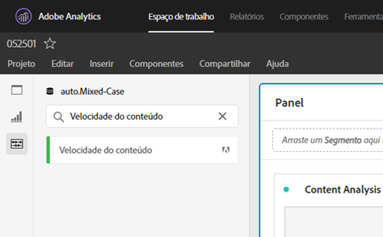

# [!UICONTROL Velocidade do conteúdo]

[!UICONTROL A Velocidade] do conteúdo é um modelo de métrica padrão do Adobe Analytics. [!UICONTROL A Velocidade] do conteúdo é definida como [Visualizações[!UICONTROL da página]] | Participação [!UICONTROL da]visita] / [[!UICONTROL Visitas]] e ajuda a medir o impacto de um conteúdo específico (Página, seção do site etc.) estava em conteúdo downstream. Ele pode ajudá-lo a entender qual conteúdo está ou não retendo usuários no site ou no aplicativo móvel.

[!UICONTROL A Velocidade] do conteúdo pode ser encontrada na Área de trabalho da Análise filtrando o painel esquerdo, pesquisando ou usando tags (#Adobe Template).

[!UICONTROL A Velocidade] do conteúdo é normalmente usada na análise do conteúdo juntamente com outras métricas principais, como Visualizações [!UICONTROL de]página, [!UICONTROL Visitas]e Taxa de [!UICONTROL rejeição].

