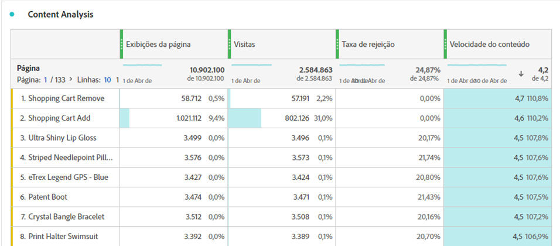

# Velocidade do conteúdo

“Velocidade do conteúdo” é um modelo de métrica calculada que ajuda a medir o impacto de uma dimensão no conteúdo de downstream. Ele usa a fórmula `Page views (Visit participation) divided by Visits`.

[!UICONTROL A velocidade do conteúdo] é normalmente utilizada na análise do conteúdo juntamente com outras métricas principais, como [!UICONTROL Visualizações de página], [!UICONTROL Visitas] e [!UICONTROL Taxa de rejeição].

