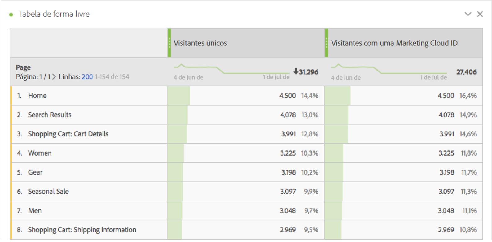
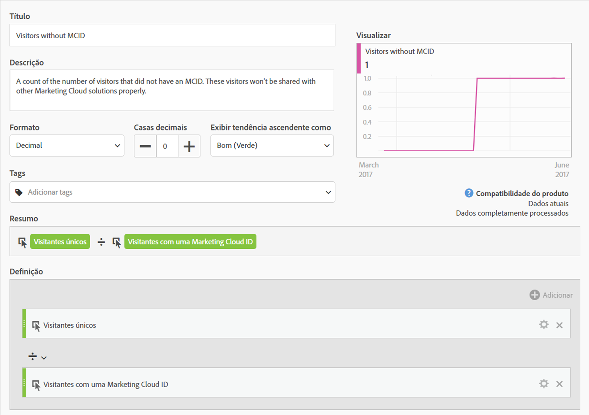
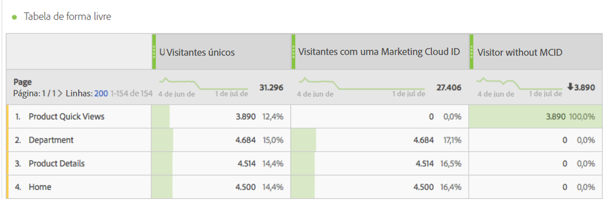

# Visitantes com Experience Cloud ID

A métrica &quot;Visitantes com a Experience Cloud ID&quot; mostra o número de visitantes únicos identificados pela Adobe usando o serviço [da](https://docs.adobe.com/content/help/pt-BR/id-service/using/home.html)Experience Cloud ID. Essa dimensão é útil para comparar com a métrica visitantes  únicos para garantir que a maioria dos visitantes do site use o serviço de ID. Se uma grande parte dos visitantes não usar os cookies do serviço de ID, isso pode indicar um problema na implementação.

>[!NOTE] Essa métrica é especialmente importante para a depuração se você usar vários serviços da Experience Cloud, como o Adobe Público alvo ou o Adobe Audiência Manager. Os segmentos compartilhados nos produtos da Experience Cloud não incluem visitantes sem uma Experience Cloud ID.

## Como essa métrica é calculada

Essa métrica é baseada na métrica visitantes  únicos, exceto que inclui somente indivíduos identificados usando a string do `mid` query (com base no [`s_ecid`](https://docs.adobe.com/content/help/pt-BR/core-services/interface/ec-cookies/cookies-analytics.html) cookie).

## Depurar a configuração da Experience Cloud ID

A métrica &quot;Visitantes com a Experience Cloud ID&quot; pode ser útil na solução de problemas de integrações da Experience Cloud ou na identificação de áreas do site que não têm o serviço de ID implantado.

Arraste os &quot;Visitantes com a Experience Cloud ID&quot; lado a lado com visitantes únicos para compará-los:

Neste exemplo, observe que cada página tem o mesmo número de &quot;Visitantes únicos&quot; que &quot;Visitantes com uma Experience Cloud ID&quot;. No entanto, o número total de Visitantes únicos é maior que o número total de Visitantes com Experience Cloud ID. Você pode criar uma métrica  calculada para descobrir quais páginas não estão configurando o serviço de ID. Você pode usar a seguinte definição:

Ao adicionar a métrica calculada ao relatório, é possível classificar o relatórios de Páginas, de forma que as páginas com os maiores números de visitantes sem MCID apareçam:

Observe que o valor da dimensão &quot;Visualizações rápidas de produto&quot; não é implementado corretamente com o Serviço de identidade. Você pode trabalhar com equipes apropriadas em sua organização para atualizar essas páginas o mais rápido possível. Você pode criar um relatório semelhante com qualquer tipo de dimensão, como tipo [de](../dimensions/browser-type.md)Navegador, seção Site ou qualquer [eVar](../dimensions/evar.md).
