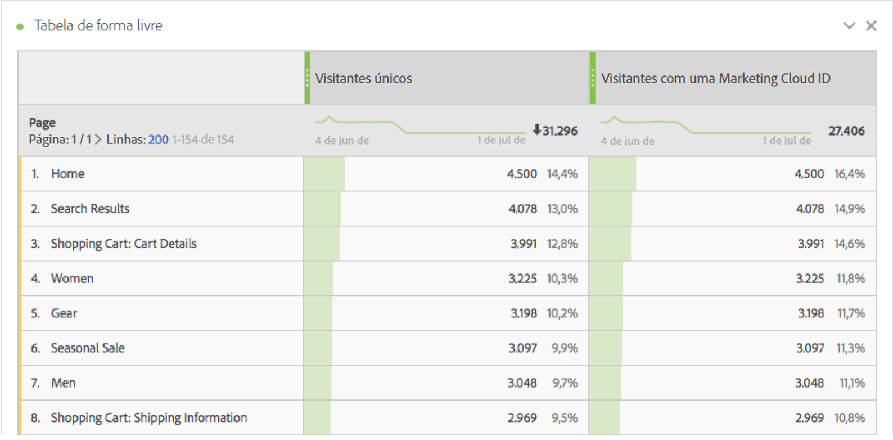
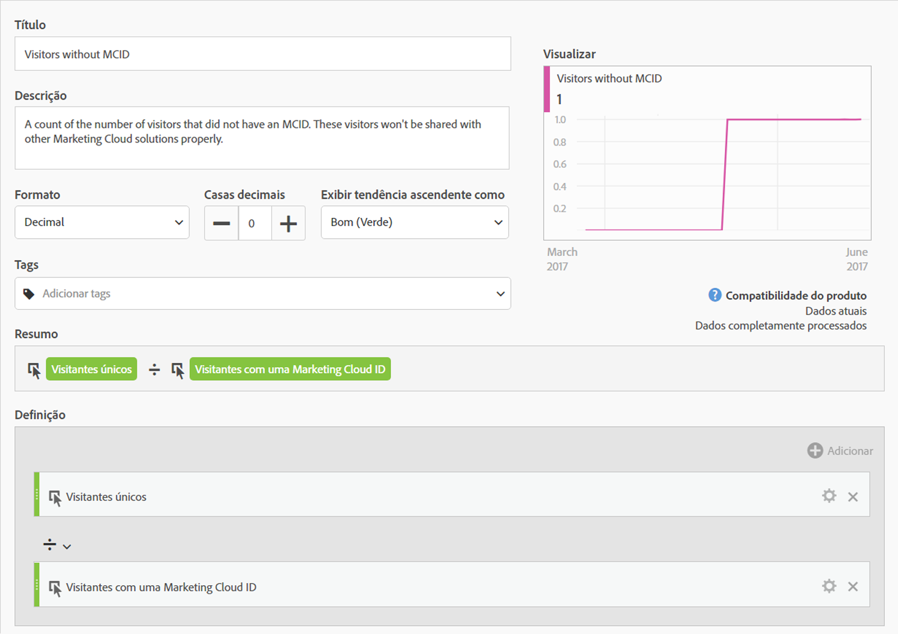
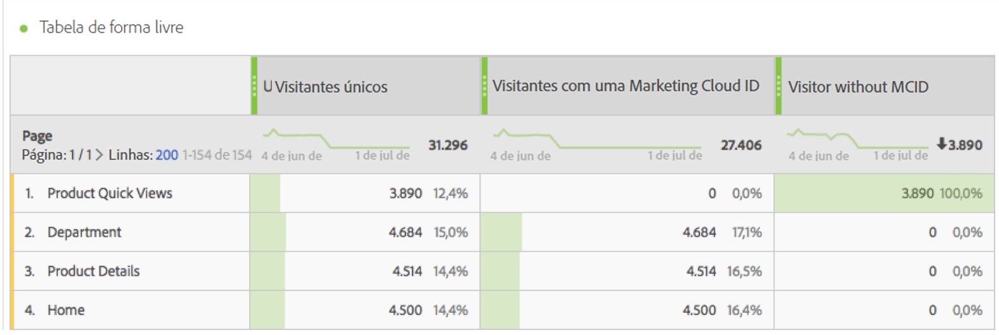

# Visitantes com Experience Cloud ID

A [métrica](overview.md) de &quot;Visitantes com Experience Cloud ID&quot; mostra o número de visitantes únicos identificados pela Adobe que usam o [serviço Experience Cloud ID](https://experienceleague.adobe.com/docs/id-service/using/home.html?lang=pt-BR). Essa métrica pode ser útil para comparar com a métrica [Visitantes únicos](unique-visitors.md) e garantir que a maioria dos visitantes do site usem o serviço de ID. Se uma grande parte dos visitantes não usar os cookies do serviço de ID, pode haver um problema na implementação.

>[!NOTE]
>
>Essa métrica é especialmente importante para a depuração se você usar vários serviços do CX Enterprise, como Adobe Target ou Adobe Audience Manager. Segmentos compartilhados entre produtos CX Enterprise não incluem visitantes sem uma Experience Cloud ID.

## Como essa métrica é calculada

Essa métrica tem como base a métrica [Visitantes únicos](unique-visitors.md), mas inclui somente pessoas identificadas utilizando a `mid` sequência de consulta (com base no cookie [`s_ecid`](https://experienceleague.adobe.com/docs/core-services/interface/ec-cookies/cookies-analytics.html?lang=pt-BR)).

## Depurar a configuração da Experience Cloud ID

A métrica &quot;Visitantes com Experience Cloud ID&quot; pode ser útil para solucionar problemas de integrações do CX Enterprise ou para identificar áreas do site que não têm o serviço de ID implantado.

Arraste os &quot;Visitantes com Experience Cloud ID&quot; lado a lado com a dimensão “Visitantes únicos” para compará-los:

Nesse exemplo, perceba que cada página tem o mesmo número de “Visitantes únicos” quanto de “Visitantes com Experience Cloud ID”. No entanto, o número total de “Visitantes únicos” é maior que o número total de Visitantes com Experience Cloud ID. Você pode criar uma [métrica calculada](../calculated-metrics/cm-overview.md) para descobrir quais páginas não estão configurando o serviço de ID. É possível utilizar a seguinte definição:

Ao adicionar a métrica calculada ao relatório, é possível classificar os Relatórios de páginas para que as páginas com os maiores números de visitantes sem MCID apareçam:

Observe que o item de dimensão “Visualizações rápidas de produto” não é implementado corretamente com o Serviço de identidade. Você pode trabalhar com as equipes apropriadas em sua organização para atualizar essas páginas o mais rápido possível. É possível criar um relatório semelhante a este com qualquer tipo de dimensão, como [Tipo de navegador](../dimensions/browser-type.md), [Seção do site](../dimensions/site-section.md) ou qualquer [eVar](../dimensions/evar.md).
