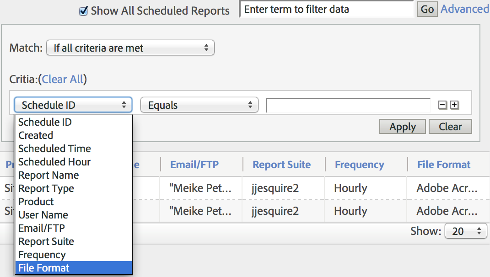

# Relação de relatórios agendados

Permite que os usuários de nível administrativo vejam e gerenciem relatórios agendados dentro da organização.

**[!UICONTROL Analytics]** > **[!UICONTROL Componentes]** > **[!UICONTROL Todos os componentes]** > **[!UICONTROL Relatórios agendados]**

Os recursos de nível administrativo no Gerenciador de relatórios agendados incluem:

* A opção de [Mostrar todos os Relatórios Agendados](/help/components/scheduled-reports-admin.md#section_3F167CAAEEC24140B476CF95B7402690) na organização.
* [Recursos de Filtragem Avançada](/help/components/scheduled-reports-admin.md#section_206A52A85DE84947AAB3AD082FBF6275) em sua organização.
* A nova guia [Fila de Relatório](/help/components/scheduled-reports-admin.md#section_03C866115D354BB182E90BF4D52F1E0B), que lista todos os relatórios que estão na fila de execução nos servidores de relatório.
* Expondo a [ID de Agendamento](/help/components/scheduled-reports-admin.md#section_568B70F4228C4229977CB85D2DCD53A1) na interface da Fila de Relatório.

## Mostrar todos os relatórios agendados {#section_3F167CAAEEC24140B476CF95B7402690}

Na guia **[!UICONTROL Lista de relatórios]**, você pode **[!UICONTROL Mostrar todos os relatórios agendados]** na organização, além daqueles que você agendou pessoalmente.

>[!NOTE]
>
>A coluna **[!UICONTROL Nome do relatório]** exibe o nome do relatório que está sendo agendado, e a coluna **[!UICONTROL Nome do arquivo]** exibe qualquer nome de arquivo personalizado definido por você nas Opções de entrega avançadas. Como resultado, se você agendar vários relatórios do mesmo tipo e especificar nomes personalizados para cada um, o Gerenciador de relatórios agendados exibirá várias entradas com o mesmo Nome de relatório, mas com nomes de arquivo diferentes. Isso ocorre porque o relatório de back-end que está sendo agendado é o mesmo. Portanto, a coluna Nome do relatório teria os mesmos nomes de relatório para todos, exceto os nomes de arquivo personalizados (conforme definido).

## Recursos de filtragem avançada {#section_206A52A85DE84947AAB3AD082FBF6275}

Por exemplo, se você deseja filtrar todos os relatórios agendados por hora, você deve especificar a **[!UICONTROL Frequência de hora em hora]** no filtro **[!UICONTROL Avançado]** e clicar em **[!UICONTROL Aplicar]**:

## Fila de relatórios {#section_03C866115D354BB182E90BF4D52F1E0B}

Essa fila permite gerenciar e possivelmente excluir quaisquer relatórios agendados que estejam &quot;obstruindo&quot; a fila. (Normalmente, os relatórios expiram após 4 horas.)

A Relação de relatório também oferece a capacidade de &quot;Ignorar um relatório agendado uma vez&quot;. Basta clicar no ícone azul na coluna **[!UICONTROL Gerenciar]**.

## ID de agendamento {#section_568B70F4228C4229977CB85D2DCD53A1}

Expor a **[!UICONTROL ID de agendamento]** na interface da Fila de relatórios é útil quando se é necessário entrar em contato com o Atendimento ao cliente da Adobe para solucionar um problema com relatórios agendados.

