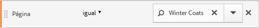

# Containers de segmentos

Um segmento define condições para filtrar um visitante com base nos atributos ou interações do visitante com seu site. Para definir as condições em um segmento, você define regras para filtrar visitantes com base nas características de visitante e/ou nas características de navegação. Para detalhar ainda mais os dados do visitante, você pode filtrar com base em visitantes específicos e/ou ocorrências de visualização de página para cada visitante. O Construtor de segmentos fornece uma arquitetura simples para construir esses subconjuntos e aplicar regras como contêineres aninhados e hierárquicos Visitante, Visita ou Ocorrência.

A arquitetura de contêiner empregada no Construtor de segmentos define

-  **[!UICONTROL Visitante]** como o container mais externo, contendo dados abrangentes específicos para visitantes em visitas e visualizações de página.
-  um aninhado **[!UICONTROL Visita]** container permite definir regras para detalhar os dados do visitante com base em visitas e
-  um aninhado **[!UICONTROL Hit]** container permite detalhar as informações do visitante com base em visualizações de página individuais.

Cada contêiner permite que você informe o histórico do visitante, as interações detalhadas por visitas ou detalhar por ocorrências individuais.

<table style="table-layout: fixed; border: none;">

<tr>
<td style="background-color: #FFFFFF; border: 0; " colspan="5">
</tr>

<tr style="border: none;">
<td style="background-color: #FFFFFF; border: 0;"></td>
<td style="background-color: #E5E4E2;" colspan="3" width="200" height="100"> Visitantes</td>
<td></td>
</tr>

<tr>
<td></td>
<td style="background-color: #E5E4E2;" width="200"></td>
<td style="background-color: #D3D3D3;" colspan="2" width="200" height="100"> Visitas</td>
<td></td>
</tr>

<tr>
<td></td>
<td style="background-color: #E5E4E2;" width="200" height="100"></td>
<td style="background-color: #D3D3D3;" width="200" height="100"></td>
<td style="background-color: #C0C0C0;" width="200" height="100" colspan="1"> Hits</td>
<td></td>
</tr>

<tr>
<td colspan="5">
<tr>
</table>


Esta é uma visão geral em vídeo dos contêineres de segmento:

>[!VIDEO](https://video.tv.adobe.com/v/25401/?quality=12)

## Contêiner do visitante

O Contêiner do visitante inclui cada visita e visualização de página de visitante em um período especificado. Um segmento no nível do Visitante retorna a página que atende à condição, além de todas as páginas visualizadas pelo visitante (e somente restrita pelos intervalos de datas definidos). Como o contêiner mais amplamente definido, os relatórios gerados no nível do contêiner Visitante retornam exibições de página em todas as visitas e permite que você gere uma análise de várias visitas. Portanto, o contêiner de Visitante é o mais susceptível às alterações com base em intervalos de datas definidos.

Os contêineres do visitante podem incluir valores com base no histórico geral do visitante.

- Dias Antes da Primeira Compra
- Página de entrada original
- Domínios de referência originais

## Container de Visita

O contêiner de Visita permite que você identifique as interações de página, campanhas ou conversões de uma sessão da Web específica. Um segmento no nível da Visita retorna a página que atende à condição, além de todas as outras páginas visualizadas como parte da sessão de visita (e somente restrita pelos intervalos de datas definidos). O contêiner de Visita é o mais usado porque capta comportamentos para a sessão de visita inteira depois que a regra é atendida. O container Visita permite definir quais visitas você deseja incluir ou excluir na criação e aplicação de um segmento. Também pode ajudar você a responder à pergunta sobre quantos visitantes visualizaram a seção Notícias e esportes na mesma visita? Ou páginas que atribuíram a uma conversão com êxito para uma venda?

Os contêineres de visita incluem valores com base em ocorrência por visita:

- Número da visita
- Página de entrada
- Frequência de Retorno
- Métricas de participação
- Métricas alocadas linearmente

## Contêiner de ocorrências

O contêiner de Ocorrências define quais ocorrências de página você deseja incluir ou excluir de um segmento. O contêiner Ocorrência é o mais estreito dos contêineres disponíveis para permitir que você identifique cliques específicos e exibição de página em que uma condição é verdadeira. Você pode visualizar um único código de rastreamento ou isolar o comportamento em uma seção específica do site. Você também pode desejar indicar um valor específico quando uma ação ocorre, como o canal de marketing quando um pedido é efetuado.

Os contêineres de ocorrência incluem valores com base em detalhamentos de páginas únicas:

- Produtos
- Props de lista
- eVars de lista
- eVars de comércio (no contexto de eventos)

   >[!NOTE]
   >
   >Se você usar esse contêiner em um valor que persiste, como uma evar, ele extrai cada ocorrência na qual o valor é persistente. Se houver um código de rastreamento que expira após uma semana, esse valor poderá persistir em várias visitas.

## Contêiner do Grupo lógico

O contêiner do Grupo lógico permite que você ofereça um contêiner separado dentro das regras do segmento, para filtrar entidades que não são baseadas hierarquicamente. Por exemplo, você pode oferecer um contêiner aninhado dentro do segmento que faz a filtragem com base no Visitante. Esse tipo de lógica requer que você quebre a hierarquia (já que você já usou um contêiner de Visitantes de nível superior) para filtrar somente para visitantes selecionados. Consulte [Exemplos de Grupos lógicos](/help/components/segmentation/segmentation-workflow/seg-sequential-build.md) para obter informações adicionais.

## Aninhamento de contêineres {#nest-containers}

Ao criar contêineres de segmento em outros contêineres, você cria um segmento dentro de um segmento. A seguinte lógica é usada com contêineres aninhados:

1. Determine quais dados estão incluídos com o contêiner mais externo. Quaisquer dados que não correspondem a essa regra exterior são descartados no relatório segmentado.
1. Aplique essa regra aninhada aos dados restantes. A regra aninhada NÃO se aplica a quaisquer ocorrências que a primeira regra descarta.
1. Repita até que todas as regras de contêiner aninhado sejam calculadas. Os dados restantes são incluídos no relatório resultante.

Você pode usar o aninhamento entre contêineres e entre regras em um contêiner. Você pode aninhar o seguinte em cada contêiner:

| Nome do contêiner | O que você pode aninhar dentro |
|---|---|
| Ocorrência | Somente eventos |
| Visita | Contêiner de ocorrências, Eventos |
| Visitante | Contêiner de visitas, Contêiner de ocorrências, Eventos |
| Grupo lógico | Contêiner de visitante, Contêiner de visita, Contêiner de hit |

### Incluir vários contêineres em uma única definição

Incluir vários segmentos em um novo segmento composto permite que você refine dados ainda mais. Arrastar dois segmentos existentes juntos atua como uma instrução &quot;OR&quot; ao filtrar visitantes. Todos os contêineres na área são analisados em comparação a todos os dados, e quaisquer dados que correspondem a qualquer um dos contêineres são incluídos no relatório.

Por exemplo, arrastar um contêiner de visita, onde País = Estados Unidos com um contêiner de visita, onde Pedido = Verdadeiro,

```
Country = United States + Order = True
```

O cria um segmento que se comporta nesta ordem:

1. Inicialmente, esse segmento analisa seus dados inteiros e identifica todos os visitantes nos Estados Unidos.
2. O segmento examinaria todos os seus dados novamente, pesquisando para ver se algum visitante fez um pedido.
3. Ambos os conjuntos de dados seriam aplicados ao relatório.

## Contêineres para segmentos sequenciais {#containers-sequential}

A segmentação sequencial emprega os mesmos contêineres básico incluindo [!UICONTROL Visitantes], [!UICONTROL Visitas] e [!UICONTROL Ocorrências] (incluindo visualizações de página ou outras dimensões) aninhados hierarquicamente.

<table style="table-layout:fixed;">
<tr>
<td style="background-color: #FFFFFF; " colspan="5">
<tr>
<tr style="border: 0;">
<td style="background-color: #FFFFFF; border: 0;"></td>
<td style="background-color: #E5E4E2;" colspan="3" width="200" height="100"> Visitantes</td>
<td></td>
</tr>
<tr>
<td></td>
<td style="background-color: #E5E4E2;" width="200"></td>
<td style="background-color: #D3D3D3;" colspan="2" width="200" height="100"> Visitas</td>
<td></td>
</tr>
<tr>
<td></td>
<td style="background-color: #E5E4E2;" width="200" height="100"></td>
<td style="background-color: #D3D3D3;" width="200" height="100"></td>
<td style="background-color: #C0C0C0;" width="200" height="100" colspan="1"> Hits</td>
<td></td>
</tr>
<tr>
<td colspan="5">
<tr>
</table>


Os [!UICONTROL Visitantes] constituem o contêiner de maior ordem na segmentação sequencial, com as [!UICONTROL Visitas] contidas no contêiner de [!UICONTROL Visitantes] e as [!UICONTROL Ocorrências] contidas nos contêineres de [!UICONTROL Visitantes] ou [!UICONTROL Visitas]. Essa  [hierarquia de contêiner](/help/components/segmentation/seg-overview.md#section_7FDF47B3C6A94C38AE40D3559AFFAF70) deve ser mantida para construir segmentos sequenciais bem ordenados.

**Para construir segmentos sequenciais**, os contêineres são aninhados e a lógica sequencial é unida usando o [!UICONTROL ENTÃO] operador que exige que cada contêiner seja `true` com base na sequência do visitante.

<table style="table-layout:fixed;">
<tr>
<td style="background-color: #FFFFFF; " colspan="5">
<tr>
<tr style="border: 0;">
<td style="background-color: #FFFFFF; border: 0;"></td>
<td style="background-color: #E5E4E2;" colspan="3" width="200" height="100"> Visitantes</td>
<td></td>
</tr>
<tr>
<td></td>
<td style="background-color: #E5E4E2;" width="200"></td>
<td style="background-color: #D3D3D3;" colspan="2" width="200" height="100"> Visitas</td>
<td></td>
</tr>
<tr>
<td></td>
<td style="background-color: #E5E4E2;" width="200" height="100"></td>
<td style="background-color: #D3D3D3;" width="200" height="100"></td>
<td style="background-color: #C0C0C0;" width="200" height="100" colspan="1"> Hits</td>
<td></td>
</tr>
<tr><td ></td><td style="background-color: #E5E4E2;"></td><td colspan="2">THEN</td></td><td></td></tr>
<tr>
<td></td>
<td style="background-color: #E5E4E2;" width="200"></td>
<td style="background-color: #D3D3D3;" colspan="2" width="200" height="100"> Visitas</td>
<td></td>
</tr>
<tr>
<td></td>
<td style="background-color: #E5E4E2;" width="200" height="100"></td>
<td style="background-color: #D3D3D3;" width="200" height="100"></td>
<td style="background-color: #C0C0C0;" width="200" height="100" colspan="1"> Hits</td>
<td></td>
</tr>
<tr>
<td colspan="5">
<tr>
</table>


A única exceção para essa hierarquia de contêineres é ao usar o [Contêiner do Grupo lógico](/help/components/segmentation/segmentation-workflow/seg-sequential-build.md). O contêiner do [!UICONTROL Grupo lógico] permite aninhar uma ocorrência em um contêiner sem ordem para capturar eventos e dimensões, mas fora de uma ordem sequencial.

<table style="table-layout:fixed;">
<tr>
<td style="background-color: #FFFFFF; " colspan="5">
<tr>
<tr style="border: 0;">
<td style="background-color: #FFFFFF; border: 0;"></td>
<td style="background-color: #E5E4E2;" colspan="3" width="200" height="100"> Visitantes</td>
<td></td>
</tr>
<tr>
<td></td>
<td style="background-color: #E5E4E2;" width="200"></td>
<td style="background-color: #D3D3D3;" colspan="2" width="200" height="100"> Visitas</td>
<td></td>
</tr>
<tr>
<td></td>
<td style="background-color: #E5E4E2;" width="200" height="100"></td>
<td style="background-color: #D3D3D3;" width="200" height="100"></td>
<td style="background-color: #C0C0C0;" width="200" height="100" colspan="1"> Hits</td>
<td></td>
</tr>
<tr><td ></td><td style="background-color: #E5E4E2;"></td><td colspan="2">THEN</td></td><td></td></tr>
<tr>
<td></td>
<td style="background-color: #E5E4E2;" width="200"></td>
<td style="background-color: #D3D3D3;" colspan="2" width="200" height="100"> Grupo</td>
<td></td>
</tr>
<tr>
<td></td>
<td style="background-color: #E5E4E2;" width="200" height="100"></td>
<td style="background-color: #D3D3D3;" width="200" height="100"></td>
<td style="background-color: #C0C0C0;" width="200" height="100" colspan="1"> Hits</td>
<td></td>
</tr>
<tr>
<td></td>
<td style="background-color: #E5E4E2;" width="200" height="100"></td>
<td style="background-color: #D3D3D3;" width="200" height="100"></td>
<td style="background-color: #C0C0C0;" width="200" height="100" colspan="1"> Visitas</td>
<td></td>
</tr>
<tr>
<td colspan="5">
<tr>
</table>


## Relatórios com base nos dados de contêiner {#reports}

Os contêineres permitem que você filtre dados de forma diferente com base em valores de relatório ao relatar segmentos e aplicá-los a relatórios.

Dados captados em cada nível da hierarquia de contêineres de Visitante > Visita > Ocorrência afetam como você constrói seus segmentos. Se você pegar o mesmo segmento aplicado ao mesmo relatório usando o mesmo conjunto de dados, obterá valores diferentes com base no contêiner a partir do qual o relatório é gerado. Fatores como nível de relatório de contêiner e persistência de valores em ocorrências pode resultar em alterações significativas na precisão do relatório.

### Dados básicos de contêiner {#container-data}

Por exemplo, o visitante representado abaixo visitou um site na primeira visita, chegou na Página inicial e, em seguida, visitou três páginas adicionais e converteu a visita em uma venda. Em uma visita separada, o visitante chegou na página do Produto, em seguida, na página inicial, retornou à página do Produto e, em seguida, fechou a sessão depois de visualizar Chapéus de inverno. Com base nos dados capturados para cada container do segmento, valores diferentes são mostrados no relatório.

O segmento *Páginas iguais a Casaco de inverno* abaixo é aplicado ao **Relatório de páginas**.



Com base no contêiner selecionado, o relatório exibe resultados diferentes.

<table style="table-layout:fixed;">
<tr>
<td style="background-color: #FFFFFF; " colspan="7">
</tr>
<tr>
<td></td>
<td style="background-color: #E5E4E2;"></td>
<td style="background-color: #E5E4E2;"colspan="5"><b>Visita 1</b></td>
</tr>
<tr>
<tr style="border: 0;">
<td style="background-color: #FFFFFF; border: 0;"></td>
<td style="background-color: #E5E4E2;">

</td>
<td style="background-color: #FFFFFF; "><br/>Início</td>
<td style="background-color: #FFFFFF;"><br/>Roupas de inverno</td>
<td style="background-color: #FFFFFF;"><br/>Casaco de inverno</td>
<td style="background-color: #FFFFFF;"><br/>Compra US$ 100</td>
<td></td>
</tr>
<tr>
<td colspan="7">
</tr>
<tr>
<td></td>
<td style="background-color: #E5E4E2;"></td>
<td style="background-color: #E5E4E2;"colspan="5"><b>Visita 2</b></td>
</tr>
<tr>
<tr style="border: 0;">
<td style="background-color: #FFFFFF; border: 0;"></td>
<td style="background-color: #E5E4E2;">

</td>
<td style="background-color: #FFFFFF; "><br/>Roupas de inverno</td>
<td style="background-color: #FFFFFF;"><br/>Botas de inverno</td>
<td style="background-color: #FFFFFF;"><br/>Roupas de inverno</td>
<td style="background-color: #FFFFFF;"><br/>Chapéus de inverno</td>
<td></td>
</tr>
<tr>
<td colspan="7">
</tr>
</table>


### Relatar a partir do Contêiner de ocorrências

Quando essa condição está em um contêiner de Ocorrência, então o relatório lista somente páginas, onde *Páginas = Casacos de inverno* é verdadeiro. Como somente uma das páginas corresponde a essa condição em um contêiner de apenas uma páginas, somente a página de Casacos de inverno é exibida.

| Página | Exibições de página |
|---|--:|
| Casaco de inverno | 1 |


Ao relatar a partir do contêiner de Ocorrência, você pode ver como os relatórios de diferentes contêineres afetam os valores gerais do relatório. Ao visualizar o relatório de segmento, observe que as visualizações de página são aproximadamente iguais às visitas (cerca de 2.000 visitantes visualizaram páginas duplicadas em uma visita, o que aumenta o número total de visualizações de página). E os visitantes únicos são aproximadamente iguais ao número de visitas (cerca de 2.000 visitantes únicos visitados mais de uma vez).


>[!IMPORTANT]
>
>Independentemente de como você visualiza os dados (dos contêineres Ocorrência, Visita ou Visitante), todos têm o mesmo número de visitantes, 63.541, neste exemplo. Independentemente de como você gerar o relatório, a condição inicial do visitante (Visitantes que visualizaram a página Casacos de inverno) permanece intacta. É o subconjunto de dados a partir do qual você cria relatórios em níveis diferentes.

### Relatar a partir do Contêiner de visitas

Se a mesma condição está em um contêiner de Visita, então o relatório lista todas as páginas na visita, onde *Página igual a Casacos de inverno* é verdadeiro. A condição filtra a página de Casacos de inverno, mas também capta todas as outras páginas na visita, onde a condição é verdadeira. Como o visitante também visitou as páginas Página inicial, Produto e Compra na visita, essas páginas adicionais são listadas no relatório quando relatadas usando os dados do contêiner de Visitante.

| Página | Exibições de página |
|---|--:|
| Início | 1 |
| Produto | 1 |
| Casaco de inverno | 1 |
| Compra | 1 |


Ao mostrar valores de segmento do contêiner Visita, você pode visualizar que o número de visualizações de página aumentou significativamente. Esse aumento ocorre porque o relatório do contêiner de Visita identifica todas as páginas que atendem às condições, além de todas as outras páginas visualizadas na visita (com todas as exibições de página capturadas em cada contêiner de Visita).


### Relatar a partir do Contêiner de visitantes

Se essa mesma condição está em um contêiner de Visitante, o relatório lista todas as páginas visualizadas por qualquer visitante, onde *Página igual a Casacos de inverno* é verdadeiro. Essa condição significa que, se um visitante visualizou a página Casacos de inverno, todas as páginas no contêiner Visitante (incluindo visualizações de página em outras visitas) são listadas. Portanto, páginas que não correspondem à condição também são listadas no relatório porque o visitante as visualizou em um momento anterior. Todas as páginas no contêiner de Visitante são listadas no relatório, mesmo que tenham ocorrido anteriormente e não atendam especificamente às condições.

| Visita 1<br/>Página | <br/>Exibições de página |
|---|--:|
| Início | 1 |
| Roupas de inverno | 1 |
| Casaco de inverno | 1 |
| Compra | 1 |

| Visita 2<br/>Página | <br/>Exibições de página |
|---|--:|
| Roupas de inverno | 2 |
| Botas de inverno | 1 |
| Chapéus de inverno | 1 |

| Visita 1 + Visita 2<br/>Página | <br/>Exibições de página |
|---|--:|
| Roupas de inverno | 3 |
| Início | 1 |
| Casaco de inverno | 1 |
| Compra | 1 |
| Botas de inverno | 1 |
| Chapéus de inverno | 1 |


Ao mostrar segmentos do contêiner Visitante, você pode visualizar que as Visualizações de página e Visitas aumentaram. Esse aumento ocorre porque, no nível do visitante, se o visitante visitou a página Casacos de inverno apenas uma vez (tornando a condição verdadeira), todas as outras exibições de página e todas as outras visitas são capturadas para esse visitante.


Em resumo, entender como a segmentação funciona em vários detalhamentos de dados é essencial para interpretar os dados retornados.

## Relatório com base no contêiner {#reporting}

Cada detalhamento de dados do segmento tem um escopo ao qual é aplicado. A maioria dos detalhamentos é baseada nas *Exibições de página*. No entanto, vários segmentos valiosos têm por base o contêiner *Visita* e, em menor grau, o contêiner *Visitante*. É importante entender o relatório com base no escopo do contêiner.

Usar o *Página = Casacos de inverno* exemplo de segmento, abaixo estão exemplos dos resultados desse segmento com base em como os dados do contêiner são aplicados e como o escopo dos dados corresponde ao tipo de segmento.

### Contêiner de segmento com base na regra de segmento correspondente

A aplicação do contêiner de segmento em comparação ao escopo natural dos dados traz resultados esperados, onde os itens de linha correspondem à regra de segmento.

- **Contêiner de ocorrência onde a página é igual a &quot;Casaco de inverno&quot;**: visualizar um relatório de *página* com esse segmento retorna somente os valores iguais a &quot;Casaco de inverno&quot;. Todas as demais páginas são excluídas do relatório.
- **Contêiner de visitas onde a página de entrada é igual a &quot;Roupas de inverno&quot;**: visualizar um relatório de *Página de entrada* com esse segmento retorna somente a segunda visita, pois a página de entrada corresponde a regra do segmento.
- **Contêiner de visita onde o número de visitas é igual a 1**: a visualização da página de Visita tudo da primeira visita está incluída no relatório, pois corresponde à regra de segmento.

### Visualizações de página no nível do contêiner de visita

Várias regras de segmento identificam visualizações de página por visita. Quando essa identificação ocorre, todo o contêiner de Visitante é aplicado, se apenas uma única ocorrência corresponder à regra. Esse relatório de segmento é especialmente valioso porque as visualizações de página com base em visitas fornecem informações com base nas visualizações de página por visita.

- **Contêiner de visita onde a página é igual a página &quot;Casaco de inverno&quot;**: em um relatório de página no nível de contêiner do visitante exibe todas as visualizações de página de visitas de incluíram uma visualização da página &quot;Roupas de inverno&quot;. Se a página corresponde à regra de segmento, todas as visualizações de página associadas a essa visita são incluídas no relatório.
- **Contêiner de visitas onde a página é igual à &quot;Página inicial&quot;**: em um relatório de Página com esse segmento, são exibidos somente os dados da primeira visita, pois na segunda visita o visitante não visualizou uma página &quot;Inicial&quot;.
- **Contêiner de visitante onde página é igual a &quot;Roupas de inverno&quot;**: em um relatório de página, esse segmento recupera todos os dados de ambas as visitas, pois nela o visitante visualizou a página &quot;Roupas de inverno&quot;.

### Contêiner de segmento que identifica Ocorrências inferiores às Visualizações de página

Usando um segmento com um contêiner menor do que o escopo de detalhamento retorna dados inesperados. O uso de um detalhamento menor ainda obtém todas as ocorrência de um escopo de dados.

- **Contêiner de ocorrência onde a página de entrada é igual à página de Produto**: cada página associa à página de entrada da visita, o que transforma isso em um detalhamento com base em visita. O uso desse segmento não apenas extrai a página de entrada do produto, mas também todas as ocorrências nessa visita.
- **Contêiner de ocorrência onde List Var 1 contém o Valor A**: se vários valores foram definidos na mesma ocorrência como a list var, então todos os valores de variável são incluídos no segmento. Não há uma forma de separar valores que ocorrem na mesma visualização de página, pois o contêiner de Ocorrência é o menor contêiner de segmento para detalhar ocorrências.
- **Contêiner de ocorrência onde Página é igual a &quot;Compra&quot;**: se estiver usando visualizações de página como uma métrica, somente a página de Compra é exibida (como esperado). Se estiver usando um relatório de Participação de renda, então todas as páginas na primeira visita recebem US$ 100, pois as métricas de participação têm por base visitas.
- **Contêiner de ocorrência onde a Página é igual a &quot;Casaco de inverno&quot;**: se estiver usando visualizações de página como uma métrica, somente a página Casaco de inverno é exibida (como esperado). Se estiver usando um relatório de Participação de receita, nenhuma página recebe o crédito, pois essa dimensão requer uma dimensão persistente. A visualização de página que resultou na compra (a Página de compra) não está incluída no contêiner de Ocorrência, portanto, nenhuma participação de receita é fornecida para qualquer item. No entanto, executar um relatório a partir de um contêiner de Visita deve incluir todas as visualizações de página nessa visita e devem distribuir a participação de receita (US$ 100) em todas as páginas visualizadas na sessão.

## Persistência em contêineres {#persistence}

A filtragem por dimensões que persistem em um intervalo de páginas, como um eVar de campanha ou uma dimensão de referência, afeta os dados coletados no nível do contêiner e deve ser entendida para relatar a precisão.

Os dados de segmento podem variar com base na persistência de uma dimensão ou podem ser aplicados variavelmente em páginas selecionadas. Algumas dimensões, como a dimensão Página, fornecem valores únicos no nível da página e são filtrados com base nos dados do contêiner Ocorrência. (Consulte o exemplo de [Relatórios com base em Dados do contêiner](/help/components/segmentation/seg-overview.md)). Outras dimensões, como a dimensão de Domínio de referência, persistem em várias páginas para uma visita. Algumas dimensões ou variáveis aplicadas, como Duração da visita, permanecem durante o histórico inteiro do visitante.


Em contraste com a dimensão Páginas, o valor do Domínio de referência é vinculado a cada página nessa visita. Por exemplo, o visitante abaixo chega na Página inicial a partir de um site de referência. Portanto, todas as páginas nessa visita recebem o mesmo valor de domínio referenciador.

O segmento do *Domínio de referência é igual a aol.com* abaixo é aplicado ao **Relatório de páginas**.

<table style="table-layout:fixed;">
<tr>
<td style="background-color: #FFFFFF; " colspan="7">
</tr>
<tr>
<td></td>
<td style="background-color: #E5E4E2;"></td>
<td style="background-color: #E5E4E2;"colspan="5"><b>Visita 1</b></td>
</tr>
<tr>
<tr style="border: 0;">
<td style="background-color: #FFFFFF; border: 0;"></td>
<td style="background-color: #E5E4E2;">
<br/>aol.com
</td>
<td style="background-color: #FFFFFF; "><br/>Início</td>
<td style="background-color: #FFFFFF;"><br/>Roupas de inverno</td>
<td style="background-color: #FFFFFF;"><br/>Casaco de inverno</td>
<td style="background-color: #FFFFFF;"><br/>Compra US$ 100</td>
<td></td>
</tr>
<tr>
<td colspan="7">
</tr>
<tr>
<td></td>
<td style="background-color: #E5E4E2;"></td>
<td style="background-color: #E5E4E2;"colspan="5"><b>Visita 2</b></td>
</tr>
<tr>
<tr style="border: 0;">
<td style="background-color: #FFFFFF; border: 0;"></td>
<td style="background-color: #E5E4E2;">
<br/>weather.com
</td>
<td style="background-color: #FFFFFF; "><br/>Roupas de inverno</td>
<td style="background-color: #FFFFFF;"><br/>Botas de inverno</td>
<td style="background-color: #FFFFFF;"><br/>Roupas de inverno</td>
<td style="background-color: #FFFFFF;"><br/>Chapéus de inverno</td>
<td></td>
</tr>
<tr>
<td colspan="7">
</tr>
</table>

<!---->

Em uma nova visita, o visitante é enviado de outro site. Portanto, todas as páginas na nova visita recebem o novo valor de domínio de referência para cada exibição de página.

### Relatar a partir do Contêiner de ocorrências

Como todas as visualizações de página na mesma visita são atribuídas o mesmo valor de Domínio de referência, relatado no nível de contêiner de Ocorrência, onde *Domínio de referência = &quot;aol.com&quot;* retorna todas as páginas listadas na tabela abaixo.

| Domínio de referência = &#39;aol.com&#39; | Exibições de página |
|----|---:|
| Início | 1 |
| Roupas de inverno | 1 |
| Casaco de inverno | 1 |
| Compra | 1 |


Exibindo dados do contêiner de Ocorrência, um pouco mais de 92.000 visualizações de página foram visualizadas em mais de 33.000 visitas por mais de 32.000 visitantes. Em média, há três visualizações de página em cada visita e aproximadamente todas as visitas foram de visitantes únicos.


### Relatar a partir do Contêiner de visitas

Se a mesma condição é filtrada no contêiner Visita para um relatório Páginas, então todas as páginas na visita, onde *Domínio de referência = &quot;aol.com&quot;* é verdadeiro. Como o valor do domínio de referência é definido no nível de visita, os relatórios nos níveis de Visualização de página e Visita são os mesmos.

| Domínio de referência = &#39;aol.com&#39; | Exibições de página |
|----|---:|
| Início | 1 |
| Roupas de inverno | 1 |
| Casaco de inverno | 1 |
| Compra | 1 |


Como todas as páginas têm o mesmo valor de domínio de referência com base na visita, o relatório do nível do contêiner de Visita é (quase) o mesmo do relatório do contêiner de Exibição de página. Há um pequeno deslocamento (98.234 versus 98.248) devido a anomalias nos dados.


### Relatar a partir do Contêiner de visitantes

Do contêiner de Visitante, o Relatório de página lista todas as páginas visualizadas por qualquer visitante, onde o *Domínio de referência é igual a &quot;aol.com&quot;* é verdadeiro. Portanto, se um visitante tiver *&quot;aol.com&quot;* como um domínio referenciador em qualquer momento do histórico (dentro do período definido), todas as páginas no contêiner de Visitante (incluindo visualizações de página em outras visitas) são listadas. Mesmo páginas que não correspondem à condição principal são listadas no relatório porque essas páginas estão incluídas no contêiner de Visitantes. Todas as páginas no contêiner de Visitante são listadas no relatório, mesmo que tenham ocorrido anteriormente e não atendam especificamente às condições.

Em um relatório Domínio de referência, *Domínio de referência = &quot;aol.com&quot;* é verdadeiro em quatro visualizações de página, mas *Domínio de referência = &quot;weather.com&quot;* é verdadeiro em outras páginas com ocorrência do visitante. No contêiner de Visitantes, você obtém uma lista de Visitantes onde &quot;aol.com&quot; é verdadeiro. Mas também fornece páginas em que o domínio de referência é &quot;weather.com&quot;, não o valor que correspondeu à solicitação inicial no segmento.

| Visita 1<br/>Domínio de referência = &#39;aol.com&#39; | <br/>Exibições de página |
|----|---:|
| Início | 1 |
| Roupas de inverno | 1 |
| Casaco de inverno | 1 |
| Compra | 1 |

| Visita 2<br/>Domínio de referência = &#39;weather.com&#39; | <br/>Exibições de página |
|----|---:|
| Roupas de inverno | 2 |
| Casaco de inverno | 1 |
| Compra | 1 |

| Contêiner de visitantes<br/>Domínio de referência = &#39;aol.com&#39; | Exibições de página |
|----|---:|
| Roupas de inverno<br/>Domínio de referência = &#39;aol.com&#39; | 1 |
| Roupas de inverno<br/>Domínio de referência = &#39;weather.com&#39; | 1 |
| Início <br/>Domínio de referência = &#39;aol.com&#39; | 1 |
| Casaco de inverno <br/>Domínio de referência = &#39;aol.com&#39; | 1 |
| Comprar<br/>Domínio de referência = &#39;aol.com&#39; | 1 |
| Botas de inverno<br/>Domínio de referência = &#39;weather.com&#39; | 1 |
| Chapéus de inverno<br/>Domínio de referência = &#39;weather.com&#39; | 1 |


Quando você visualize dados do contêiner de Visitante, observe que as visualizações de página aumentaram significativamente (de 98.248 a 112.925). Esse aumento ocorre porque todas as exibições de página pelo visitante (incluindo as páginas com outros valores de domínio de referência salvas em no nível do container Visitante ) foram listadas. E as visitas adicionais daquele visitante, aumentando as visitas de 33.203 para 43.448.


## Resumo

- O contêiner de Visitante retorna todas as páginas vistas por um visitante, nas quais pelo menos uma página atende aos critérios. Portanto, se uma página for vista somente na visita 1 no dia 1, todas as páginas visualizadas pelo visitante em várias visitas serão incluídas nos dados.
- O contêiner de Visita retorna todas as páginas vistas em uma visita, para as quais pelo menos uma página atende aos critérios. Portanto, se uma página é visualizada somente na visita 1 no dia 1, então todas as páginas visualizadas na visita inteira são incluídas nos dados.
- Tenha cuidado para basear a condição usada para segmentação em um eVar ou outro tipo de variável persistente. Por exemplo, você pode usar a condição &quot;onde a campanha contém email&quot; e expira após sete dias. Portanto, se a campanha for definida na primeira visita, ela persistirá por mais sete dias. Cada visita é incluída mesmo que a campanha tenha sido definida somente na primeira visita. As outras visitas também são incluídas (desde que estejam no intervalo de datas do relatório). Se você deseja impedir que valores persistentes sejam incluídos, use a &quot;instância de&quot; do evento, ou uma variável Prop equivalente, se disponível.
