# Containers de segmento

Um segmento define condições para filtrar um(a) visitante com base nos atributos do(a) visitante ou nas interações com seu site. Para definir as condições em um segmento, você define regras para filtrar visitantes com base nas características de visitante e/ou nas características de navegação. Para detalhar ainda mais os dados do visitante, você pode filtrar com base em visitantes específicos e/ou ocorrências de visualização de página para cada visitante. O Construtor de segmentos fornece uma arquitetura simples para construir esses subconjuntos e aplicar regras como contêineres aninhados e hierárquicos Visitante, Visita ou Ocorrência.

A arquitetura de container que o Construtor de segmentos utiliza define

- : **[!UICONTROL Visitante]** é utilizado como o container mais externo, e contém dados abrangentes específicos para visitantes em visitas e exibições de página.
- : um container de **[!UICONTROL Visita]** aninhado que permite definir regras para detalhar os dados de visitantes com base em visitas, e
- : um container de **[!UICONTROL Ocorrência]** que permite detalhar as informações de visitantes com base em exibições de página individuais.

Cada container permite que você relate o histórico do(a) visitante, as interações detalhadas por visitas ou um detalhamento de ocorrências individuais.

<table style="table-layout: fixed; border: none;">

<tr>
<td style="background-color: #E5E4E2;" colspan="3" width="200" height="100"> Visitantes</td>
</tr>

<tr>
<td style="background-color: #E5E4E2;" width="200"></td>
<td style="background-color: #D3D3D3;" colspan="2" width="200" height="100"> Visitas</td>
</tr>

<tr>
<td style="background-color: #E5E4E2;" width="200" height="100"></td>
<td style="background-color: #D3D3D3;" width="200" height="100"></td>
<td style="background-color: #C0C0C0;" width="200" height="100" colspan="1"> Ocorrências</td>
</tr>
</table>

<!--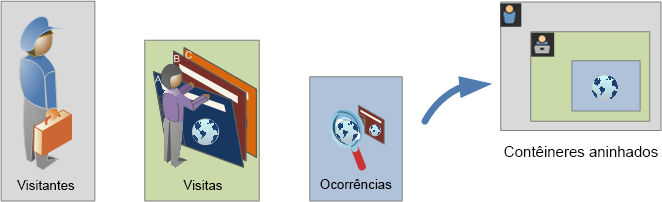-->

Esta é uma visão geral em vídeo dos containers de segmento:

>[!VIDEO](https://video.tv.adobe.com/v/25401/?quality=12)

## Container de Visitante

O Contêiner do visitante inclui cada visita e visualização de página de visitante em um período especificado. Um segmento no nível do Visitante retorna a página que atende à condição, além de todas as páginas visualizadas pelo visitante (e somente restrita pelos intervalos de datas definidos). Por ser o container mais amplamente definido, os relatórios gerados no nível do container de Visitante retornam exibições de páginas em todas as visitas e permitem gerar uma análise de múltiplas visitas. Consequentemente, o container de Visitante é o mais suscetível a alterações com base em intervalos de datas definidos.

Os contêineres do visitante podem incluir valores com base no histórico geral do visitante.

- Dias Antes da Primeira Compra
- Página de entrada original
- Domínios de referência originais

## Container de Visita

O container de Visita permite que você identifique as interações de página, campanhas ou conversões de uma sessão da web específica. Um segmento no nível de Visita retorna a página que atende à condição, além de todas as outras páginas exibidas como parte da sessão de visita (e limitadas apenas por intervalos de datas definidos). O container de Visita é o mais usado porque captura comportamentos da sessão de visita inteira depois de atender a regra. O container de Visita permite definir quais visitas você deseja incluir ou excluir na criação e aplicação de um segmento. Também pode ajudar você a responder à pergunta sobre quantos visitantes visualizaram a seção Notícias e esportes na mesma visita? Ou páginas que atribuíram a uma conversão com êxito para uma venda?

Os contêineres de visita incluem valores com base em ocorrência por visita:

- Número da visita
- Página de entrada
- Frequência de Retorno
- Métricas de participação
- Métricas alocadas linearmente

## Container de Ocorrência

O container de Ocorrência define quais ocorrências de página você deseja incluir ou excluir de um segmento. O container de Ocorrência é o mais restrito dos containers disponíveis e permite identificar cliques e exibições de página específicas nas quais uma condição é “verdadeira”. Você pode exibir um único código de rastreamento ou isolar o comportamento em uma seção específica do site. Você também pode desejar indicar um valor específico quando uma ação ocorre, como o canal de marketing quando um pedido é efetuado.

Os contêineres de ocorrência incluem valores com base em detalhamentos de páginas únicas:

- Produtos
- Props de lista
- eVars de lista
- eVars de comércio (no contexto de eventos)

  >[!NOTE]
  >
  >Se você usar esse container em um valor persistente, como uma eVar, ele extrairá cada ocorrência na qual esse valor persiste. Se houver um código de rastreamento que expira após uma semana, esse valor poderá persistir em várias visitas.

## Container de Grupo lógico

O contêiner do Grupo lógico permite que você ofereça um contêiner separado dentro das regras do segmento, para filtrar entidades que não são baseadas hierarquicamente. Por exemplo, você pode oferecer um contêiner aninhado dentro do segmento que faz a filtragem com base no Visitante. Esse tipo de lógica exige que você quebre a hierarquia (pois já usou um container de Visitantes de nível superior) para filtrar apenas visitantes selecionados. Consulte [Exemplos de grupos lógicos](/help/components/segmentation/segmentation-workflow/seg-sequential-build.md) para obter mais informações.

## Aninhamento de contêineres {#nest-containers}

Ao criar contêineres de segmento em outros contêineres, você cria um segmento dentro de um segmento. A seguinte lógica é usada com contêineres aninhados:

1. Determine quais dados estão incluídos com o contêiner mais externo. Quaisquer dados que não correspondem a essa regra exterior são descartados no relatório segmentado.
1. Aplique essa regra aninhada aos dados restantes. A regra aninhada NÃO se aplica a quaisquer ocorrências que a primeira regra descarta.
1. Repita até que todas as regras de contêiner aninhado sejam calculadas. Os dados restantes são incluídos no relatório resultante.

Você pode realizar o aninhamento de containers, bem como de regras de um container. Você pode aninhar o seguinte em cada contêiner:

| Nome do contêiner | O que você pode aninhar dentro |
|---|---|
| Ocorrência | Somente eventos |
| Visita | Contêiner de ocorrências, Eventos |
| Visitante | Contêiner de visitas, Contêiner de ocorrências, Eventos |
| Grupo lógico | Contêiner de visitante, Contêiner de visita, Contêiner de hit |

### Incluir vários containers em uma única definição

Incluir vários segmentos em um novo segmento composto permite que você refine dados ainda mais. Arrastar dois segmentos existentes juntos atua como uma instrução &quot;OR&quot; ao filtrar visitantes. Todos os contêineres na área são analisados em comparação a todos os dados, e quaisquer dados que correspondem a qualquer um dos contêineres são incluídos no relatório.

Por exemplo, arrastar um container de Visita, no qual “País = Estados Unidos”, com um container de Visita, no qual “Pedido = Verdadeiro”,

```
Country = United States + Order = True
```

criará um segmento que se comporta desta forma:

1. Inicialmente, esse segmento analisa seus dados inteiros e identifica todos os visitantes nos Estados Unidos.
2. O segmento analisaria todos os seus dados novamente, para descobrir se algum(a) visitante fez um pedido.
3. Ambos os conjuntos de dados seriam aplicados ao relatório.

## Contêineres para segmentos sequenciais {#containers-sequential}

A segmentação sequencial emprega os mesmos containers básicos, incluindo [!UICONTROL Visitantes], [!UICONTROL Visitas] e [!UICONTROL Ocorrências] (bem como exibições de página ou outras dimensões) aninhados hierarquicamente.

<table style="table-layout:fixed; border: none;">

<tr>
<td style="background-color: #E5E4E2;" colspan="3" width="200" height="100"> Visitantes</td>
</tr>

<tr>
<td style="background-color: #E5E4E2;" width="200"></td>
<td style="background-color: #D3D3D3;" colspan="2" width="200" height="100"> Visitas</td>
</tr>

<tr>
<td style="background-color: #E5E4E2;" width="200" height="100"></td>
<td style="background-color: #D3D3D3;" width="200" height="100"></td>
<td style="background-color: #C0C0C0;" width="200" height="100" colspan="1"> Ocorrências</td>
</tr>
</table>

<!---->

O container de [!UICONTROL Visitantes] assume a posição mais elevada na segmentação sequencial, com as [!UICONTROL Visitas] contidas no container de [!UICONTROL Visitantes] e as [!UICONTROL Ocorrências] contidas nos containers de [!UICONTROL Visitantes] ou [!UICONTROL Visitas]. Você deve manter essa [hierarquia de containers](/help/components/segmentation/seg-overview.md#section_7FDF47B3C6A94C38AE40D3559AFFAF70) para criar segmentos sequenciais bem ordenados.

**Para criar segmentos sequenciais**, você deve aninhar os containers e unir a lógica sequencial usando o operador [!UICONTROL THEN], que exige que cada container seja `true` com base na sequência do(a) visitante.

<table style="table-layout:fixed; border: none;">

<tr>

<td style="background-color: #E5E4E2;" colspan="3" width="200" height="100"> Visitantes</td>
</tr>

<tr>
<td style="background-color: #E5E4E2;" width="200"></td>
<td style="background-color: #D3D3D3;" colspan="2" width="200" height="100"> Visitas</td>
</tr>

<tr>
<td style="background-color: #E5E4E2;" width="200" height="100"></td>
<td style="background-color: #D3D3D3;" width="200" height="100"></td>
<td style="background-color: #C0C0C0;" width="200" height="100" colspan="1"> Ocorrências</td>
</tr>

<tr>
<td style="background-color: #E5E4E2;"></td><td colspan="2">THEN</td></td>
</tr>

<tr>
<td style="background-color: #E5E4E2;" width="200"></td>
<td style="background-color: #D3D3D3;" colspan="2" width="200" height="100"> Visitas</td>
</tr>

<tr>
<td style="background-color: #E5E4E2;" width="200" height="100"></td>
<td style="background-color: #D3D3D3;" width="200" height="100"></td>
<td style="background-color: #C0C0C0;" width="200" height="100" colspan="1"> Ocorrências</td>
</tr>
</table>

<!--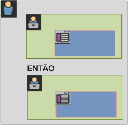-->

A única exceção a essa hierarquia de containers é ao usar o [container de Grupo lógico](/help/components/segmentation/segmentation-workflow/seg-sequential-build.md). O container de [!UICONTROL Grupo lógico] permite aninhar uma ocorrência em um container sem ordem para capturar eventos e dimensões, mas fora de uma ordem sequencial.

<table style="table-layout:fixed; border: none;">

<tr>
<td style="background-color: #E5E4E2;" colspan="3" width="200" height="100"> Visitantes</td>
</tr>

<tr>
<td style="background-color: #E5E4E2;" width="200"></td>
<td style="background-color: #D3D3D3;" colspan="2" width="200" height="100"> Visitas</td>
</tr>

<tr>
<td style="background-color: #E5E4E2;" width="200" height="100"></td>
<td style="background-color: #D3D3D3;" width="200" height="100"></td>
<td style="background-color: #C0C0C0;" width="200" height="100" colspan="1"> Ocorrências</td>
</tr>

<tr>
<td style="background-color: #E5E4E2;"></td><td colspan="2">THEN</td></td>
</tr>

<tr>
<td style="background-color: #E5E4E2;" width="200"></td>
<td style="background-color: #D3D3D3;" colspan="2" width="200" height="100"> Grupo</td>
</tr>

<tr>
<td style="background-color: #E5E4E2;" width="200" height="100"></td>
<td style="background-color: #D3D3D3;" width="200" height="100"></td>
<td style="background-color: #C0C0C0;" width="200" height="100" colspan="1"> Ocorrências</td>
</tr>

<tr>
<td style="background-color: #E5E4E2;" width="200" height="100"></td>
<td style="background-color: #D3D3D3;" width="200" height="100"></td>
<td style="background-color: #C0C0C0;" width="200" height="100" colspan="1"> Visitas</td>
</tr>

</table>

<!--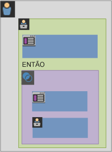-->

## Relatórios com base nos dados de contêiner {#reports}

Os contêineres permitem que você filtre dados de forma diferente com base em valores de relatório ao relatar segmentos e aplicá-los a relatórios.

Dados captados em cada nível da hierarquia de contêineres de Visitante > Visita > Ocorrência afetam como você constrói seus segmentos. Se você aplicar o mesmo segmento ao mesmo relatório usando o mesmo conjunto de dados, obterá valores diferentes com base no container a partir do qual você gerou o relatório. Fatores como o nível de relatório de container e a persistência de valores em ocorrências podem resultar em grandes alterações na precisão dos relatórios. 

### Dados básicos de contêiner {#container-data}

Por exemplo, o visitante representado abaixo visitou um site na primeira visita, chegou na Página inicial e, em seguida, visitou três páginas adicionais e converteu a visita em uma venda. Em uma visita separada, o visitante chegou na página do Produto, em seguida, na página inicial, retornou à página do Produto e, em seguida, fechou a sessão depois de visualizar Chapéus de inverno. Com base nos dados capturados de cada container do segmento, valores diferentes aparecerão no relatório.

O segmento `Pages equals Winter Coat` abaixo se aplica ao **Relatório de páginas**.


Dependendo do container selecionado, o relatório exibe resultados diferentes para as seguintes visitas e exibições de página de um(a) visitante.

<table style="table-layout:auto; border: 0;">

<tr>
<td style="background-color: #E5E4E2;"></td>
<td style="background-color: #E5E4E2;" colspan="4"><b>Visita 1</b></td>
</tr>
<tr>
<tr>
<td style="background-color: #E5E4E2;">

</td>
<td style="background-color: #FFFFFF; "><br/>Página inicial</td>
<td style="background-color: #FFFFFF;"><br/>Roupas de inverno</td>
<td style="background-color: #FFFFFF;"><br/>Casaco de inverno</td>
<td style="background-color: #FFFFFF;"><br/>Compra de US$ 100</td>
</tr>
<tr>
<td colspan="5">
</tr>
<tr>
<td style="background-color: #E5E4E2;"></td>
<td style="background-color: #E5E4E2;"colspan="4"><b>Visita 2</b></td>
</tr>
<tr>
<tr style="border: 0;">

<td style="background-color: #E5E4E2;">

</td>
<td style="background-color: #FFFFFF; "><br/>Roupas de inverno</td>
<td style="background-color: #FFFFFF;"><br/>Botas de inverno</td>
<td style="background-color: #FFFFFF;"><br/>Roupas de inverno</td>
<td style="background-color: #FFFFFF;"><br/>Chapéus de inverno</td>

</table>


<!--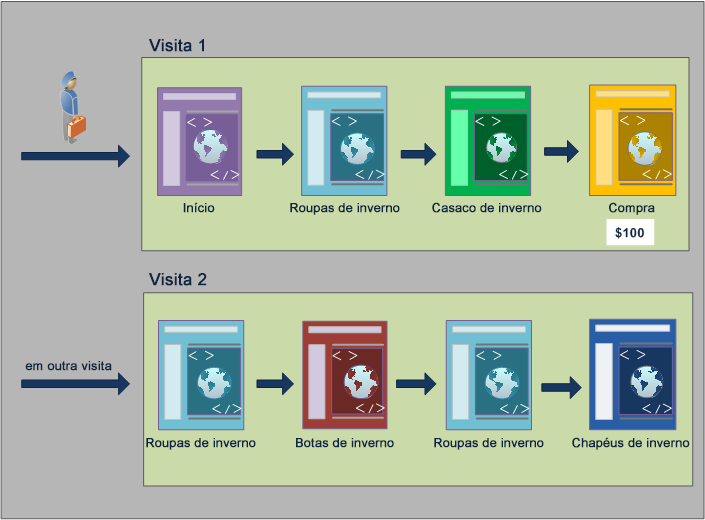-->

### Relatórios do container de Ocorrência

Quando essa condição está em um contêiner de Ocorrência, então o relatório lista somente páginas, onde *Páginas = Casacos de inverno* é verdadeiro. Como somente uma das páginas corresponde a essa condição em um contêiner de apenas uma páginas, somente a página de Casacos de inverno é exibida.

| Página | Exibições de página |
|---|--:|
| Casaco de inverno | 1 |

<!--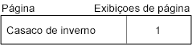-->

Ao gerar relatórios a partir do container de Ocorrência, você pode ver como os relatórios de diferentes containers afetam os valores gerais dos relatórios. Ao visualizar o relatório de segmento, observe que as exibições de página são aproximadamente iguais às visitas (cerca de 2.000 visitantes viram páginas duplicadas em uma visita, o que aumenta o número total de exibições de página). E os visitantes únicos são aproximadamente iguais ao número de visitas (cerca de 2.000 visitantes únicos visitaram mais de uma vez).

|  | Métrica | # | % |
|---|---|--:|--:|
| | Exibições de página:<br/>Exibições:<br/>Visitantes únicos: | **69.252** de 351.292 <br/>**67.554** de 165.175 <br/>**63.541** de 113.169 | **19%**<br/>**40%**<br/>**56%** |


<!--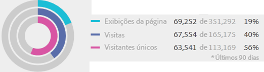-->

>[!IMPORTANT]
>
>Independentemente de como você visualiza os dados (a partir dos containers de Ocorrência, Visita ou Visitante), neste exemplo, todos eles têm o mesmo número de visitantes: 63.541. Independentemente de como você gera o relatório, a condição inicial do visitante (Visitantes que visualizaram a página Casacos de inverno) permanece intacta. É o subconjunto de dados a partir do qual você cria relatórios em níveis diferentes.

### Relatórios do container de Visita

Se a mesma condição está em um contêiner de Visita, então o relatório lista todas as páginas na visita, onde *Página igual a Casacos de inverno* é verdadeiro. A condição filtra a página de Casacos de inverno, mas também capta todas as outras páginas na visita, onde a condição é verdadeira. Como o visitante também visitou as páginas Início, Produto e Compra na visita, essas páginas adicionais serão listadas no relatório quando gerado usando os dados do container de Visitante.

| Página | Exibições de página |
|---|--:|
| Página inicial | 1 |
| Produto | 1 |
| Casaco de inverno | 1 |
| Compra | 1 |

<!--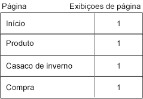-->

Ao observar os valores de segmento do container de Visita, você pode ver que o número de exibições de página aumentou significativamente. Esse aumento ocorre porque os relatórios do container de Visita identificam todas as páginas que atendem às condições, além de todas as outras páginas exibidas na visita (com todas as exibições de página capturadas em cada container de Visita).

|  | Métrica | # | % |
|---|---|--:|--:|
| | Exibições de página:<br/>Exibições:<br/>Visitantes únicos: | **226.193** de 351.292 <br/>**67.554** de 165.175 <br/>**63.541** de 113.169 | **64%**<br/>**40%**<br/>**56%** |

<!--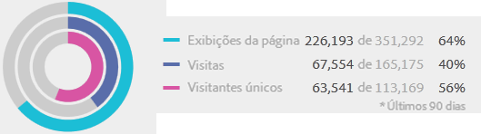-->

### Relatórios do container de Visitante

Se essa mesma condição se aplica a um container de Visitante, o relatório lista todas as páginas exibidas por qualquer visitante, onde *Página = Casacos de inverno* é verdadeiro. Essa condição significa que se um visitante exibiu a página Casacos de inverno, todas as páginas no container de Visitante (incluindo exibições de página em outras visitas) serão listadas. Portanto, as páginas que não correspondem à condição também são listadas no relatório, porque o visitante as visualizou anteriormente. Todas as páginas do container de Visitante são listadas no relatório, mesmo se as exibições ocorreram anteriormente e não atenderam especificamente às condições.

| Visita 1<br/>Página | <br/>Exibições de página |
|---|--:|
| Página inicial | 1 |
| Roupas de inverno | 1 |
| Casaco de inverno | 1 |
| Compra | 1 |

| Visita 2<br/>Página | <br/>Exibições de página |
|---|--:|
| Roupas de inverno | 2 |
| Botas de inverno | 1 |
| Chapéus de inverno | 1 |

| Visita 1 + Visita 2<br/>Página | <br/>Exibições de página |
|---|--:|
| Roupas de inverno | 3 |
| Página inicial | 1 |
| Casaco de inverno | 1 |
| Compra | 1 |
| Botas de inverno | 1 |
| Chapéus de inverno | 1 |

<!--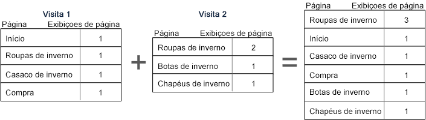-->

Ao mostrar segmentos do container de Visitante, você pode observar que as exibições de página e visitas aumentaram. Isso ocorre porque, do nível de visitante, se o(a) visitante visitou a página Casacos de inverno somente uma vez (estabelecendo a condição como verdadeira), então todas as outras exibições de página e as demais visitas são capturadas para tal visitante.

|  | Métrica | # | % |
|---|---|--:|--:|
| | Exibições de página:<br/>Exibições:<br/>Visitantes únicos: | **240.094** de 351.292 <br/>**83.823** de 165.175 <br/>**63.541** de 113.169 | **68%**<br/>**50%**<br/>**56%** |

<!--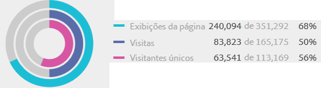-->

Em resumo, entender como a segmentação funciona em vários detalhamentos de dados é essencial para interpretar os dados retornados.

## Relatório com base no contêiner {#reporting}

Cada detalhamento de dados do segmento tem um escopo ao qual é aplicado. A maioria dos detalhamentos é baseada nas *Exibições de página*. No entanto, vários segmentos valiosos têm por base o contêiner *Visita* e, em menor grau, o contêiner *Visitante*. É importante entender o relatório com base no escopo do container.

Usando o exemplo do segmento `Page equals Winter Coats`, veja abaixo alguns exemplos dos resultados desse segmento com base em como os dados do container são aplicados e em como o escopo dos dados corresponde ao tipo de segmento.

### Container de segmento baseado na regra de segmento correspondente

A aplicação do contêiner de segmento em comparação ao escopo natural dos dados traz resultados esperados, onde os itens de linha correspondem à regra de segmento.

- **Contêiner de ocorrência onde a página é igual a &quot;Casaco de inverno&quot;**: visualizar um relatório de *página* com esse segmento retorna somente os valores iguais a &quot;Casaco de inverno&quot;. Todas as demais páginas são excluídas do relatório.
- **Contêiner de visitas onde a página de entrada é igual a &quot;Roupas de inverno&quot;**: visualizar um relatório de *Página de entrada* com esse segmento retorna somente a segunda visita, pois a página de entrada corresponde a regra do segmento.
- **Container de visita com um número de visitas igual a 1**: a visualização “Visita: todas as exibições de página da primeira visita” é incluída no relatório, pois corresponde à regra de segmento.

### Exibições de página no nível do container de Visita

Várias regras de segmento identificam exibições de página por visita. Quando isso ocorre, o container inteiro de Visitante é aplicado se uma única ocorrência corresponder à regra. Esse relatório de segmento é especialmente valioso porque as visualizações de página com base em visitas fornecem informações com base nas visualizações de página por visita.

- **Contêiner de visita onde a página é igual a página &quot;Casaco de inverno&quot;**: em um relatório de página no nível de contêiner do visitante exibe todas as visualizações de página de visitas de incluíram uma visualização da página &quot;Roupas de inverno&quot;. Se a página corresponde à regra de segmento, todas as visualizações de página associadas a essa visita são incluídas no relatório.
- **Container de visitas no qual a página equivale à “Página inicial”**: em um relatório de página, esse segmento exibe apenas os dados da primeira visita, pois na segunda visita o(a) visitante não visualizou uma página “inicial”.
- **Container de visitante no qual a página equivale a “Roupas de inverno”**: em um relatório de página, esse segmento recupera todos os dados de ambas as visitas, pois o(a) visitante visualizou a página “Roupas de inverno” em ambas.

### O container de segmento que identifica ocorrências inferiores às exibições de página

Usando um segmento com um contêiner menor do que o escopo de detalhamento retorna dados inesperados. O uso de um detalhamento menor ainda obtém todas as ocorrência de um escopo de dados.

- **Contêiner de ocorrência onde a página de entrada é igual à página de Produto**: cada página associa à página de entrada da visita, o que transforma isso em um detalhamento com base em visita. O uso desse segmento extrai não apenas a página de entrada do produto, mas também todas as ocorrências nessa visita.
- **Contêiner de ocorrência onde List Var 1 contém o Valor A**: se vários valores foram definidos na mesma ocorrência como a list var, então todos os valores de variável são incluídos no segmento. Não há uma forma de separar valores que ocorrem na mesma visualização de página, pois o contêiner de Ocorrência é o menor contêiner de segmento para detalhar ocorrências.
- **Contêiner de ocorrência onde Página é igual a &quot;Compra&quot;**: se estiver usando visualizações de página como uma métrica, somente a página de Compra é exibida (como esperado). Se estiver usando um relatório de Participação de renda, então todas as páginas na primeira visita recebem US$ 100, pois as métricas de participação têm por base visitas.
- **Contêiner de ocorrência onde a Página é igual a &quot;Casaco de inverno&quot;**: se estiver usando visualizações de página como uma métrica, somente a página Casaco de inverno é exibida (como esperado). Se estiver usando um relatório de Participação de receita, nenhuma página recebe o crédito, pois essa dimensão requer uma dimensão persistente. A visualização de página que resultou na compra (a Página de compra) não está incluída no contêiner de Ocorrência, portanto, nenhuma participação de receita é fornecida para qualquer item. No entanto, executar um relatório a partir de um contêiner de Visita deve incluir todas as visualizações de página nessa visita e devem distribuir a participação de receita (US$ 100) em todas as páginas visualizadas na sessão.

## Persistência em contêineres {#persistence}

Uma filtragem por dimensão que persiste em várias páginas, como uma eVar de campanha ou uma dimensão de referência, afeta os dados coletados no nível do container e deve ser compreendida para conferir precisão ao relatório.

Os dados de segmento podem variar com base na persistência de uma dimensão ou podem ser aplicados variavelmente em páginas selecionadas. Algumas dimensões, como a dimensão Página, fornecem valores únicos no nível da página e são filtrados com base nos dados do contêiner Ocorrência. (Veja o exemplo de [Relatórios baseados em dados do container](/help/components/segmentation/seg-overview.md)). Outras dimensões, como a dimensão de Domínio de referência, persistem em várias páginas de uma visita. Por exemplo: `Referring Domain equals aol.com`. Algumas dimensões ou variáveis aplicadas, como Duração da visita, permanecem durante o histórico inteiro do visitante.

<!--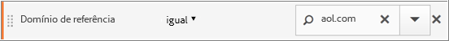-->

Em contraste com a dimensão Páginas, o valor do Domínio de referência é vinculado a cada página nessa visita. Por exemplo, o visitante abaixo chega na Página inicial a partir de um site de referência. Consequentemente, todas as páginas nessa visita recebem o mesmo valor de domínio referenciador.

O segmento `Referring Domain equals aol.com` abaixo é aplicado ao **Relatório de páginas**.

<table style="table-layout:fixed; border: 0;">

<tr>
<td style="background-color: #E5E4E2;"></td>
<td style="background-color: #E5E4E2;" colspan="4"><b>Visita 1</b></td>
</tr>
<tr>
<tr>
<td style="background-color: #E5E4E2;">
<br/>aol.com
</td>
<td style="background-color: #FFFFFF; "><br/>Página inicial</td>
<td style="background-color: #FFFFFF;"><br/>Roupas de inverno</td>
<td style="background-color: #FFFFFF;"><br/>Casaco de inverno</td>
<td style="background-color: #FFFFFF;"><br/>Compra de US$ 100</td>
</tr>
<tr>
<td colspan="5">
</tr>
<tr>
<td style="background-color: #E5E4E2;"></td>
<td style="background-color: #E5E4E2;"colspan="4"><b>Visita 2</b></td>
</tr>
<tr>
<tr style="border: 0;">

<td style="background-color: #E5E4E2;">
<br/>weather.com
</td>
<td style="background-color: #FFFFFF; "><br/>Roupas de inverno</td>
<td style="background-color: #FFFFFF;"><br/>Botas de inverno</td>
<td style="background-color: #FFFFFF;"><br/>Roupas de inverno</td>
<td style="background-color: #FFFFFF;"><br/>Chapéus de inverno</td>

</table>

<!--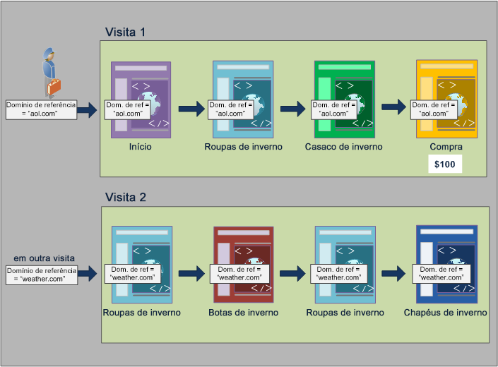-->

Em uma nova visita, o(a) visitante é referenciado(a) de outro site. Consequentemente, todas as páginas na nova visita recebem o novo valor de domínio referenciador para cada exibição de página.

### Relatórios do container de Ocorrência

Como todas as exibições de página na mesma visita recebem o mesmo valor de domínio referenciador, relatar no nível do container de ocorrência (no qual `Referring Domain equsls 'aol.com'`) retorna todas as páginas listadas na tabela abaixo.

| O domínio referenciador é igual a &#39;aol.com&#39; | Exibições de página |
|----|---:|
| Página inicial | 1 |
| Roupas de inverno | 1 |
| Casaco de inverno | 1 |
| Compra | 1 |

<!--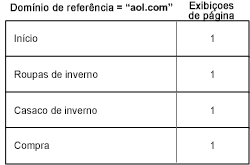-->

Exibindo dados do contêiner de Ocorrência, um pouco mais de 92.000 visualizações de página foram visualizadas em mais de 33.000 visitas por mais de 32.000 visitantes. Em média, há três visualizações de página em cada visita e aproximadamente todas as visitas foram de visitantes únicos.

|  | Métrica | # | % |
|---|---|--:|--:|
| | Exibições de página:<br/>Exibições:<br/>Visitantes únicos: | **98.234** de 351.165 <br/>**33.203** de 165.173 <br/>**32.269** de 113.110 | **27%**<br/>**20%**<br/>**28%** |

<!--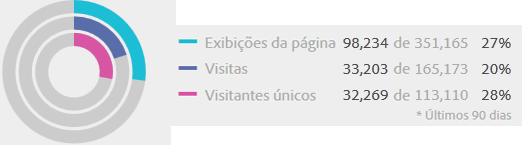-->

### Relatórios do container de Visita

Se a mesma condição é filtrada no container de Visita para um relatório de páginas, então todas as páginas na visita nas quais `Referring Domain equals 'aol.com'` serão verdadeiras. Como o valor do domínio referenciador é definido no nível de visita, os relatórios nos níveis de exibição de página e visita são os mesmos.

| O domínio referenciador é igual a &#39;aol.com&#39; | Exibições de página |
|----|---:|
| Página inicial | 1 |
| Roupas de inverno | 1 |
| Casaco de inverno | 1 |
| Compra | 1 |

<!---->

Como todas as páginas têm o mesmo valor de domínio referenciador baseado na visita, o relatório do nível de container de Visita é (quase) o mesmo do relatório do container de Exibição de página. Há uma pequena diferença (98.234 em relação a 98.248) devido a anomalias nos dados.

|  | Métrica | # | % |
|---|---|--:|--:|
| | Exibições de página:<br/>Exibições:<br/>Visitantes únicos: | **98.248** de 351.165 <br/>**33.203** de 165.173 <br/>**32.269** de 113.110 | **27%**<br/>**20%**<br/>**28%** |

<!---->

### Relatórios do container de Visitante

No container de Visitante, o relatório de páginas lista todas as páginas visualizadas por qualquer visitante nas quais `Referring Domain equals 'aol.com'` é verdadeiro. Portanto, se um visitante utilizar *&#39;aol.com&#39;* como domínio referenciador em qualquer momento (dentro do período definido), todas as páginas no container de Visitante (incluindo exibições de página em outras visitas) serão listadas. Até mesmo as páginas que não correspondem à condição principal são listadas no relatório, porque fazem parte do container de Visitante. Todas as páginas do container de Visitante são listadas no relatório, mesmo se ocorreram anteriormente e não atenderam especificamente às condições.

Em um relatório de domínio referenciador, `Referring Domain equals 'aol.com'` é verdadeiro em quatro exibições de página, mas `Referring Domain equals "weather.com"` é verdadeiro nas outras páginas que o(a) visitante acessou. No container de Visitante, você obtém uma lista de visitantes em que &#39;aol.com&#39; é verdadeiro. Mas isso também fornece páginas em que o domínio referenciador é “weather.com”, e não o valor que corresponde à sua solicitação inicial no segmento.

| Visita 1<br/>O domínio referenciador é igual a &#39;aol.com&#39; | <br/>Exibições de página |
|----|---:|
| Página inicial | 1 |
| Roupas de inverno | 1 |
| Casaco de inverno | 1 |
| Compra | 1 |

| Visita 2<br/>O domínio referenciador = weather.com | <br/>Exibições de página |
|----|---:|
| Roupas de inverno | 2 |
| Casaco de inverno | 1 |
| Compra | 1 |

| Container de Visitante<br/>O domínio referenciador é igual a &#39;aol.com&#39; | Exibições de página |
|----|---:|
| Roupas de inverno<br/>Domínio referenciador: &#39;aol.com&#39; | 1 |
| Roupas de inverno<br/>Domínio referenciador: &#39;weather.com&#39; | 1 |
| Página inicial <br/>Domínio referenciador: &#39;aol.com&#39; | 1 |
| Casaco de inverno <br/>Domínio referenciador: &#39;aol.com&#39; | 1 |
| Comprar<br/>Domínio referenciador: &#39;aol.com&#39; | 1 |
| Botas de inverno<br/>Domínio referenciador: &#39;weather.com&#39; | 1 |
| Chapéus de inverno<br/>Domínio referenciador: &#39;weather.com&#39; | 1 |


<!--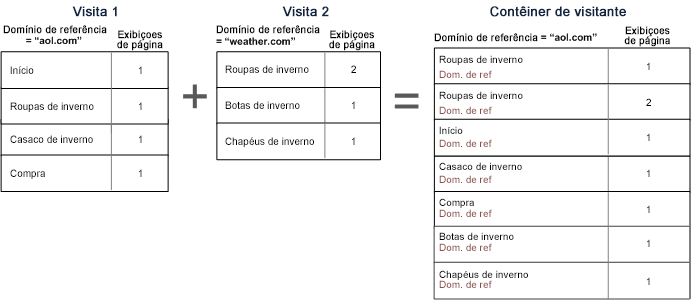-->

Ao visualizar dados do container de Visitante, observe que as exibições de página aumentaram significativamente (de 98.248 para 112.925). Esse aumento ocorre porque todas as exibições de página do visitante (incluindo páginas com outros valores de domínio referenciador salvas no nível do container de Visitante) foram listadas. Somando as visitas adicionais deste visitante, as visitas aumentam de 33.203 para 43.448.

|  | Métrica | # | % |
|---|---|--:|--:|
| | Exibições de página:<br/>Exibições:<br/>Visitantes únicos: | **112.925** de 351.165 <br/>**43.448** de 165.173 <br/>**32.269** de 113.110 | **32%**<br/>**26%**<br/>**28%** |

<!--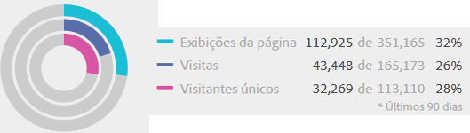-->

## Resumo

- O container de Visitante retorna todas as páginas visualizadas por visitantes onde pelo menos uma página atende aos critérios. Portanto, se uma página é visualizada somente na visita 1 no dia 1, então todas as páginas visualizadas pelo(a) visitante em várias visitas são incluídas nos dados.
- O container de Visitante retorna todas as páginas vistas em uma visita, das quais pelo menos uma atende aos critérios. Portanto, se uma página é visualizada somente na visita 1 no dia 1, então todas as páginas visualizadas na visita inteira são incluídas nos dados.
- Certifique-se de que a condição que está usando para a segmentação seja baseada em uma eVar ou outro tipo de variável persistente. Por exemplo, você pode usar a condição “onde a campanha contém email”, que expirará após sete dias. Portanto, se a campanha é definida na primeira visita, ela persistirá por mais 7 dias. Cada visita será incluída, embora a campanha seja definida somente na primeira visita. As outras visitas também serão incluídas (enquanto estiverem no intervalo de datas do relatório). Se você deseja impedir que valores persistentes sejam incluídos, use o evento “instância de” ou uma variável de propriedade equivalente, se disponível.
