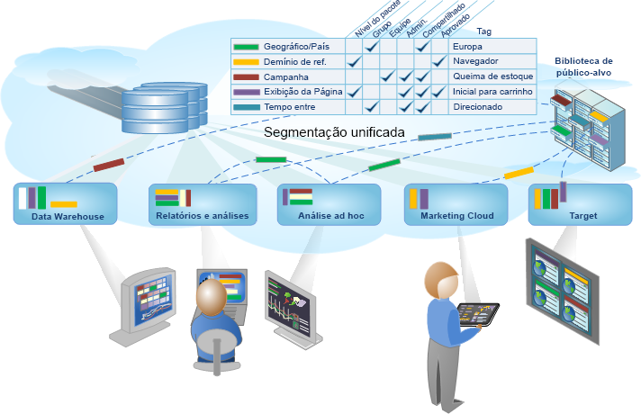

# Segmentação do Analytics

O Adobe Analytics permite construir, gerenciar, compartilhar e aplicar segmentos avançados de público-alvo em seus relatórios usando os recursos do Analytics, a Adobe Experience Cloud, o Adobe Target e outros produtos integrados da Adobe.

A segmentação do Analytics inclui o [Construtor de segmentos](/help/components/segmentation/segmentation-workflow/seg-workflow.md) para construir segmentos e executar um pré-teste, e o [Gerenciador de segmentos](/help/components/segmentation/segmentation-workflow/seg-workflow.md) para coletar, marcar, aprovar, definir a segurança e compartilhar segmentos na organização.

Os cientistas de dados e analistas de marketing podem empregar, estender e refinar segmentos para análises específica para suas necessidades, em seguida, salvar o segmento para outros usuários a fim de estender, refinar e salvar como um novo segmento na biblioteca. Depois de executado, é um ciclo de criação e gerenciamento de informações de público-alvo codificado como um [fluxo de trabalho de segmento unificado](/help/components/segmentation/segmentation-workflow/seg-workflow.md).

**Introdução**

Comece com [Configuração de um fluxo de trabalho de segmentação](/help/components/segmentation/segmentation-workflow/seg-workflow.md) ou [Criação de segmentos](/help/components/segmentation/segmentation-workflow/seg-build.md), ou consulte [Sobre segmentos](/help/components/segmentation/seg-overview.md) para obter uma visão geral rápida.
