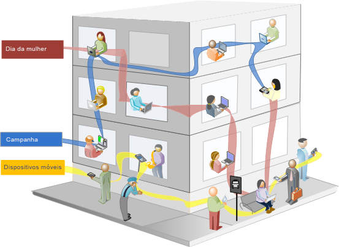
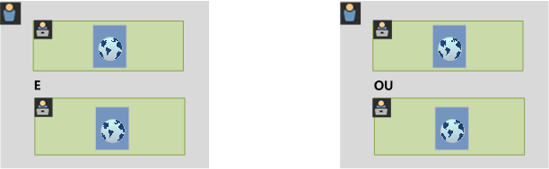
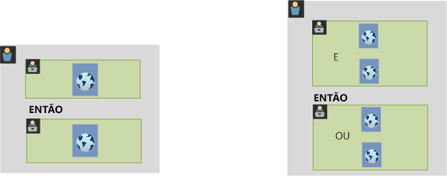

# Sobre segmentos

Os segmentos permitem identificar subconjuntos de visitantes com base em características ou interações no site. Os segmentos foram desenvolvidos como insights de público-alvo que você pode criar para necessidades específicas e verificar, editar e compartilhar com outros membros da equipe ou usar em outros produtos da Adobe e recursos do Analytics.

Os segmentos baseiam-se em uma hierarquia de nível de [!UICONTROL Visitante], [!UICONTROL Visita] e [!UICONTROL Ocorrência], utilizando um modelo de container aninhado. Os containers aninhados permitem definir atributos de visitante e ações com base em regras contidas nos containers e entre eles. Segmentos do Analytics podem ser construídos, aprovados, compartilhados, salvos e executados em vários produtos e recursos da [!DNL Adobe Experience Cloud]. Os segmentos podem ser gerados a partir de um relatório, construído em um relatório de painel, ou marcado para acesso rápido.

Você pode criar e salvar segmentos no construtor de segmentos ou gerá-los a partir de um relatório de fallout (no [!UICONTROL Analysis Workspace]). Você também pode empregar e estender segmentos pré-construídos com base em regras específicas entre containers aninhados, o que permite filtrar resultados e aplicar a relatórios. Além disso, os segmentos podem ser usados juntos como [segmentos empilhados](/help/components/segmentation/segmentation-workflow/seg-workflow.md).

Os segmentos identificam

- quem são seus visitantes (país, gênero, cafeteria),
- quais dispositivos e serviços usam (navegador, mecanismo de pesquisa, dispositivo móvel),
- de onde vieram (mecanismo de pesquisa, página de saída anterior, pesquisa natural)
- e muito mais.

<!---->

Os segmentos podem ter por base os seguintes valores:

- Visitantes com base em atributos: tipo de navegador, dispositivo, número de visitas, país, gênero.
- Visitantes com base em interações: campanhas, pesquisa por palavras-chave, mecanismo de pesquisa.
- Visitantes com base em saídas e entradas: visitantes do Facebook, uma página inicial definida e um domínio de referência.
- Visitantes com base em variáveis personalizadas: campos do formulário, categorias definidas, ID do cliente.

Ao criar segmentos de público-alvo no construtor de segmentos, é possível definir condições utilizando os operadores [!UICONTROL AND] e [!UICONTROL OR] entre os containers.

<table style="table-layout:fixed; border: none;">

<tr>

<td style="background-color: #E5E4E2;" colspan="3" width="200" height="100"> Visitantes</td>
</tr>

<tr>
<td style="background-color: #E5E4E2;" width="200"></td>
<td style="background-color: #D3D3D3;" colspan="2" width="200" height="100"> Visitas</td>
</tr>

<tr>
<td style="background-color: #E5E4E2;" width="200" height="100"></td>
<td style="background-color: #D3D3D3;" width="200" height="100"></td>
<td style="background-color: #C0C0C0;" width="200" height="100" colspan="1"> Ocorrências</td>
</tr>

<tr>
<td style="background-color: #E5E4E2;"></td><td colspan="2">AND</td></td>
</tr>

<tr>
<td style="background-color: #E5E4E2;" width="200"></td>
<td style="background-color: #D3D3D3;" colspan="2" width="200" height="100"> Visitas</td>
</tr>

<tr>
<td style="background-color: #E5E4E2;" width="200" height="100"></td>
<td style="background-color: #D3D3D3;" width="200" height="100"></td>
<td style="background-color: #C0C0C0;" width="200" height="100" colspan="1"> Ocorrências</td>
</tr>
</table>

<table style="table-layout:fixed; border: none;">

<tr>

<td style="background-color: #E5E4E2;" colspan="3" width="200" height="100"> Visitantes</td>
</tr>

<tr>
<td style="background-color: #E5E4E2;" width="200"></td>
<td style="background-color: #D3D3D3;" colspan="2" width="200" height="100"> Visitas</td>
</tr>

<tr>
<td style="background-color: #E5E4E2;" width="200" height="100"></td>
<td style="background-color: #D3D3D3;" width="200" height="100"></td>
<td style="background-color: #C0C0C0;" width="200" height="100" colspan="1"> Ocorrências</td>
</tr>

<tr>
<td style="background-color: #E5E4E2;"></td><td colspan="2">OR</td></td>
</tr>

<tr>
<td style="background-color: #E5E4E2;" width="200"></td>
<td style="background-color: #D3D3D3;" colspan="2" width="200" height="100"> Visitas</td>
</tr>

<tr>
<td style="background-color: #E5E4E2;" width="200" height="100"></td>
<td style="background-color: #D3D3D3;" width="200" height="100"></td>
<td style="background-color: #C0C0C0;" width="200" height="100" colspan="1"> Ocorrências</td>
</tr>
</table>

<!---->

Esse tipo de segmento filtra conjuntos de dados com base em características unidas por meio de operadores [!UICONTROL AND] e [!UICONTROL OR].

- É possível [aplicar vários segmentos a um relatório ou projeto](/help/components/segmentation/segmentation-workflow/t-seg-apply.md).
- Os segmentos são universais para todos os conjuntos de relatórios.
- O [Construtor de segmentos](/help/components/segmentation/segmentation-workflow/seg-build.md) simplifica a criação de segmentos.
- O [Gerenciador de segmentos](/help/components/segmentation/segmentation-workflow/seg-manage.md) permite configurar [fluxos de trabalho](/help/components/segmentation/segmentation-workflow/seg-workflow.md) com recursos de compartilhamento, marcação, verificação e aprovação de segmentos.
- Você pode [adicionar tags a segmentos](/help/components/segmentation/segmentation-workflow/seg-tag.md) para organizar e pesquisar depois, em vez de usar pastas.
- Você pode criar [segmentos sequenciais](/help/components/segmentation/segmentation-workflow/seg-sequential-build.md).
- O container de [!UICONTROL Exibição de página] foi renomeado como container de [!UICONTROL Ocorrência] para indicar que ele segmenta todos os tipos de dados e não apenas exibições de página. Por exemplo, chamadas de rastreamento de link e chamadas de rastreamento de ações originadas por SDKs móveis também são incluídas ou excluídas pelo container de ocorrências.

## Segmentação no Analysis Workspace:

O Analysis Workspace contém estes recursos adicionais:

- Você pode [comparar segmentos](../../analyze/analysis-workspace/c-panels/c-segment-comparison/segment-comparison.md).
- Use segmentos como dimensões em visualizações de tabela de forma livre.
- Use segmentos na [análise de fallout](../../analyze/analysis-workspace/visualizations/fallout/compare-segments-fallout.md).

## Segmentos fornecidos pela Adobe

O painel esquerdo “Componentes” mostra segmentos criados por você e pela sua empresa, bem como segmentos prontos para uso fornecidos pela Adobe. Ao clicar em **[!UICONTROL Mostrar tudo]**, esses segmentos normalmente aparecem na parte inferior da lista e são identificados pelo ícone .

## Segmentos sequenciais {#sequential}

Os segmentos sequenciais permitem que você identifique visitantes com base na navegação e visualização de página no site, o que fornece um segmento de ações e interações definidas. Os segmentos sequenciais ajudam você a identificar o que um visitante gosta e o que um visitante evita. Ao construir segmentos sequenciais, o operador [!UICONTROL THEN] é usado para definir e organizar a navegação do visitante.

| Visita um | Visita dois | Visita três |
|---|---|---|
| Na primeira visita, o(a) visitante foi para a página de destino principal (A), excluiu a página da campanha (B) e visualizou a página do produto (C). | Na segunda visita, o(a) visitante foi novamente para a página de destino principal (A), excluiu a página da campanha (B), foi novamente para a página do produto (C) e, em seguida, foi para a nova página (D). | Na terceira visita, o(a) visitante entrou e seguiu o mesmo caminho da primeira e da segunda visita; em seguida, excluiu a página (F) para ir diretamente para a página do produto direcionada (G). |

Os segmentos sequenciais podem ser baseados nos seguintes valores de ocorrência:

- Visitantes com base na sequência de ocorrências de página: exibições de página em uma única visita, exibições de página em visitas separadas e visitas que excluíram exibições de página.
- Visitantes com base no tempo entre e após as exibições de página: após um tempo limite, entre ocorrências e após um evento.

<table style="table-layout:fixed; border: none;">

<tr>

<td style="background-color: #E5E4E2;" colspan="3" width="200" height="100"> Visitantes</td>
</tr>

<tr>
<td style="background-color: #E5E4E2;" width="200"></td>
<td style="background-color: #D3D3D3;" colspan="2" width="200" height="100"> Visitas</td>
</tr>

<tr>
<td style="background-color: #E5E4E2;" width="200" height="100"></td>
<td style="background-color: #D3D3D3;" width="200" height="100"></td>
<td style="background-color: #C0C0C0;" width="200" height="100" colspan="1"> Ocorrências</td>
</tr>

<tr>
<td style="background-color: #E5E4E2;"></td><td colspan="2">THEN</td></td>
</tr>

<tr>
<td style="background-color: #E5E4E2;" width="200"></td>
<td style="background-color: #D3D3D3;" colspan="2" width="200" height="100"> Visitas</td>
</tr>

<tr>
<td style="background-color: #E5E4E2;" width="200" height="100"></td>
<td style="background-color: #D3D3D3;" width="200" height="100"></td>
<td style="background-color: #C0C0C0;" width="200" height="100" colspan="1"> Ocorrências</td>
</tr>
</table>

<table style="table-layout:fixed; border: none;">

<tr>

<td style="background-color: #E5E4E2;" colspan="3" width="200" height="100"> Visitantes</td>
</tr>

<tr>
<td style="background-color: #E5E4E2;" width="200"></td>
<td style="background-color: #D3D3D3;" colspan="2" width="200" height="100"> Visitas</td>
</tr>

<tr>
<td style="background-color: #E5E4E2;" width="200" height="100"></td>
<td style="background-color: #D3D3D3;" width="200" height="100"></td>
<td style="background-color: #C0C0C0;" width="200" height="100" colspan="1"> Ocorrências</td>
</tr>

<tr>
<td style="background-color: #E5E4E2;"></td><td style="background-color: #D3D3D3;"></td><td>AND</td></td>
</tr>

<tr>
<td style="background-color: #E5E4E2;" width="200" height="100"></td>
<td style="background-color: #D3D3D3;" width="200" height="100"></td>
<td style="background-color: #C0C0C0;" width="200" height="100" colspan="1"> Ocorrências</td>
</tr>

<tr>
<td style="background-color: #E5E4E2;"></td><td colspan="2">THEN</td></td>
</tr>

<tr>
<td style="background-color: #E5E4E2;" width="200"></td>
<td style="background-color: #D3D3D3;" colspan="2" width="200" height="100"> Visitas</td>
</tr>

<tr>
<td style="background-color: #E5E4E2;" width="200" height="100"></td>
<td style="background-color: #D3D3D3;" width="200" height="100"></td>
<td style="background-color: #C0C0C0;" width="200" height="100" colspan="1"> Ocorrências</td>

<tr>
<td style="background-color: #E5E4E2;"></td><td style="background-color: #D3D3D3;"></td><td>OR</td></td>
</tr>

<tr>
<td style="background-color: #E5E4E2;" width="200" height="100"></td>
<td style="background-color: #D3D3D3;" width="200" height="100"></td>
<td style="background-color: #C0C0C0;" width="200" height="100" colspan="1"> Ocorrências</td>
</tr>
</tr>
</table>

<!---->

Um segmento sequencial filtra conjuntos de dados com base nas ações do usuário com o operador [!UICONTROL THEN].

## Tutorial em vídeo sobre a segmentação {#segment-video}

Este vídeo oferece uma visão geral breve do que são os containers de segmentos e como usá-los.

>[!BEGINSHADEBOX]

Consulte  [Containers de segmentos](https://video.tv.adobe.com/v/25401?quality=12&learn=on){target="_blank"} para assistir a um vídeo de demonstração.

>[!ENDSHADEBOX]

## Permissões {#permissions}

+++ **Quais direitos e privilégios são necessários para que eu possa usar, criar e gerenciar segmentos?**

Por padrão, todos os usuários podem criar e editar segmentos pessoais. Contudo, os administradores podem escolher quem deve ter [permissões para criar segmentos](/help/admin/admin-console/home.md) e quem pode atribuí-los a grupos específicos. Esses segmentos podem ser compartilhados diretamente com qualquer outro usuário do Analytics.

Os administradores podem editar qualquer segmento e compartilhar segmentos com grupos e todos na organização. [Direitos de segmento por função](/help/components/segmentation/seg-reference/seg-rights.md)

+++

+++ **É possível visualizar todos os segmentos na minha empresa?**

Sim, admins podem visualizar todos os segmentos na interface do [!DNL Analysis Workspace].

O Report Builder exibe os segmentos que você possui e os segmentos compartilhados com você.

+++

+++ **Posso gerenciar todos os segmentos do Analytics no gerenciador de segmentos?**

Sim, todos os segmentos podem ser gerenciados pelo gerenciador de segmentos. O gerenciador de segmentos exibe os segmentos que estão visíveis para o proprietário (o usuário que criou o segmento), usuários compartilhados e usuários admins. O seletor de segmentos exibe segmentos de propriedade e compartilhados com o usuário.

Admins podem visualizar todos os segmentos na interface do Analysis Workspace.

O Report Builder só exibe segmentos criados por você ou que tenham sido compartilhados especificamente com você.

+++

+++ **Por que não consigo excluir um segmento?**

Se o segmento tiver sido [publicado na Experience Cloud](/help/components/segmentation/segmentation-workflow/seg-workflow.md), ele não poderá ser excluído nem editado. No entanto, você poderá copiar o segmento e editar a versão copiada.

+++
