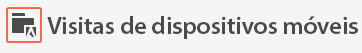
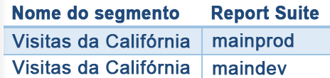
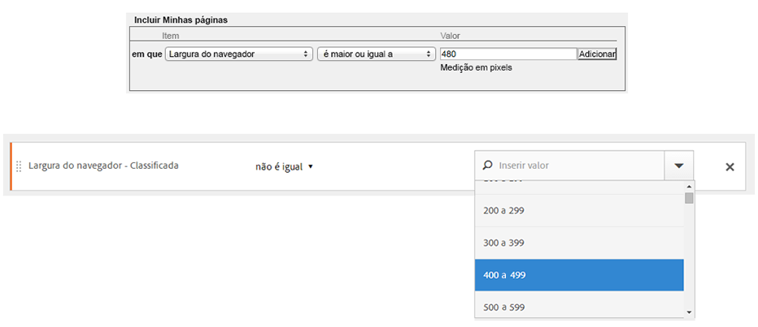

# Perguntas frequentes sobre segmentos herdados

Responde perguntas frequentes sobre práticas recomendadas para gerenciar segmentos herdados - segmentos criados antes de 2014.

## Gerenciamento de segmentos herdados {#legacy}

+++ **O que aconteceu com meus segmentos existentes?**

Seus segmentos existentes continuarão a funcionar como anteriormente. Quaisquer relatórios com esses segmentos aplicados continuarão a funcionar corretamente. [Mais...](/help/components/segmentation/seg-transition.md)

A maioria dos segmentos pré-definidos e de conjunto serão migrados como modelos de segmento no Construtor de segmentos. Os modelos de segmentos são usados para criar rapidamente segmentos personalizados com públicos comuns. Os modelos de segmento não podem ser aplicados diretamente a um relatório, mas podem ser salvos facilmente em um segmento personalizado.

Os modelos de segmento são marcados com um ícone especial no Construtor de segmentos:

+++

+++ **O que aconteceu com os relatórios agendados com segmentos aplicados?**

Os relatórios agendados continuar a funcionar apropriadamente com os segmentos definidos.

Ao excluir um segmento, os relatórios e painéis agendados com esse segmento aplicado continuam a funcionar normalmente, ou seja, o segmento ou painel continua a usar o segmento excluído.

Os relatórios agendados não são atualizados quando você edita um segmento com o mesmo nome. Exemplo: imagine que você tem 2 segmentos com o mesmo nome em conjuntos de relatórios diferentes:

Você tem um marcador que faz referência ao segmento para o conjunto de relatórios da produção principal. Em seguida, você exclui esse segmento, pois é uma duplicata. O marcador continuará a funcionar, com referência à definição do segmento excluído. Se você alterar a definição de segmento para o segmento de desenvolvimento principal a fim de incluir a Ilha de Catalina e Tijuana no México, o segmento aplicado ao marcador não mudará. Usará a definição antiga. Para corrigir isso, atualize o marcador para fazer referência à nova definição. Se você não tiver certeza se um marcador, painel ou relatório agendado está usando um segmento excluído, é possível alterar o nome do segmento restante para que fique mais clara se o marcador usa o segmento restante.

+++

+++ **O que aconteceu com os segmentos do Data Warehouse?**

Todos os segmentos existentes no Data Warehouse ainda funcionam nele. A maioria dos segmentos do Data Warehouse também funcionarão em outros componentes, como o Analysis Workspace, a e o Reports &amp; Analytics.

Você pode criar ou editar novos segmentos de Data Warehouse no gerenciador/construtor de segmentos. O mecanismo de Compatibilidade do produto no Construtor de segmentos determina automaticamente se um segmento é compatível com o Data Warehouse.

+++

+++ **O que aconteceu com os segmentos pré-configurados?**

* **Visitas únicas à página**
* **Visitas de dispositivos móveis**
* **Visitas da pesquisa natural**
* **Visitantes da pesquisa paga**
* **Visitantes com cookie de ID do visitante**

Esses segmentos serão transferidos como modelos de segmento no Construtor de segmentos. Os relatórios com esses segmentos aplicados continuarão funcionando da forma correta.

+++

+++ **O que aconteceu com os segmentos do Experience Cloud (Suite):**

* Não compradores
* Compradores
* Novas visitas
* Visitas de sites sociais
* Visitas de mais de 10 minutos*
* Visitas com mais de cinco visitas anteriores*
* Visitas do Facebook*

A maioria desses segmentos (exceto os marcados com um asterisco *) foram migrados como modelos de segmentos no construtor de segmentos. Além disso, vários novos modelos de segmento foram adicionados.

Os relatórios com esses segmentos aplicados continuam a funcionar corretamente.

+++

+++ **O que aconteceu com os segmentos Admin (também conhecidos como segmentos &quot;Globais&quot;)?**

Os segmentos do **administrador** serão migrados na nova interface de segmentos e serão exibidos como segmentos compartilhados com todos.

O proprietário desses segmentos está definido como o administrador com a conta mais antiga na lista de usuários administradores da empresa de logon, no entanto, todos os Administradores podem excluir, editar e compartilhar esses segmentos.

A interface de gerenciamento de segmento no Admin Console, onde os administradores criaram e gerenciaram esses segmentos globais, não está mais disponível. Os administradores agora devem usar o novo construtor de segmentos para criar segmentos e compartilhá-los com os grupos ou indivíduos apropriados, ou com todos.

Os segmentos existentes que usam lógica que foi alterada como descrito nesse documento continuam a funcionar corretamente, embora precisem ser atualizados antes de serem salvos novamente. Por exemplo, se você tem um segmento existente, onde Estados dos EUA contém &quot;Nova York&quot;, ele continua a funcionar corretamente, embora na próxima vez que você editar o segmento será necessário atualizá-lo para usar o tipo enumerado com uma condição de igual.

+++

+++ **O que devo fazer com segmentos duplicados que possuem o mesmo nome, mas podem ter definições diferentes?**
Agora que os segmentos funcionam em vários conjuntos de relatórios, você pode acabar descobrindo que possui vários segmentos com o mesmo nome. Recomendamos que você

* Renomeie os segmentos com o mesmo nome, mas com diferentes definições, ou
* Exclua os segmentos que não são mais necessários.

+++

+++ **O que a Adobe recomenda com relação à limpeza de segmentos?**

* Marque todos os segmentos com uma tag legada.
* Analise todos os seus segmentos.
* Quando apropriado, adicione-os à biblioteca de segmentos.
* Aprovar segmentos canônicos.
* Marcar segmentos de acordo com as [práticas recomendadas](/help/components/segmentation/segmentation-workflow/seg-workflow.md).

+++

### Dicas de migração

As seguintes dicas ajudarão você a migrar dimensões comuns:

* Cidade/regiões/país geográfico - pesquise e selecione cidades, regiões ou países específicos em vez de usar uma correspondência parcial.
* Navegadores - use a dimensão de Tipos de navegador para obter todos os navegadores em um tipo, por exemplo, Google Chrome
* Sistemas operacionais - use as dimensões de Tipos de sistema operacional para obter todos os sistemas operacionais em um tipo, por exemplo, Microsoft Windows.
* Consulte &quot;Dimension novas e renomeadas&quot; (veja abaixo)

## Dimensões novas e renomeadas {#renamed}

A tabela a seguir contém uma lista de dimensões que foram renomeadas no Construtor de segmentos.

| Nome da nova dimensão | Nome anterior | Notas |
|--- |--- |--- |
| Tipos de sistema operacional | Novo | Adicionado no segundo trimestre de 2015. |
| Largura do navegador - Classificada | Largura da janela do navegador | Essa dimensão é compatível com todas as interfaces e é dividida em uma lista enumerada de intervalos em vez dos valores inteiros específicos. Se for necessário segmentar valores específicos, use a versão granular dessa dimensão no segmento de data warehouse. |
| Altura do navegador - Classificada | Altura da janela do navegador | Essa dimensão é compatível com todas as interfaces e é dividida em uma lista enumerada de intervalos em vez dos valores inteiros específicos. Se for necessário segmentar valores específicos, use a versão granular dessa dimensão no segmento de data warehouse. |
| Largura do navegador - Granular | Largura da janela do navegador | Isso foi renomeado e agora é compatível somente com data warehouse. Ao definir segmentos compatíveis com todas as interfaces, use o tipo enumerado, Largura de navegador - Classificado. |
| Altura do navegador - Granular | Altura da janela do navegador | Isso foi renomeado e agora é compatível somente com data warehouse. Ao definir segmentos compatíveis com todas as interfaces, use o tipo enumerado, Altura do navegador - Classificado. |
| Suporte a cookies | Cookies | - |
| Intensidade de cor | Intensidade de cor do monitor | - |
| - | &quot;Aplicativo - *&quot; | Os prefixos &quot;Aplicativo - &quot; foram removidos de vários tipos de dimensão. Como os dados de aplicativo móvel são normalmente capturados em um conjunto de relatórios que não contém dados da Web, esses prefixos não são necessários. |
| Página de entrada original | Página de entrada original | - |
| Java ativado | Java | - |
| Extensão máx. do URL do navegador para dispositivo móvel | Extensão do URL do navegador remoto | - |
| Decoração de correio para dispositivo móvel | Suporte a email de decoração remoto | - |
| Dispositivo móvel | Nome do dispositivo móvel | - |
| Extensão max do marcador de dispositivo móvel | Extensão Max do URL do Marcador Remoto | - |
| Extensão máx. de email móvel | Extensão Max do URL do Email Remoto | - |
| sistema operacional do dispositivo móvel (obsoleto) | Sistema operacional móvel | Use a dimensão do Sistema operacional e, em vez disso, aplique a visitas de segmentos de dispositivos móveis. |
| Push To Talk para dispositivo móvel | PTT Remoto | - |
| Visualizações da Pesquisa de Opinião | Total de visualizações da pesquisa | - |
| Respostas da Pesquisa de Opinião | Total de respostas da pesquisa | - |
| Profundidade da visita | Comprimento do caminho | - |
| Código postal | CEP/Código postal | - |

{style=&quot;table-layout:auto&quot;}

## Alterações nas dimensões com base em sequência de caracteres com valores conhecidos {#string-based-dims}

Dimensões com base em sequência de caracteres com conjunto de valores conhecidos foram alteradas para tipos enumerados. Ao criar um segmento com essas dimensões, a lista é pré-preenchida com todos os valores conhecidos e o único operador suportado é igual. Isso permite que você segmente rapidamente os valores exatos que você estava procurando sem selecionar valores não intencionais ao usar correspondências menos restritivas.

As seguintes dimensões foram alteradas para listas enumeradas:

| fabricante do dispositivo móvel | comprimento de email remoto | intensidade de cor |
|---|---|---|
| tamanho da tela do dispositivo móvel | número do dispositivo móvel | resolução do monitor |
| altura da tela do dispositivo móvel | Push To Talk para dispositivo móvel | plugin |
| Suporte a cookie em dispositivo móvel | Decoração de correio para dispositivo móvel | sistema operacional |
| Suporte a imagem em dispositivo móvel | serviços de informação para dispositivos móveis | tipo de referenciador |
| intensidade de cor de dispositivo móvel | tipo de dispositivo móvel | mecanismo de pesquisa |
| suporte a áudio remoto | tipo de navegador | estado |
| suporte a vídeo em dispositivo móvel | navegador | país geográfico |
| drm móvel | tipo de conexão | região geográfica |
| protocolos de rede para dispositivo móvel | operadora de celular | cidade geográfica |
| sistema operacional móvel | cookie | dma geográfico |
| java VM para dispositivo móvel | fidelização do cliente | cookie persistente |
| tamanho do marcador remoto | java ativado | pesquisa paga |
| extensão do URL remoto | idioma |  |

## Alterações nas dimensões com base em inteiro com valores conhecidos {#integer-based-dims}

Dimensões com base em inteiros (como a largura do navegador) com um conjunto conhecido de valores foram divididas em intervalos enumerados para que você possa definir rapidamente segmentos para um intervalo específico. Essas listas enumeradas são anexadas com &quot; - Classificado&quot; após o nome da dimensão. A seguinte tela demonstra como essas dimensões são segmentadas usando as interfaces do construtor de segmento anterior e novo:

Os operadores menor que, maior que e semelhante agora são compatíveis somente com os segmentos do Data Warehouse. Os segmentos que devem ser compatíveis com todas as interfaces de relatório devem usar a versão “Classificada” da métrica com o operador igual.
